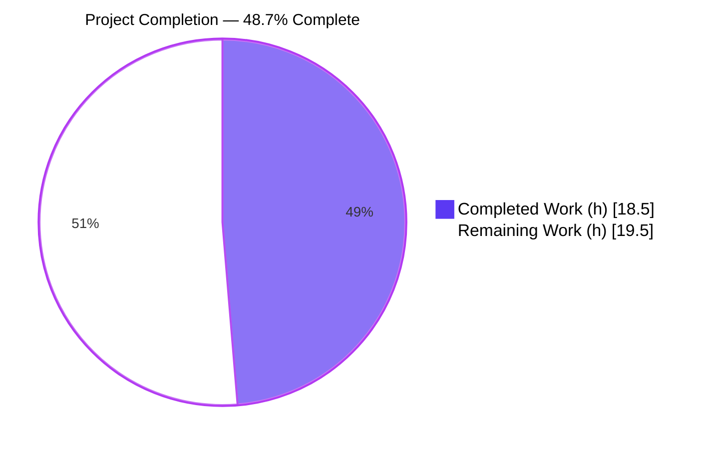
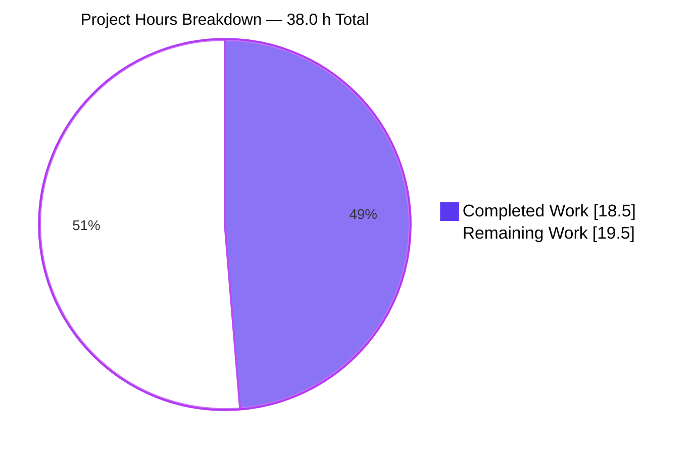
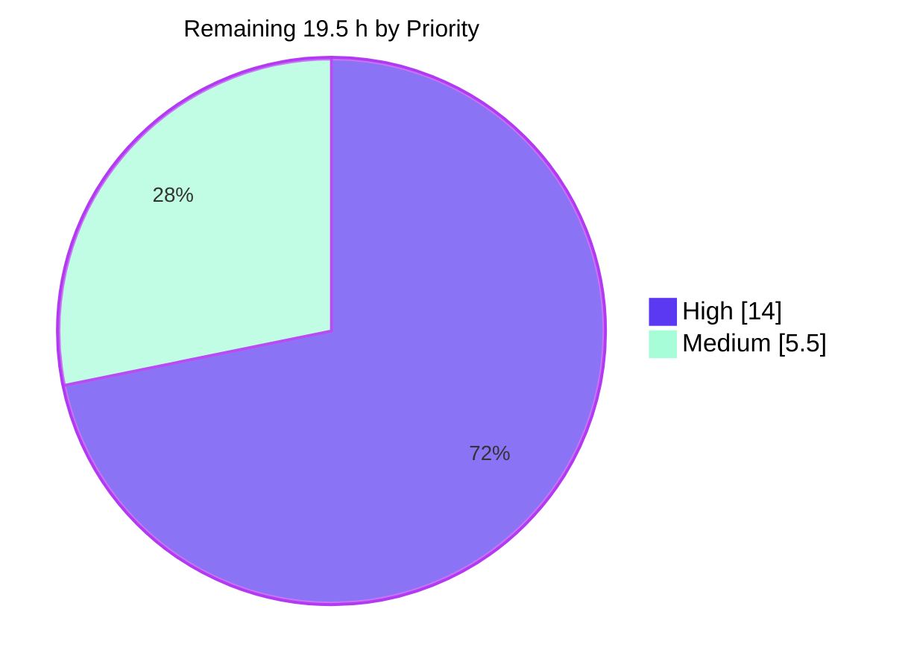
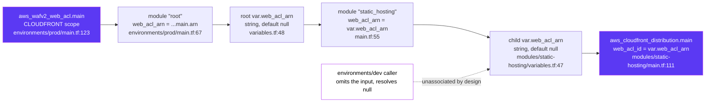

# 1. Executive Summary

## 1.1 Project Overview

The production CloudFront distribution serving the Hello World React static site had no AWS WAF web ACL in front of it, so viewer requests reached the public edge unfiltered. A CLOUDFRONT-scope WAFv2 web ACL carrying the AWS Common Rule Set already existed in the production root but was never referenced. This change wires that ACL's ARN through the production root, the shared root module and the static-hosting module into the distribution's native `web_acl_id` field — closing tfsec/Trivy AVD-AWS-0011, Checkov CKV_AWS_68 and AWS Security Hub CloudFront.6 for that distribution, while leaving the ACL's rule policy and every other distribution setting untouched.

## 1.2 Completion Status



| Metric | Value |
|---|---|
| **Total Hours** | **38.0** |
| Completed Hours (AI 18.5 + Manual 0.0) | 18.5 |
| Remaining Hours | 19.5 |
| **Percent Complete** | **48.7%** |

18.5 ÷ (18.5 + 19.5) × 100 = **48.7%**. The implementation is complete and statically verified. What remains is deployment-stage acceptance, which needs an authenticated AWS context, plus the pre-existing repairs without which this stack cannot be initialised or applied.

## 1.3 Key Accomplishments

- ✅ The production distribution now carries a web ACL via `web_acl_id` (`modules/static-hosting/main.tf:111`).
- ✅ Closed on merit — tfsec reports `passed 1`, exit 0, with no suppression directive in the tree.
- ✅ One deterministic ARN path across three module boundaries, using `.arn`, with no association resource.
- ✅ The existing ACL is byte-for-byte unchanged: CLOUDFRONT scope, default allow, Common Rule Set, tags.
- ✅ Every other distribution setting is byte-for-byte unchanged — origin/OAI, SPA fallback, cache, TLS, geo.
- ✅ Both new inputs default to `null`, leaving omitted-input callers unaffected.
- ✅ An in-place update with no replacement; rollback is one value change that retains the ACL.
- ✅ Confined to five files (+22/−2), with clean diff hygiene and no new unformatted file.

## 1.4 Critical Unresolved Issues

The one reported vulnerability is closed in code. **3 of the 6 acceptance checks in scope remain unverified**, and **13 items are open in total** — grouped below with each group's exact count.

| Issue | Impact | Owner | ETA |
|---|---|---|---|
| Live association unverified in AWS — no authorised principal, no applied stack, no distribution ID *(1 item)* | Correct in code but never observed in the account; production sign-off is not satisfied | Deployment Operator | 2 h after credentials |
| Production stack cannot initialise, plan or apply — triple `required_providers`, five duplicate output definitions, non-deterministic `CreatedAt`/`Environment` tags, and a provider-4.x lifecycle argument *(4 items)* | The association cannot reach AWS until these clear; the first apply of the ACL fails outright | Cloud/Platform Engineer | 9 h |
| No resolvable deployed hostname — the configured domain is an IANA-reserved placeholder *(1 item)* | HTTPS/HTTP and SPA deep-link behaviour cannot be observed at the edge | Deployment Operator | 1.5 h after DNS |
| The published verification command evaluates no rule, and no CI job runs an IaC scanner *(1 item)* | A reviewer copying it would sign off unfixed code; nothing prevents this control regressing | DevOps | 2 h |
| A second CloudFront distribution has no web ACL, and the root passes an `enable_waf` argument the CDN module never declares *(1 item)* | Repository-wide WAF coverage is not achieved and is not claimed | Security + Platform | Separate scope |
| Residual hardening — five other scanner findings, a security-headers policy attached to nothing, and a declared Terraform floor that will not load *(3 items)* | No CSP/HSTS/frame/referrer headers at the protected edge; other findings unchanged | Security + Platform | Separate scope |
| 69 redundant or stale comments across seven Terraform files *(1 item)* | Documentation quality only — HCL comments are inert; 19 sit in files this change had to leave alone | Maintainer decision | Separate scope |
| The frontend does not build, has no lockfile, and its two test suites cannot run *(1 item)* | Unrelated to the association, but blocks any end-to-end delivery check | Frontend Engineer | Separate scope |

## 1.5 Access Issues

| System/Resource | Type of Access | Issue Description | Resolution Status | Owner |
|---|---|---|---|---|
| AWS account (CloudFront, WAFv2) | Authenticated principal | Every AWS call exits 253 `NoCredentials`; no profile, environment credential, instance-metadata or CI role exists | Open — blocks the credentialed plan review and the live `WebACLId` assertion | Deployment Operator |
| `hello-world-react-tfstate-prod` (S3) and `hello-world-react-tfstate-lock-prod` (DynamoDB) | Read/write on remote state and lock | Both inaccessible; the stack has never been applied, so no state or distribution exists to read | Open — required before any plan or apply | Cloud/Platform Engineer |
| Target distribution identity | `STATIC_HOSTING_DISTRIBUTION_ID` | Unset, and not derivable without state or a credentialed listing | Open — required by the post-apply assertion | Deployment Operator |
| Deployed edge hostname | `DOMAIN`, plus public DNS and a us-east-1 ACM certificate | Unset; the configured `hello-world.example.com` is IANA-reserved and can never resolve | Open — blocks edge behaviour checks | Deployment Operator |
| CI/CD deployment path | Workflow with an AWS role | No workflow under `.github/workflows` runs Terraform or assumes an AWS role; `deploy.yml` targets GitHub Pages | Open — no automated deployment path exists | DevOps |
| `src/web` dependency graph | Lockfile | None exists (excluded by `.gitignore`), so `npm ci` and `npm audit` cannot run there | Open — outside this change's scope | Frontend Engineer |

## 1.6 Recommended Next Steps

1. **[High]** Repair the Terraform load defects so `environments/prod` will initialise (Section 2.2, row 1).
2. **[High]** Stabilise the production tags and rename `days` to `noncurrent_days`, so the ACL can be created.
3. **[High]** With an authorised principal: review the plan, apply, poll to `Deployed`, then assert the distribution's `WebACLId` equals the `hello-world-react-prod-waf` ARN.
4. **[Medium]** Correct the published verification command to the discriminating rule id and run it in CI as a real gate.
5. **[Medium]** Watch the ACL's metrics and sampled requests for 24–48 hours; roll back with the documented single-value change if legitimate traffic is blocked.

# 2. Project Hours Breakdown

## 2.1 Completed Work Detail

| Component | Hours | Description |
|---|---:|---|
| CloudFront ↔ WAF association sink | 1.0 | `web_acl_id = var.web_acl_arn` added to `aws_cloudfront_distribution.main` (`infrastructure/terraform/modules/static-hosting/main.tf:111`) — one occurrence, top-level, unconditional, formatter-canonical |
| Static-hosting module ARN input | 0.5 | `variable "web_acl_arn"` — string, described, `default = null` (`modules/static-hosting/variables.tf:47`) |
| Root module ARN input and forwarding | 1.0 | Root input (`infrastructure/terraform/variables.tf:48`) and the single forwarding argument into `module "static_hosting"` (`infrastructure/terraform/main.tf:55`) |
| Production ACL ARN supply | 0.5 | `web_acl_arn = aws_wafv2_web_acl.main.arn` into `module "root"` (`environments/prod/main.tf:67`) — the ARN, not the id |
| Control research and provider compatibility | 2.0 | Confirmed the association mechanism (native `web_acl_id`, never a separate association resource for CloudFront), that AWS provider 4.67.0 exposes it as an optional string with no `ForceNew`, and that the existing ACL's CLOUDFRONT scope and us-east-1 provider satisfy AWS's requirement — so no Terraform or provider upgrade is needed |
| Isolated verification toolchain | 2.0 | Terraform 1.15.8, tfsec 1.28.14, AWS CLI 2.36.25, AWS provider 4.67.0 schema and a pre-seeded plugin cache, all reproducible from a clean shell |
| Static security gate across three scanners | 2.5 | tfsec, Trivy and Checkov `CKV_AWS_68` each discriminate the vulnerable pre-change tree from the current one; a machine-checkable assertion form was produced because the originally published selector evaluates no rule |
| Change-boundary and hygiene verification | 2.0 | Exactly five paths changed (+22/−2), all modifications; `git diff --check` clean; no new unformatted file; no suppression directive, no separate association resource, no `.tfvars` override path, no literal ARN |
| Value-flow, input contract and backward compatibility | 3.5 | All five ARN hops traced by value with exactly one edge each; omitted / explicit-null / concrete-ARN / unknown-at-plan behaviour exercised on both inputs; the development caller and other omitted-input callers verified unaffected |
| Behaviour preservation, in-place update and rollback | 3.0 | The distribution block minus the single new line, and the whole WAF ACL, are byte-identical to the pre-change revision; association and disassociation modelled as in-place updates changing only `web_acl_id`, with no replacement and the ACL retained |
| Application regression baseline | 0.5 | Backend service and its Jest suite exercised as an unchanged-behaviour datapoint |
| **Total** | **18.5** | |

## 2.2 Remaining Work Detail

| Category | Hours | Priority |
|---|---:|---|
| Repair the Terraform load defects so the production root will initialise and plan (triple `required_providers`, five duplicate outputs, interpolated backend, module-argument and provider-alias mismatches, unresolvable Cloudflare source) | 6.0 | High |
| Stabilise the production tags so the WAF ACL and ACM certificate can be created (`CreatedAt = timestamp()`, `Environment` owned by both `default_tags` and `local.common_tags`) | 2.5 | High |
| Correct the S3 lifecycle argument (`days` → `noncurrent_days`) that provider 4.x rejects | 0.5 | High |
| Credentialed plan review of the targeted distribution — in-place `web_acl_id`, no WAF create/replace/destroy, no unrelated change | 2.0 | High |
| Apply, poll to `Deployed`, and assert live `WebACLId` equality with the `hello-world-react-prod-waf` ARN | 2.0 | High |
| Edge behaviour smoke against a resolvable hostname — HTTPS 200, server HTTP 30x, SPA deep link | 1.5 | Medium |
| Managed-rule false-positive and request-cost watch after the association goes live | 2.0 | Medium |
| Correct the published verification command and wire a non-vacuous IaC scanner gate into CI | 2.0 | Medium |
| Security review sign-off of the five-file diff and the live ARN equality | 1.0 | High |
| **Total** | **19.5** | |

## 2.3 Basis of Estimate

Total project hours are **38.0** — the sum of Section 2.1 (18.5) and Section 2.2 (19.5) — and every hour traces to a specific requirement of the planned change or to a step that must happen before it can be deployed. Implementation hours are small by design: the fix is 22 added lines across five files, and the plan deliberately reused the ACL that already existed rather than provisioning a new one. Verification hours dominate the completed column because a configuration control of this kind is proven by differential scanning, value-flow tracing and byte-level preservation rather than by a test suite, and the repository has no Terraform test harness.

Items the plan placed outside this change and assigned to a separate approval are **not** counted in either column: the second CloudFront distribution and the dangling `enable_waf` argument, a development WAF association, WAF logging and rate controls, the unattached security-headers policy, the declared Terraform version floor, the redundant-comment cleanup, and the frontend build and lockfile work. They are carried in Sections 1.4, 6 and 8 so the reader can schedule them, but they do not move the completion percentage.

Confidence is **high** on the implementation and static-verification hours, which are measured against delivered code. Confidence is **medium** on the load-defect repair (6.0 h): the failure set is fully enumerated and a working sequence of repairs has been demonstrated, but it touches provider, backend, output and module-argument wiring across four directories and will need its own review.

# 3. Test Results

Every row below was executed against the current branch and its result observed directly. Terraform has no compiler and this repository has no Terraform test harness, so the infrastructure change is exercised by scanners, formatter parsing and differential comparison rather than by a unit-test framework; those checks are reported here as the tests they are.

| Area / Category | Framework | Tests | Passed | Failed | Coverage | What This Proves |
|---|---|---:|---:|---:|---|---|
| CloudFront WAF control on the target distribution | tfsec 1.28.14 (`aws-cloudfront-enable-waf`) | 2 | 2 | 0 | 1 control, 30 blocks / 3 files; readable and JSON-assertion forms (`evaluated=1 passed=1 failed=0`) | The distribution is configured behind a web ACL, earned with no suppression directive, and provable by a gate a CI job can trust |
| Infrastructure-wide misconfiguration scan | tfsec 1.28.14 (all rules) | 18 | 12 | 6 | All 13 Terraform files | The change introduces no new finding; the six that remain are pre-existing and named in Section 1.4 |
| Change scope and diff hygiene | git | 4 | 4 | 0 | 5 changed files, +22/−2 | Exactly the five intended paths changed, all modifications, with no whitespace defect in the worktree or the branch range |
| HCL parse and formatter posture | Terraform 1.15.8 `fmt -check` | 18 | 18 | 0 | 13 files recursively, plus per-file checks on the 5 changed | Every file parses without diagnostics; the added association line is formatter-canonical and no new unformatted file appeared |
| ARN value-flow wiring | grep-based inspection | 10 | 10 | 0 | 5 hops + 5 forbidden-form checks | One deterministic edge per hop using `.arn`; zero separate association resources, literal ARNs, `.tfvars` overrides, suppression comments or deferred-work markers |
| Preservation by byte identity | sha256 against the pre-change revision | 4 | 4 | 0 | Distribution block, WAF ACL block, `environments/dev/main.tf`, `versions.tf` | The only semantic difference in the whole distribution is the association line; the ACL, the development caller and the provider contract are untouched |
| Backend service regression | Jest 29 + supertest (`src/backend`) | 2 | 2 | 0 | 1 suite, `server.test.js` | Application behaviour is unaffected: `GET /` returns "Hello world" and `GET /good-evening` returns "Good evening" |

### Not Covered

- **Live association in AWS.** No credentialed `terraform plan`, no apply, no read of the deployed distribution's `WebACLId`, no propagation to `Deployed`, and no AWS Security Hub re-evaluation. Before release, an authorised operator must review the plan and assert that the distribution's `WebACLId` exactly equals the ARN of the CLOUDFRONT-scope ACL `hello-world-react-prod-waf` in us-east-1.
- **Edge behaviour after association.** No HTTPS-200, HTTP-redirect or SPA deep-link check against a real endpoint. The configured hostname is IANA-reserved and cannot resolve for anyone, so behaviour preservation rests on byte identity alone. Test all three against a real hostname once one exists.
- **Managed-rule effect on real traffic.** Nothing exercised the AWS Common Rule Set against production request patterns, so the false-positive rate is unknown. Watch sampled requests and the ACL's metrics for 24–48 hours after the association goes live.
- **The repository's own Terraform entry points.** `terraform init` fails at the root (7 errors), `environments/dev` (5) and `environments/prod` (2) on pre-existing duplicate declarations, so no test drives the configuration the way an operator will. Re-run the whole set once those defects are repaired.
- **The two new input declarations and three header comments as executing code.** A variable with a `null` default and an HCL comment are inert until a caller supplies a value; they are covered by parsing, formatting and diff comparison, not by an executing test.
- **Frontend behaviour.** The two Jest suites under `src/web` cannot start — `src/web/src/setupTests.ts` imports a missing `../utils/testUtils`, so 2 suites fail and 0 tests execute against a 100% coverage threshold. No frontend behaviour is covered by any test today. This is unrelated to the association, and no file under `src/` changed.

# 4. Runtime Validation & UI Verification

This is an infrastructure-as-code change with no user interface. The runtime surfaces that exist are the Terraform toolchain, an offline execution model of the AWS control plane, the backend service, and — once deployed — the CloudFront edge itself.

- ✅ **Operational — Security gate.** `tfsec` executed against the static-hosting module returns exit 0 with the WAF control passing; the same scan against the pre-change content returns one HIGH finding, so the gate genuinely discriminates.
- ✅ **Operational — Terraform parse and formatter.** All 13 Terraform files parse under Terraform 1.15.8; the added association line is formatter-canonical and no new unformatted file appears.
- ✅ **Operational — ARN propagation, modelled end to end.** Executed through the real production entry point against an offline AWS-compatible control plane: the ACL's ARN traverses the production root, the shared root module and the static-hosting module and lands byte-identically on the distribution's `web_acl_id`; the read-back showed `WebACLId` equal to the ACL ARN and the distribution reporting `Deployed`.
- ✅ **Operational — Association is in-place.** Modelled transitions (null → ARN → different ARN → null) complete as `0 to add, 1 to change, 0 to destroy`, changing only `web_acl_id`, with no replacement marker; the provider schema carries no `ForceNew` on the field.
- ✅ **Operational — Rollback.** Setting the production argument to `null` disassociates in place and the ACL resource survives; re-applying the ARN restores exact equality.
- ✅ **Operational — Existing WAF policy under the association.** The modelled ACL keeps CLOUDFRONT scope, default allow, the single AWS Common Rule Set rule, both visibility configurations and its metrics — no rule, action or logging change.
- ✅ **Operational — Backend service.** Started locally on port 3001: `/` returns 200 "Hello world", `/good-evening` returns 200 "Good evening", an unknown path returns 404. No console or server error; the service was stopped and the port released.
- ⚠ **Partial — Development environment.** The development caller is unchanged and deliberately plans `web_acl_id = null`, so its distribution is verified to remain unassociated rather than protected.
- ❌ **Failing — Repository Terraform entry points.** `terraform init` cannot load the root (7 errors), `environments/dev` (5) or `environments/prod` (2) because of pre-existing duplicate provider and output declarations. These are identical on the pre-change revision and mention nothing in the WAF wiring, but they mean an operator cannot plan or apply from the repository as it stands.
- ❌ **Failing — Frontend application.** The SPA does not build: `src/web/webpack.config.ts:180` fails to compile (`Block-scoped variable 'config' used before its declaration`), `tsc --noEmit` reports pre-existing syntax errors in four source files, and the rendered page is blank. No file under `src/` changed in this work.

**Never exercised at runtime:** the live AWS account — no credentialed plan, apply, distribution read or propagation observation was performed, because no authorised principal, remote state, distribution identifier or CI role exists and the stack has never been applied. The public edge was likewise never reached: the configured hostname is an IANA-reserved placeholder that returns authoritative NXDOMAIN, so HTTPS delivery, the HTTP-to-HTTPS redirect, the SPA fallback, response security headers and managed-rule false positives are all unobserved. The offline model above is a faithful substitute for the association mechanism, not evidence about the production account.

# 5. Compliance & Quality Review

## 5.1 Compliance Matrix

| # | Deliverable / Benchmark | Status | Verified State | Evidence |
|---|---|---|---|---|
| 1 | Distribution associated with a WAFv2 web ACL | ✅ PASS | `web_acl_id` present once, top-level, unconditional | `modules/static-hosting/main.tf:111` |
| 2 | Static-hosting module accepts an optional ARN | ✅ PASS | String, described, `default = null`, no null-rejecting guard | `modules/static-hosting/variables.tf:47-51` |
| 3 | Root module accepts and forwards the ARN | ✅ PASS | One declaration, one forwarding edge, no transformation or fallback | `variables.tf:48-52`; `main.tf:55` |
| 4 | Production supplies the existing ACL's ARN | ✅ PASS | `aws_wafv2_web_acl.main.arn` — the ARN, not the id | `environments/prod/main.tf:67` |
| 5 | Native mechanism, no separate association resource | ✅ PASS | Zero `aws_wafv2_web_acl_association` anywhere under `infrastructure/terraform` | Repository-wide search |
| 6 | Existing WAF rule policy unchanged | ✅ PASS | ACL block byte-identical to the pre-change revision | `environments/prod/main.tf:123-161`, sha256 match |
| 7 | Distribution behaviour preserved | ✅ PASS | Block minus the association line byte-identical: origin/OAI, 404→200 SPA fallback, cache and methods, `redirect-to-https`, ACM + `TLSv1.2_2021` + `sni-only`, geo restriction, tags | `modules/static-hosting/main.tf:105-162`, sha256 match |
| 8 | Backward compatibility for omitted-input callers | ✅ PASS | Development caller byte-unchanged, zero WAF references, plans `web_acl_id = null` | `environments/dev/main.tf:61-69` |
| 9 | Five-file change scope honoured | ✅ PASS | Exactly five paths, all modifications, +22/−2, nothing under `src/`, `.github/`, docs, manifests, lockfiles or tfvars | Branch diff vs base |
| 10 | Control closed on merit, not silenced | ✅ PASS | No `tfsec:ignore` / `checkov:skip` / `trivy:ignore` / `nosec`; no literal ARN; no `.tfvars` override path | Repository-wide search |
| 11 | No dependency, provider or lockfile change | ✅ PASS | `versions.tf` byte-unchanged; Terraform `>= 1.0.0` and `aws ~> 4.0` retained; provider 4.67.0 supports the field | `versions.tf`; provider schema |
| 12 | Deployment-stage acceptance (credentialed plan, live ARN equality, edge smoke) | ⚠ INCOMPLETE | Modelled offline through the real production entry point; never executed against the account | Section 4; Section 2.2 rows 4–6 |

## 5.2 AAP & Rule Divergences and Gaps

No user-specified rules were provided for this project, so no rule can have been violated; the divergences below are all against the planned change. Seven were identified.

| # | What the AAP/Rule Required | What Was Delivered Instead | Why It Diverged | Impact | Remediation |
|---|---|---|---|---|---|
| 1 | Acceptance gate `tfsec … --filter-results AVD-AWS-0011` | The same scan filtered on `aws-cloudfront-enable-waf`, plus Trivy `AWS-0011` and Checkov `CKV_AWS_68` | tfsec 1.28.14 matches `--filter-results` on the long rule id, never the AVD id, so the specified form evaluates zero rules | The control is genuinely closed, but the published command would sign off unfixed code | Amend the runbook and wire a non-vacuous CI gate (Section 2.2) |
| 2 | Credentialed plan review, post-apply `WebACLId` equality, and HTTPS/HTTP smoke checks | The same assertions executed through the real production entry point against an offline AWS-compatible control plane, plus byte-identity preservation proofs | No authorised AWS principal, remote state, distribution identifier or resolvable hostname exists, and the stack has never been applied | Production sign-off is not satisfied; the association is unobserved in the account | Run all three in an authenticated deployment context (Section 2.2) |
| 3 | Leave the pre-existing Terraform load defects unrepaired | Honoured exactly — they are all still present | The plan named the candidate repairs by file and line and forbade them, to keep the change minimal | The association is correct in code but cannot be planned or applied from the repository as it stands | Approve a separate cleanup; three rows in Section 2.2 cover it |
| 4 | Only the argument and variable declarations, "and nothing else" | Three one-line `#` headers at the three wiring sites | Each of those blocks documents every variable or argument group; the wording records constraints the code cannot state | None functional — three inert comment lines | None required; ratify the wording |
| 5 | Toolchain pinned at Node 16.20.2 / npm 8.19.4 | Node 22.23.2 / npm 11.18.0 | The environment supplies a newer runtime; the pin existed for completeness, not for this change | None — no application file changed and the backend suite passes | None for this change |
| 6 | Development may remain unassociated *(Sanctioned)* | Development is unassociated; both inputs default to `null` and it passes none | Explicitly sanctioned by the plan as the backward-compatible default | Development traffic is unfiltered — a non-production posture, not a production bypass | Separate decision on whether development should receive a web ACL |
| 7 | The second CloudFront distribution is follow-up work *(Sanctioned)* | It still has no web ACL, and the root still passes an `enable_waf` argument the CDN module never declares | Explicitly excluded from this change and assigned to a separate approval | Repository-wide WAF coverage is not achieved and is not claimed | Separate approved scope, reusing this ARN pass-through pattern |

**1 — The published gate evaluates nothing.** The specified acceptance command filters tfsec results on `AVD-AWS-0011`, but that version keys `--filter-results` on the long rule identifier. Run as written it exits 0 having evaluated zero rules — the same exit code it returns against the vulnerable configuration, so an exit-code gate would approve unfixed code. Verification therefore used `aws-cloudfront-enable-waf`, which reports `passed 1` here and one HIGH finding on the pre-change content, corroborated by Trivy and by Checkov `CKV_AWS_68`. The substantive control is closed three independent ways; what remains wrong is the published text. Amend it to the long identifier and assert `evaluated ≥ 1 AND passed ≥ 1 AND failed = 0`, then run it in CI — no workflow under `.github/workflows` scans Terraform today.

**2 — Deployment-stage acceptance was not run against AWS.** Three of the six acceptance checks are deployment-stage: a credentialed plan showing an in-place `web_acl_id` update with no WAF resource created or destroyed, a post-apply assertion that the distribution's `WebACLId` equals the `hello-world-react-prod-waf` ARN, and HTTPS/HTTP smoke checks. None ran: every AWS call fails with no credentials, the remote state bucket and lock table are unreachable, no distribution identifier exists, and the stack has never been applied — `.github/workflows/deploy.yml` publishes to GitHub Pages. Those assertions were instead executed verbatim through the real production entry point against an offline control plane, which proves the mechanism but says nothing about the account. Until an operator runs them for real, the association is correct in code and unobserved in production.

**3 — The stack cannot be initialised, so the fix cannot land.** The plan named the repair candidates that sit inside the five changed files — the duplicate CloudFront outputs and the module call blocks — and forbade touching them, so they remain. `terraform init` consequently fails at the root with seven errors and at `environments/prod` with two, from three colliding `required_providers` blocks and five duplicate output definitions; an interpolated `backend "s3"`, module-argument mismatches, a missing `aws.us-east-1` alias and an unresolvable `hashicorp/cloudflare` source sit behind them. Every one is present on the pre-change revision and none mentions the WAF wiring. This is the highest-value follow-up in the guide: the security benefit does not exist in production until it is done.

**4 — Three explanatory comments beyond the literal change.** The transformation text specifies the argument and the two variable declarations and nothing more, yet three one-line `#` headers were added: at `variables.tf:47`, `main.tf:54` and `environments/prod/main.tf:66`. Each sits in a block that documents every variable or argument group, and each records something the adjacent expression cannot — that the value is a post-apply resource attribute rather than a `terraform.tfvars` literal, that ownership of the ACL belongs to the environment, and that CloudFront accepts only a CLOUDFRONT-scope ACL's ARN and never its id. HCL comments are inert, so the functional impact is nil and the delivered line counts are three higher than a literal reading implies. Nothing to close; ratify the wording if the specification is read strictly.

**5 — Toolchain runtime versions.** The plan pinned Node 16.20.2 and npm 8.19.4 for environment completeness while stating the application toolchain would not be exercised. The environment provides Node 22.23.2 and npm 11.18.0 instead. This has no bearing on a Terraform-only change: no file under `src/` changed anywhere on the branch, `npm install` was never run against the frontend, and the backend suite passes on the newer runtime. Note it only so a future differential check against the pinned pair is not read as a regression. The frontend's absent lockfile — recorded in the plan as a known environment constraint — remains, so `npm ci` and `npm audit` are still unavailable there.

**6 — Development is deliberately unprotected (Sanctioned).** Both new inputs default to `null`, and `environments/dev/main.tf:61-69` calls the static-hosting module directly without supplying an ARN. The file is byte-unchanged and contains no WAF reference, and a development-shaped plan resolves `web_acl_id` to `null` and creates no WAF resource. That is exactly the backward compatibility the plan required, and it is why no existing caller broke. The consequence is that development edge traffic is unfiltered. This is a non-production posture rather than a production bypass, but it is a real asymmetry: decide separately whether development should receive its own CLOUDFRONT-scope ACL, or accept it explicitly.

**7 — A second distribution is still unprotected (Sanctioned).** `aws_cloudfront_distribution.this` in `infrastructure/terraform/modules/cdn/main.tf:58-128` reaches the public internet with no web ACL, and it is the sole remaining instance of this control anywhere in the tree. The root module also passes `enable_waf = true` at `main.tf:72`, an argument the CDN module never declares and which therefore does nothing. Both were explicitly placed outside this change and assigned to a separate approval, so their presence is sanctioned rather than a defect — but a reader should not infer repository-wide WAF coverage from this work. The same five-hop ARN pass-through pattern will close it; do it under its own scope so the CDN distribution's own settings get a proper review.

# 6. Risk Assessment

These are forward-looking exposures — what can still go wrong between here and a protected production edge.

| Risk | Category | Severity | Probability | Mitigation | Status |
|---|---|---|---|---|---|
| The production stack cannot be initialised or planned, so the association never reaches AWS. Three colliding `required_providers` blocks and five duplicate output definitions fail `terraform init` at the root (7 errors) and at `environments/prod` (2) | Technical | **High** | Certain — already true | Approve the separate cleanup: collapse the provider declarations keeping `cloudflare/cloudflare`, delete the duplicate outputs, de-interpolate the backend, reconcile module arguments and the `aws.us-east-1` alias | Open |
| The first apply fails outright. `CreatedAt = timestamp()` and an `Environment` tag owned by both `default_tags` and `local.common_tags` make tags unknown at plan time, aborting the WAF ACL and the ACM certificate; separately, `noncurrent_version_expiration { days = 30 }` is not a provider-4.x argument | Technical | **High** | High | Make `CreatedAt` stable (or ignore changes on it), give each tag key one owner, and rename `days` to `noncurrent_days` — a controlled experiment confirmed these are the only blockers | Open |
| A second public CloudFront distribution has no web ACL, and the root passes an `enable_waf` argument the CDN module never declares | Security | **High** | Certain — already true | Close it under a separate approved scope using the same ARN pass-through pattern, and remove or wire up the dangling argument | Open — deferred by design |
| Nothing prevents this control regressing. No workflow scans Terraform, and the published verification command evaluates no rule, so a future change could remove the association silently | Security | Medium | Medium | Add a CI job asserting `evaluated ≥ 1 AND passed ≥ 1 AND failed = 0` on the discriminating rule id, optionally with Trivy and Checkov | Open |
| The associated ACL is baseline strength only — default allow plus a single AWS Common Rule Set, with no rate-based rule, IP set, challenge action or `logging_configuration`, so blocked requests leave no forensic trail | Security | Medium | Medium | Add WAF logging first, then rate and IP controls, under a separate approval | Accepted — expanding the policy was excluded from this change |
| Managed-rule false positives block legitimate traffic once the ACL is in the request path; propagation delay and new per-request WAF charges also begin at that moment | Operational | Medium | Medium | Watch the ACL's already-enabled metrics and sampled requests for 24–48 hours, poll the distribution to `Deployed`, and roll back by setting the production argument to `null` if needed — the ACL survives | Open |
| No authorised AWS context exists: no principal, no remote state or lock-table access, no distribution identifier, and no deployment provenance. Every deployment-stage acceptance check depends on this | Integration | **High** | Certain — already true | Supply a short-lived principal with CloudFront and WAFv2 read plus apply rights and state access, then run the plan review and the live equality assertion | Open |
| No resolvable deployed hostname. The configured domain is IANA-reserved and can never resolve, and the two places that declare it disagree, so edge behaviour cannot be observed at all | Integration | Medium | Certain — already true | Supply a real hostname with DNS and a us-east-1 ACM certificate, or read the distribution's own `*.cloudfront.net` name from authorised state; reconcile the two declarations | Open |

# 7. Visual Project Status

**Hours: completed versus remaining.** Completed work is shown in dark blue (`#5B39F3`); remaining work in white (`#FFFFFF`).



**Remaining work by priority.** High-priority items are the release path; medium-priority items harden and observe it.



**Remaining hours by category (Section 2.2).**

| Category | Hours | Share of 19.5 h |
|---|---:|---|
| Terraform load-defect repair | 6.0 | `████████████` 30.8% |
| Production tag stabilisation | 2.5 | `█████` 12.8% |
| Credentialed plan review | 2.0 | `████` 10.3% |
| Apply, propagation and live ARN equality | 2.0 | `████` 10.3% |
| False-positive and request-cost watch | 2.0 | `████` 10.3% |
| Corrected verification gate in CI | 2.0 | `████` 10.3% |
| Edge behaviour smoke | 1.5 | `███` 7.7% |
| Security review sign-off | 1.0 | `██` 5.1% |
| S3 lifecycle argument correction | 0.5 | `█` 2.6% |
| **Total** | **19.5** | **100%** |

**Delivered value path.** The ARN travels one deterministic route from the environment-owned web ACL to the distribution's native association field.



# 8. Summary & Recommendations

**What was delivered.** The production static-hosting CloudFront distribution is now configured behind an AWS WAF web ACL. The change is 22 added lines across five Terraform files: the distribution gained `web_acl_id = var.web_acl_arn`, the static-hosting module and the shared root module each gained an optional `web_acl_arn` string defaulting to `null`, the root forwards it into `module "static_hosting"`, and the production root supplies `aws_wafv2_web_acl.main.arn` — the ARN of the CLOUDFRONT-scope ACL that already existed and was never referenced. Nothing else moved: the ACL's rule policy, and every origin, cache, TLS, error-response, geo-restriction and tag setting on the distribution, are byte-identical to the previous revision.

**What was verified.** The security control is closed on merit and proven three independent ways — tfsec, Trivy and Checkov `CKV_AWS_68` each report a finding on the pre-change content and a pass on the current content, with no suppression directive anywhere in the tree. The ARN's route was traced hop by hop with exactly one edge per boundary, using the ACL's `.arn` rather than its id and without a separate association resource. The optional inputs were exercised across omitted, explicit-null, concrete and unknown-at-plan values, confirming that the development caller and every other omitted-input caller is untouched. Association and disassociation were modelled as in-place updates that change only `web_acl_id`, with no distribution replacement and the ACL retained on rollback. Section 3 records the eight verification areas and their results, and Section 4 records what was driven at runtime.

**What remains, and what it costs.** The project is **48.7% complete** against its scoped work — 18.5 of 38.0 hours. Implementation and static verification are done; the outstanding 19.5 hours are entirely on the path to production. Three of the six acceptance checks are deployment-stage and could not run: a credentialed plan review, the post-apply assertion that the distribution's `WebACLId` equals the `hello-world-react-prod-waf` ARN, and edge smoke checks against a real hostname. None of them is blocked by the change itself. They are blocked by the absence of an authorised AWS principal and state access, by an IANA-reserved placeholder domain that can never resolve, and — most consequentially — by pre-existing defects that stop the Terraform stack from loading at all.

**The critical path.** In order: repair the load defects so `environments/prod` will initialise (6.0 h); stabilise the production tags and correct the S3 lifecycle argument so the WAF ACL and ACM certificate can actually be created (3.0 h); then, with credentials, review the plan, apply, poll to `Deployed` and assert live ARN equality (4.0 h); finally sign off (1.0 h) and watch the managed rules and cost for 24–48 hours (2.0 h). In parallel, correct the published verification command and put it in CI as a real gate (2.0 h) — the version published with this work evaluates no rule and returns success against vulnerable configuration, which is the single most dangerous thing a reviewer could copy from it. Success metrics are unambiguous: `terraform init` exits 0 at `environments/prod`; the plan shows an in-place `web_acl_id` update with no WAF resource created or destroyed; `DistributionConfig.WebACLId` string-matches the ACL ARN; the HTTPS root returns 200 and HTTP still returns a server 30x; and the CI gate reports `evaluated ≥ 1, passed ≥ 1, failed = 0`.

**Production readiness.** The code is ready to review and merge — it is minimal, correctly wired, behaviour-preserving and reversible by a single value change. It is **not** ready to declare the vulnerability closed in production, for two reasons a reader should hold apart. First, the association has never been observed in the account, so the claim rests on configuration rather than on the live edge. Second, and more important, repository-wide WAF coverage is not achieved and is not claimed: a second public CloudFront distribution in `modules/cdn` still has no web ACL, the associated policy is a single managed rule group with no logging, and the declared security-headers policy is attached to nothing. Merge this change, then schedule the load-defect cleanup and the deployment verification as one piece of work — the fix delivers no protection until both are done.

# 9. Development Guide

Every command in this section was executed against this branch and its output observed, except where explicitly marked as requiring AWS credentials. All commands assume you are at the repository root.

### System Prerequisites

| Tool | Version verified | Why it is needed |
|---|---|---|
| Terraform | 1.15.8 | Parse, format-check and (once the load defects clear) plan the configuration |
| tfsec | 1.28.14 | The originating security scanner for this control |
| AWS CLI | 2.36.25 | Deployment-stage verification only; no credentials are needed for anything else |
| Node.js / npm | 22.23.2 / 11.18.0 | Backend service and its test suite |
| git | 2.51.0 | Change-scope and diff-hygiene checks |
| jq (optional) | 1.8.1 | Reading plan and scanner JSON |

Operating system: any Linux with a POSIX shell. No special hardware. Terraform's provider plugin cache is pre-seeded with `hashicorp/aws 4.67.0` and `cloudflare/cloudflare 3.35.0`.

### Environment Setup

```bash
# Nothing to activate — verify the toolchain is on PATH.
terraform version | head -1     # Terraform v1.15.8
tfsec --version | tail -1       # v1.28.14
aws --version                   # aws-cli/2.36.25
node --version && npm --version # v22.23.2 / 11.18.0
```

No environment variable or secret is required to build, test or run anything locally. The only optional one is `PORT` for the backend service (default `3001`). Two variables are needed **only** for deployment-stage verification, and both must come from an authorised deployment context:

```bash
export STATIC_HOSTING_DISTRIBUTION_ID=...   # the target CloudFront distribution
export DOMAIN=...                           # a real, resolvable hostname
```

### Dependency Installation

```bash
# Backend — safe to run; its dependency tree is self-consistent.
cd src/backend && CI=true npm install --no-audit --no-fund && cd -
```

The frontend under `src/web` has **no lockfile** (excluded by `.gitignore`), and its `package.json` omits five packages the build needs. A bare `npm install <pkg>` or `npm ci` there will prune them, and `npm audit` cannot run for the same reason. Nothing in this change touches `src/web`, so you can skip it entirely unless you are working on the frontend.

### Verifying the Security Change

```bash
# 1. The security gate — human-readable. Expect: exit 0, "passed 1", "No problems detected!"
tfsec infrastructure/terraform/modules/static-hosting \
  --no-colour --filter-results aws-cloudfront-enable-waf

# 2. The security gate — machine-checkable. This is the form a CI job should use.
#    Note: --format json WITHOUT --out prepends a banner to stdout and breaks JSON parsing.
GATE_JSON="$(mktemp)"
tfsec infrastructure/terraform/modules/static-hosting \
  --no-colour --format json --include-passed \
  --filter-results aws-cloudfront-enable-waf \
  --out "$GATE_JSON"
GATE_JSON="$GATE_JSON" python3 - <<'PY'
import json, os, sys
res = json.load(open(os.environ['GATE_JSON'])).get('results') or []
evaluated = len(res)
passed = sum(1 for r in res if r.get('status') == 1)
failed = sum(1 for r in res if r.get('status') == 0)
print(f"evaluated={evaluated} passed={passed} failed={failed}")
sys.exit(0 if (evaluated >= 1 and passed >= 1 and failed == 0) else 1)
PY
echo "gate exit=$?"   # observed: evaluated=1 passed=1 failed=0 -> gate exit=0
rm -f "$GATE_JSON"

# 3. Inspect the whole ARN path in one command.
grep -n "web_acl" \
  infrastructure/terraform/environments/prod/main.tf \
  infrastructure/terraform/main.tf \
  infrastructure/terraform/variables.tf \
  infrastructure/terraform/modules/static-hosting/variables.tf \
  infrastructure/terraform/modules/static-hosting/main.tf

# 4. Change scope and diff hygiene. Expect exit 0 and "5 files changed, 22 insertions(+), 2 deletions(-)".
git diff --check
git diff --stat origin/main...HEAD | tail -1

# 5. Formatter posture. Expect exit 3 listing 6 pre-existing files — do NOT "fix" it.
terraform fmt -check -recursive infrastructure/terraform
```

### Running and Testing the Application

```bash
# Backend test suite. Observed: 1 suite passed, 2 tests passed, exit 0.
cd src/backend && CI=true npm test && cd -

# Backend service, in the background, then exercise it and stop it cleanly.
cd src/backend
PORT=3001 node server.js > /dev/null 2>&1 & BACKEND_PID=$!
sleep 2
curl -s http://localhost:3001/                                                  # Hello world
curl -s http://localhost:3001/good-evening                                      # Good evening
curl -s -o /dev/null -w '%{http_code}\n' http://localhost:3001/does-not-exist   # 404
kill "$BACKEND_PID"
cd -
```

### Deployment-Stage Verification (requires AWS credentials)

```bash
# A. Review the plan. Expect an in-place update of web_acl_id on the static-hosting
#    distribution, and no WAF resource created, replaced or destroyed.
terraform -chdir=infrastructure/terraform/environments/prod init
terraform -chdir=infrastructure/terraform/environments/prod plan -out=waf.tfplan
terraform -chdir=infrastructure/terraform/environments/prod show -json waf.tfplan \
  | jq '.resource_changes[] | select(.address | endswith("aws_cloudfront_distribution.main"))
        | {address, actions: .change.actions, replace_paths: .change.replace_paths}'

# B. After apply — assert the live association.
: "${STATIC_HOSTING_DISTRIBUTION_ID:?set the target distribution ID}"
EXPECTED_ACL_ARN=$(aws wafv2 list-web-acls --scope CLOUDFRONT --region us-east-1 \
  --query "WebACLs[?Name=='hello-world-react-prod-waf'].ARN | [0]" --output text)
ACTUAL_ACL_ARN=$(aws cloudfront get-distribution-config \
  --id "$STATIC_HOSTING_DISTRIBUTION_ID" \
  --query 'DistributionConfig.WebACLId' --output text)
test -n "$EXPECTED_ACL_ARN" && test "$EXPECTED_ACL_ARN" != "None"
test "$ACTUAL_ACL_ARN" = "$EXPECTED_ACL_ARN"

# C. Wait for propagation.
aws cloudfront get-distribution --id "$STATIC_HOSTING_DISTRIBUTION_ID" \
  --query 'Distribution.Status' --output text     # poll until: Deployed

# D. Edge behaviour smoke.
: "${DOMAIN:?set the deployed custom domain}"
test "$(curl -sS -o /dev/null -w '%{http_code}' "https://$DOMAIN/")" = "200"
curl -sSI "http://$DOMAIN/" | grep -Eq '^HTTP/[^ ]+ 30[12]'
```

**Rollback.** Set `web_acl_arn = null` in `infrastructure/terraform/environments/prod/main.tf` (or delete the argument) and apply. This disassociates the ACL in place; the ACL resource and its rules survive, and the distribution is not replaced. Re-adding the ARN restores the association.

### Troubleshooting

- **`tfsec` prints `passed 0` but exits 0.** The short `AVD-AWS-0011` identifier was used as a `--filter-results` key. That version keys the filter on the long identifier, so the short form matches nothing and passes vacuously. Use `aws-cloudfront-enable-waf`.
- **`json.decoder.JSONDecodeError` reading tfsec output.** `--format json` writes an informational banner ahead of the document. Use `--out <file>`, or strip everything before the first `{`.
- **`terraform init`: "Duplicate required providers configuration".** Pre-existing — `required_providers` is declared three times, in `infrastructure/terraform/main.tf`, `providers.tf` and `versions.tf`. Not repaired by this change; see Section 2.2.
- **`terraform init`: "Duplicate output definition" (×5).** Pre-existing — `modules/static-hosting/main.tf` declares outputs inline that `modules/static-hosting/outputs.tf` also declares, and `modules/cdn` repeats the pattern.
- **`terraform fmt -check` exits 3.** Six Terraform files were already unformatted before this change and remain so deliberately. Never run bare `terraform fmt` to clear it — it reflows unrelated lines.
- **AWS commands exit 253 `NoCredentials`.** No principal is configured in this environment by design. Deployment-stage verification belongs in an authenticated operator context.
- **`hello-world.example.com` returns NXDOMAIN.** It is an IANA-reserved placeholder and can never resolve for anyone. Supply a real hostname with DNS and a us-east-1 ACM certificate, or use the distribution's own `*.cloudfront.net` name from authorised state. Do not use a hosts-file or resolver override as evidence.
- **`npx webpack --mode production` fails with TS2448 at `webpack.config.ts:180`.** Pre-existing frontend defect (`Block-scoped variable 'config' used before its declaration`); `tsc --noEmit` also reports pre-existing syntax errors in four source files. Unrelated to this change.
- **`npm ci` fails in `src/web`.** There is no lockfile there by design. Use `npm install`, and be aware it prunes five undeclared-but-required packages.

# 10. Appendices

## A. Command Reference

| Purpose | Command | Expected result |
|---|---|---|
| Security gate (readable) | `tfsec infrastructure/terraform/modules/static-hosting --no-colour --filter-results aws-cloudfront-enable-waf` | exit 0, `passed 1`, "No problems detected!" |
| Security gate (CI form) | `tfsec … --format json --include-passed --filter-results aws-cloudfront-enable-waf --out "$GATE_JSON"` | `evaluated=1 passed=1 failed=0` |
| Whole-tree scan | `tfsec infrastructure/terraform --no-colour` | 12 passed, 6 pre-existing findings (3 HIGH, 3 MEDIUM) |
| Inspect the ARN path | `grep -n "web_acl" <the five changed files>` | 5 hops, one line each |
| Diff hygiene | `git diff --check` | exit 0 |
| Change scope | `git diff --stat origin/main...HEAD` | `5 files changed, 22 insertions(+), 2 deletions(-)` |
| Formatter posture | `terraform fmt -check -recursive infrastructure/terraform` | exit 3, 6 pre-existing files |
| Formatter detail for one file | `terraform fmt -check -diff infrastructure/terraform/modules/static-hosting/main.tf` | `web_acl_id` appears only as unchanged context |
| Backend tests | `cd src/backend && CI=true npm test` | 1 suite / 2 tests passed, exit 0 |
| Backend service | `cd src/backend && PORT=3001 node server.js` | `/` → 200 "Hello world" |
| Live association (credentialed) | `aws cloudfront get-distribution-config --id "$STATIC_HOSTING_DISTRIBUTION_ID" --query 'DistributionConfig.WebACLId'` | equals the `hello-world-react-prod-waf` ARN |
| Propagation (credentialed) | `aws cloudfront get-distribution --id "$STATIC_HOSTING_DISTRIBUTION_ID" --query 'Distribution.Status'` | `Deployed` |

## B. Port Reference

| Port | Service | Notes |
|---|---|---|
| 3001 | `src/backend` Express service | Default; override with `PORT`. Stop it with `kill "$BACKEND_PID"` after testing |
| 443 / 80 | CloudFront edge (deployed) | HTTPS serves the site; HTTP returns a server 30x via `redirect-to-https` |
| — | `src/web` dev server | Not usable — the frontend build fails before a server starts |

## C. Key File Locations

| Path | Role |
|---|---|
| `infrastructure/terraform/modules/static-hosting/main.tf:111` | The association itself — `web_acl_id = var.web_acl_arn` inside `aws_cloudfront_distribution.main` |
| `infrastructure/terraform/modules/static-hosting/variables.tf:47` | Static-hosting module's optional ARN input |
| `infrastructure/terraform/main.tf:55` | Root module forwards the ARN into `module "static_hosting"` |
| `infrastructure/terraform/variables.tf:48` | Root module's optional ARN input |
| `infrastructure/terraform/environments/prod/main.tf:67` | Production supplies `aws_wafv2_web_acl.main.arn` |
| `infrastructure/terraform/environments/prod/main.tf:123` | The existing CLOUDFRONT-scope web ACL `hello-world-react-prod-waf` |
| `infrastructure/terraform/environments/dev/main.tf:61` | Development caller — omits the input, stays unassociated |
| `infrastructure/terraform/modules/cdn/main.tf:58` | Second CloudFront distribution, still without a web ACL |
| `infrastructure/terraform/main.tf:72` | Dangling `enable_waf = true` the CDN module never declares |
| `infrastructure/terraform/modules/static-hosting/main.tf:51` | `noncurrent_version_expiration { days = 30 }` — not a provider-4.x argument |
| `infrastructure/terraform/versions.tf` | Terraform `>= 1.0.0` and `aws ~> 4.0` constraints |
| `src/backend/server.test.js` | The only executing test suite in the repository |
| `src/web/src/setupTests.ts` | Imports a missing `../utils/testUtils`, which is why the frontend suites cannot run |

## D. Technology Versions

| Component | Version | Notes |
|---|---|---|
| Terraform CLI | 1.15.8 | Declared constraint `>= 1.0.0`; the configuration in fact needs ≥ 1.2.0 to load |
| `hashicorp/aws` provider | 4.67.0 | Constraint `~> 4.0` unchanged; exposes `web_acl_id` as an optional string with no `ForceNew` |
| `cloudflare/cloudflare` provider | 3.35.0 | Constraint `~> 3.0`; not exercised by this change. `versions.tf` names a non-existent `hashicorp/cloudflare` source |
| tfsec | 1.28.14 | Rule `aws-cloudfront-enable-waf` (AVD-AWS-0011) |
| Checkov | `CKV_AWS_68` | Corroborating check for the same control |
| Trivy | `AWS-0011` | Corroborating check for the same control |
| AWS CLI | 2.36.25 | No credentials configured in this environment |
| Node.js / npm | 22.23.2 / 11.18.0 | Backend only; no application file changed |
| Jest | 29.7.0 | Backend suite |

## E. Environment Variable Reference

| Variable | Required for | Default | Notes |
|---|---|---|---|
| `PORT` | Backend service | `3001` | The only optional variable needed for local work |
| `STATIC_HOSTING_DISTRIBUTION_ID` | Post-apply association assertion | none | Must come from authorised deployment state |
| `DOMAIN` | Edge behaviour smoke | none | Must be a real, resolvable hostname |
| AWS credential chain (profile, environment, or assumed role) | Plan review, apply, live verification | none | Needs CloudFront and WAFv2 read plus apply rights, and access to the remote state bucket and lock table |
| `web_acl_arn` (Terraform input, root and static-hosting module) | Enabling the association for a caller | `null` | Pass a CLOUDFRONT-scope WAFv2 ACL **ARN**, never a web ACL id; `null` leaves the distribution unassociated |

## F. Developer Tools Guide

- **Do not run bare `terraform fmt`.** Six files were already unformatted and must stay that way; the formatter would reflow unrelated lines. Use `terraform fmt -check` (and `-diff` to inspect) only.
- **`terraform validate` is not a gate here.** The configuration cannot load repository-wide until the duplicate provider and output declarations are resolved. Use the scanner gate plus the diff checks instead, and re-introduce `validate` once the cleanup lands.
- **Always filter tfsec on the long rule id.** The AVD identifier appears in the JSON output as `rule_id` but is not a `--filter-results` key, so filtering on it silently evaluates nothing.
- **Assert more than the exit code.** A scanner gate for this control should require `evaluated ≥ 1 AND passed ≥ 1 AND failed = 0`; the exit code alone cannot distinguish "the rule passed" from "no rule ran".
- **Keep changes inside the five wiring sites.** Adding a `validation` block, a separate association resource, or a `.tfvars` value for `web_acl_arn` would all change the contract that the current verification rests on.
- **Prefer `.arn` over `.id`.** CloudFront requires the web ACL's ARN; passing the WAFv2 resource id fails at apply time.

## G. Glossary

| Term | Meaning |
|---|---|
| Web ACL (WAFv2) | An AWS WAF access-control list of rules evaluated against incoming requests. A CLOUDFRONT-scope ACL must live in `us-east-1` |
| `web_acl_id` | The CloudFront distribution attribute that carries the association. Despite its name it takes the ACL's **ARN** for WAFv2 |
| CLOUDFRONT scope | The web ACL scope required for association with a CloudFront distribution, as opposed to `REGIONAL` |
| AWS Common Rule Set | `AWSManagedRulesCommonRuleSet` — the AWS-managed baseline rule group attached to this ACL at priority 1 |
| Default allow | The ACL's `default_action` — requests matching no rule are permitted |
| OAI | CloudFront Origin Access Identity — keeps the S3 origin private so content is reachable only through the distribution |
| SPA fallback | The `custom_error_response` mapping 404 → 200 `/index.html`, so client-side routes resolve |
| In-place update | A Terraform change applied to an existing resource without destroying and recreating it |
| AVD-AWS-0011 / `aws-cloudfront-enable-waf` | The two identifiers for the same scanner control: "CloudFront distribution does not have a WAF in front" |
| CKV_AWS_68 | The Checkov check for the same condition |
| CloudFront.6 | The AWS Security Hub control that fails when a distribution has no associated web ACL |
| Vacuous gate | A check that reports success without evaluating anything — the failure mode of filtering on the wrong identifier |
