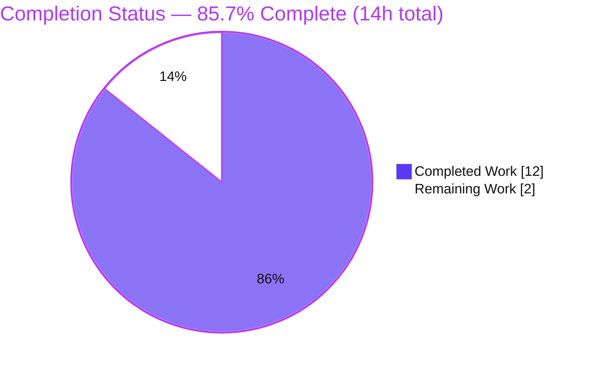
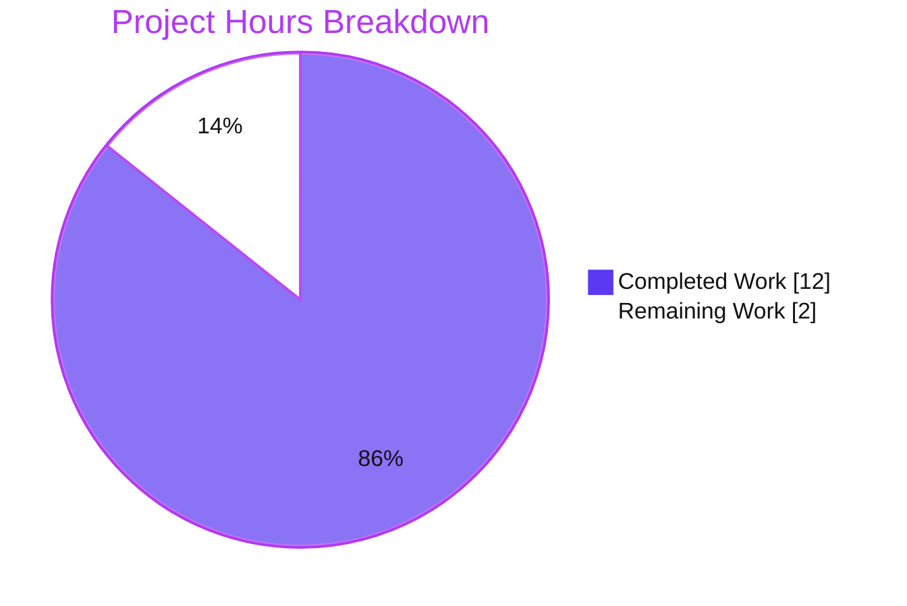
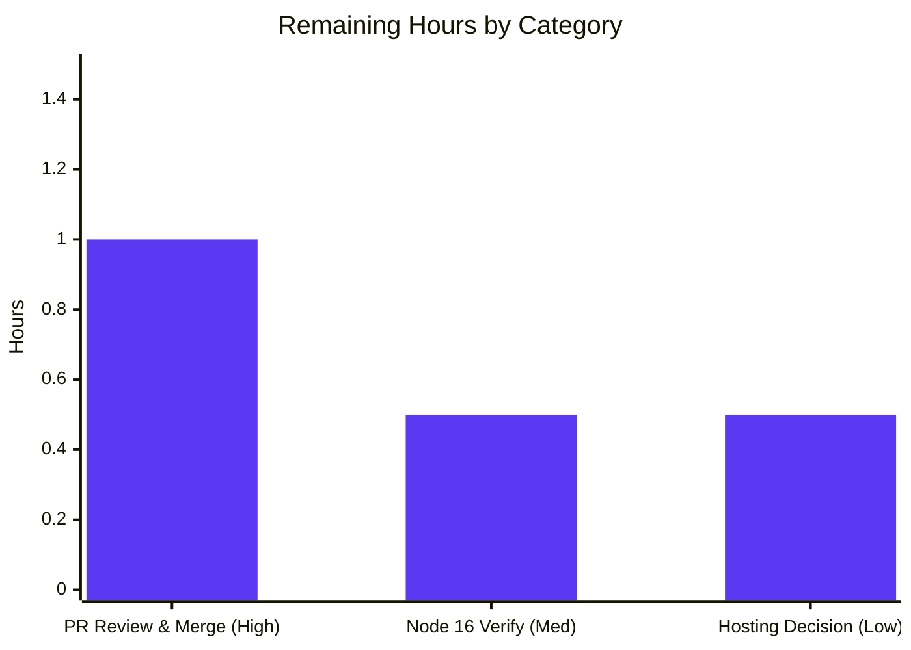

# Blitzy Project Guide — Express Backend ("Hello world" + "Good evening")

> **Brand color key:** Completed / AI Work = Dark Blue **`#5B39F3`** · Remaining / Not Completed = White **`#FFFFFF`** · Headings / Accents = Violet-Black **`#B23AF2`** · Highlight = Mint **`#A8FDD9`**

---

## 1. Executive Summary

### 1.1 Project Overview

This project adds the first server-side runtime to a repository that was previously a static **React 18 + TypeScript** single-page application. Honoring the user's intent to "add Express and a second endpoint," a minimal **Node.js/Express** backend was created at `src/backend/` as an independent sibling package to the untouched frontend (`src/web/`). It exposes two plain-text HTTP endpoints — `GET /` returning `Hello world` and `GET /good-evening` returning `Good evening` — on port `3001` (overridable via `PORT`). Target users are developers and tutorial consumers. Business impact: demonstrates an additive backend introduction with zero disruption to the existing SPA. Technical scope: 7 files, 130 inserted lines, Express 4.x on Node 16+, with a Jest + Supertest test suite.

### 1.2 Completion Status



| Metric | Value |
|--------|-------|
| **Total Hours** | **14** |
| **Completed Hours (AI + Manual)** | **12** (AI: 12 · Manual: 0) |
| **Remaining Hours** | **2** |
| **Percent Complete** | **85.7%** |

> **Completion formula (PA1, AAP-scoped):** `12 ÷ (12 + 2) = 12 ÷ 14 = 85.7%`. All Agent Action Plan (AAP) deliverables are complete; the remaining 2 hours are human path-to-production activities only (never 100% before human review).

### 1.3 Key Accomplishments

- ✅ **FR-1 — Express introduced:** `express ^4.21.2` declared and used to host HTTP endpoints (resolves to `4.22.2` on the documented Node 16.x line).
- ✅ **FR-2 — "Good evening" endpoint:** `GET /good-evening` returns exactly `Good evening` (HTTP 200).
- ✅ **FR-3 — "Hello world" preserved:** `GET /` returns exactly `Hello world` (HTTP 200), using the prompt's lowercase spelling.
- ✅ **Automated tests:** Jest + Supertest suite covering both endpoints — **2/2 passing**.
- ✅ **Security:** `X-Powered-By` header disabled; `npm audit` (production) reports **0 vulnerabilities**.
- ✅ **Testable, well-formed design:** `module.exports = app`; `listen` guarded by `require.main === module` (import opens no port).
- ✅ **Scope isolation:** `src/web/**`, `infrastructure/**`, workflows, and root `.gitignore` left untouched; backend runs as an independent Node process.
- ✅ **Conventions honored:** `src/<app>/` monorepo layout, minimalism ethos (7-line server), and the repo's no-lockfile convention.
- ✅ **Integration hooks:** additive "Backend (Express)" section in the root README and a Dependabot npm entry for `/src/backend`.

### 1.4 Critical Unresolved Issues

No critical unresolved issues were identified. All five autonomous production-readiness gates passed and zero code fixes were required during final validation.

| Issue | Impact | Owner | ETA |
|-------|--------|-------|-----|
| _None identified_ | — | — | — |

### 1.5 Access Issues

**No access issues identified.** The repository, git history, and npm registry were all fully accessible during autonomous work — a clean `npm install` completed successfully (355 packages resolved), and all git operations succeeded on branch `blitzy-e3647160-80f3-4cae-8f4c-61467fbd65fc`.

| System/Resource | Type of Access | Issue Description | Resolution Status | Owner |
|-----------------|----------------|-------------------|-------------------|-------|
| Git repository | Read/Write | None — full access | ✅ Resolved | — |
| npm registry | Read (install) | None — `npm install` exit 0 | ✅ Resolved | — |

### 1.6 Recommended Next Steps

1. **[High]** Review and merge the 10-commit feature branch (`f31bcd6..e6580c8`) into `main`. *(1.0h)*
2. **[Medium]** Verify `npm install` / `npm test` / runtime on the documented **Node 16.x** target runtime (autonomous validation ran on Node 22). *(0.5h)*
3. **[Low]** Make a production hosting decision for the long-lived Node process — the existing infrastructure serves only a static SPA and has no provision for a persistent server. *(0.5h)*

---

## 2. Project Hours Breakdown

### 2.1 Completed Work Detail

Every completed component traces to a specific AAP requirement. All hours below were delivered autonomously by Blitzy agents.

| Component | Hours | Description |
|-----------|-------|-------------|
| Express introduction + manifest + version research | 2.0 | **FR-1 / G1.** Created `src/backend/package.json` (name, version, private, main, engines, scripts, deps); selected `express ^4.21.2` and `jest ^29.7.0` after researching Express 4-vs-5 and Jest 29-vs-30 Node-16 compatibility. |
| `server.js` Express bootstrap + routes | 2.0 | **FR-2 / FR-3 / G1.** `GET /` → `Hello world`, `GET /good-evening` → `Good evening`; `module.exports = app`; `listen` guarded on `process.env.PORT || 3001`; `X-Powered-By` disabled. |
| Jest + Supertest test suite | 1.5 | **G3.** `server.test.js` asserting 200 + exact body for both endpoints (in-process, no live port). |
| Backend documentation | 1.5 | **G2.** `README.md` (prerequisites, install, run, endpoints table, verify, test) + `.env.example` (`PORT=3001`). |
| Monorepo integration edits | 1.0 | **G4.** Additive root `README.md` "Backend (Express)" section (+30/-0) + `dependabot.yml` npm block for `/src/backend`. |
| Dependency install & compatibility validation | 0.5 | Clean `npm install` (355 pkgs; express@4.22.2, jest@29.7.0, supertest@7.2.2); `npm audit` → 0 vulnerabilities. |
| Autonomous 5-gate validation & QA | 2.5 | Static/`node --check`, unit tests (2/2), runtime on ports 3001 + 4005, security review, scope & hygiene checks across all 7 files. |
| Iterative review-cycle fixes | 1.0 | M1 (Node 16 dependency compatibility + artifact hygiene), F1/F2 (engine-contract alignment), and the `X-Powered-By` security fix. |
| **Total Completed** | **12.0** | **Matches Completed Hours in §1.2.** |

### 2.2 Remaining Work Detail

Every remaining item is a path-to-production activity; there are **no incomplete AAP deliverables**.

| Category | Hours | Priority |
|----------|-------|----------|
| Human PR review & merge of feature branch to `main` | 1.0 | High |
| Confirm install/test/runtime on documented Node 16.x target runtime | 0.5 | Medium |
| Production hosting decision & planning for the Node service (AAP-deferred infra) | 0.5 | Low |
| **Total Remaining** | **2.0** | **Matches Remaining Hours in §1.2 and §7.** |

### 2.3 Hours Reconciliation

| Check | Calculation | Result |
|-------|-------------|--------|
| Completed (§2.1 sum) | 2.0+2.0+1.5+1.5+1.0+0.5+2.5+1.0 | **12.0** |
| Remaining (§2.2 sum) | 1.0+0.5+0.5 | **2.0** |
| Total (§1.2) | 12.0 + 2.0 | **14.0** |
| Completion % | 12.0 ÷ 14.0 | **85.7%** |

> **Note:** Production-hardening enhancements (process manager, `/health` endpoint, structured logging, backend CI job, TLS, CORS) are a **separate future initiative** that the AAP explicitly scoped out (§0.6.2). They are surfaced as risks/optional items in §6 and §8 but are intentionally **not** counted in the 14-hour total.

---

## 3. Test Results

All tests below originate from Blitzy's autonomous validation logs for this project and were independently re-executed during this assessment (Jest exit 0).

| Test Category | Framework | Total Tests | Passed | Failed | Coverage % | Notes |
|---------------|-----------|-------------|--------|--------|------------|-------|
| API / Integration (endpoint) | Jest 29.7.0 + Supertest 7.2.2 | 2 | 2 | 0 | 100% of routes (2/2) | In-process HTTP assertions: `GET /` → 200 `Hello world`; `GET /good-evening` → 200 `Good evening`. |
| Static / Syntax | `node --check` | 2 | 2 | 0 | n/a | `server.js` and `server.test.js` both parse cleanly (exit 0). |
| Dependency Security | `npm audit --omit=dev` | 1 | 1 | 0 | n/a | 0 vulnerabilities in the production dependency tree. |

**Aggregate:** 2 functional tests, **100% pass rate**, covering both defined routes (the complete public HTTP surface). Test command: `npm test` (`jest`). Latest run: `Test Suites: 1 passed, 1 total · Tests: 2 passed, 2 total`.

---

## 4. Runtime Validation & UI Verification

**Runtime health (backend):**

- ✅ **Operational** — Server starts via `node server.js` and binds to port `3001` (default).
- ✅ **Operational** — `GET /` → `200` with exact body `Hello world`.
- ✅ **Operational** — `GET /good-evening` → `200` with exact body `Good evening`.
- ✅ **Operational** — `PORT` override honored (verified on `4000` and `4005`); default `3001` freed when overridden.
- ✅ **Operational** — `GET /nonexistent` → `404`, confirming only the two intended routes exist.
- ✅ **Operational** — `X-Powered-By` header **absent** on all responses (security hardening active).
- ✅ **Operational** — `require('./server')` returns an Express app **without** opening a port (listen guard verified).

**API integration:** ✅ No external integrations required — endpoints return static strings; no database, cache, queue, or third-party service is involved.

**UI verification:** ⚠ **Not applicable (by design).** This is a backend-only feature returning plain-text HTTP responses; no React component, style, or screen was added or changed. The existing SPA under `src/web/` is out of scope and remains functionally unchanged (verified: zero diffs in `src/web/**` across the feature range).

---

## 5. Compliance & Quality Review

AAP deliverables cross-mapped to quality/compliance benchmarks. Fixes applied during autonomous validation are noted; there are no outstanding in-scope items.

| Benchmark / AAP Deliverable | Status | Progress | Evidence / Notes |
|-----------------------------|--------|----------|------------------|
| FR-1 — Express introduced | ✅ Pass | 100% | `express ^4.21.2` in manifest, required in `server.js`. |
| FR-2 — `GET /good-evening` → `Good evening` | ✅ Pass | 100% | Runtime + test confirm exact 200 body. |
| FR-3 — `GET /` → `Hello world` | ✅ Pass | 100% | Runtime + test confirm exact 200 body (lowercase per prompt). |
| Exact response fidelity (no JSON/HTML wrapping) | ✅ Pass | 100% | `res.send('...')` plain-text; byte-exact match. |
| Additive / non-disruptive (`src/web/**` untouched) | ✅ Pass | 100% | `git diff` shows zero changes under `src/web/`. |
| `src/<app>/` monorepo convention | ✅ Pass | 100% | Backend placed at `src/backend/` as a sibling package. |
| Minimalism ethos ("do as little as possible") | ✅ Pass | 100% | 7-line server, CommonJS, no unrequested middleware. |
| Node 16.x runtime compatibility | ✅ Pass | 100% | Express 4.x + Jest 29.x chosen specifically for Node 16 (fix M1). |
| No-lockfile convention | ✅ Pass | 100% | `package-lock.json` git-ignored & untracked (confirmed). |
| Port hygiene (avoid dev-server 3000) | ✅ Pass | 100% | Binds `process.env.PORT || 3001`. |
| Security — no framework fingerprinting | ✅ Pass | 100% | `app.disable('x-powered-by')` (security fix, commit e6580c8). |
| Zero-placeholder policy | ✅ Pass | 100% | No TODO/stub/mock; all handlers fully implemented. |
| Dependency vulnerabilities | ✅ Pass | 100% | `npm audit` (prod) → 0 vulnerabilities. |

**Fixes applied autonomously during validation:** M1 (Node 16 dependency compatibility + artifact hygiene), F1/F2 (manifest & README aligned to the frozen engine contract), and the `X-Powered-By` disable (security finding). **Outstanding in-scope items: none.**

---

## 6. Risk Assessment

Eight risks identified across the four PA3 categories. None are High-severity; none block release. Most are accepted-by-design under the AAP's minimalism scope or already mitigated.

| Risk | Category | Severity | Probability | Mitigation | Status |
|------|----------|----------|-------------|------------|--------|
| T1 — Runtime version drift: validated on Node 22, AAP targets Node 16.x | Technical | Low | Low | Run `npm install`/`npm test`/runtime on Node 16.x before deploy (task R2) | Open |
| T2 — No process manager / auto-restart (single `app.listen`) | Technical | Low | Medium | Use PM2/systemd or a container restart policy at deploy time | Accepted (out of minimal scope) |
| S1 — Jest 29 pulls deprecated transitive deps (`inflight`, `glob`) | Security | Low | Low | Dependabot `/src/backend` (added, weekly) surfaces updates | Mitigated |
| S2 — No TLS / rate-limit / auth on open plaintext endpoints | Security | Low | Low | Terminate TLS at a reverse proxy/CDN if publicly exposed; `X-Powered-By` already disabled | Accepted (static, non-sensitive strings by design) |
| O1 — No health-check endpoint / structured logging / monitoring | Operational | Low | Medium | Add `/health` + logging when integrating into a monitored environment | Accepted (out of minimal scope) |
| O2 — No backend CI job (workflows lack a `src/backend` build/test) | Operational | Low | Medium | Add a backend test job to CI when promoting to production | Accepted (AAP §0.6.2 out of scope) |
| I1 — Deployment-model mismatch: existing infra serves a static SPA only | Integration | Medium | Medium | Choose a hosting model (container/VM/serverless) — task R3 | Open (AAP deferred as separate concern) |
| I2 — No code coupling between frontend and backend | Integration | Low | Low | Add CORS/proxy config if FE↔BE integration is later required | Accepted (not requested) |

---

## 7. Visual Project Status



**Remaining hours by category (from §2.2):**



> **Integrity:** the pie chart's "Remaining Work" = **2** exactly matches §1.2 Remaining Hours and the §2.2 total; "Completed Work" = **12** matches §1.2 and the §2.1 total.

---

## 8. Summary & Recommendations

**Achievements.** The feature is functionally complete and production-ready within its defined scope. A minimal Express backend was introduced at `src/backend/` satisfying all three functional requirements — Express is now a runtime dependency (FR-1), `GET /good-evening` returns `Good evening` (FR-2), and `GET /` preserves `Hello world` (FR-3). The work is fully additive: the React SPA, infrastructure, workflows, and `.gitignore` are untouched. Automated tests pass 2/2, the production dependency tree has 0 vulnerabilities, and the server was verified at runtime on multiple ports with security hardening in place.

**Remaining gaps.** The project is **85.7% complete** (12 of 14 AAP-scoped hours). The remaining **2 hours** are exclusively human path-to-production activities: reviewing and merging the branch, confirming behavior on the documented Node 16.x runtime, and deciding how to host the long-lived Node process (the AAP explicitly deferred backend deployment infrastructure as a separate concern).

**Critical path to production:** (1) PR review & merge → (2) Node 16.x runtime confirmation → (3) hosting decision. No blocking issues or High-severity risks stand in the way.

**Success metrics:**

| Metric | Target | Actual | Status |
|--------|--------|--------|--------|
| Functional requirements met | 3/3 | 3/3 | ✅ |
| Automated tests passing | 100% | 2/2 (100%) | ✅ |
| Production vulnerabilities | 0 | 0 | ✅ |
| In-scope files delivered | 7/7 | 7/7 | ✅ |
| Unwanted scope changes | 0 | 0 | ✅ |

**Production readiness assessment:** **READY** for merge and target-runtime confirmation. Deployment/operational hardening (process manager, health checks, CI, TLS) is a deliberate, AAP-deferred follow-on initiative — recommended before exposing the service publicly, but not part of this minimal feature.

---

## 9. Development Guide

### 9.1 System Prerequisites

- **Node.js** `>= 16.0.0` (declared in `package.json` `engines`; autonomous validation ran on `v22.23.1`, which is backward-compatible).
- **npm** `>= 8.0.0` (validated on `10.9.8`).
- A verification client: `curl` (macOS/Linux/Git-Bash) **or** PowerShell `Invoke-WebRequest` (Windows).
- No database, cache, message queue, or external service is required — the endpoints return static strings.

### 9.2 Environment Setup

```bash
cd src/backend
# Optional: create a local .env to override the port (the only variable is PORT)
cp .env.example .env      # macOS/Linux/Git-Bash
# PowerShell: Copy-Item .env.example .env
```

The only configurable value is `PORT` (default `3001`).

### 9.3 Dependency Installation

```bash
cd src/backend
npm install
```

Expected: installs `express` (`4.22.2`), `jest` (`29.7.0`), and `supertest` (`7.2.2`), ~355 packages, exit code `0`. The generated `package-lock.json` is intentionally **not** committed (git-ignored per repo convention). Deprecation warnings for transitive `inflight`/`glob` (from Jest 29) are harmless.

### 9.4 Application Startup

```bash
cd src/backend
npm start          # runs: node server.js  → listens on http://localhost:3001
```

To run on a different port:

```bash
# macOS/Linux/Git-Bash
PORT=4000 npm start
# Windows PowerShell
$env:PORT=4000; npm start
```

The server is a single self-contained process with no startup ordering; it runs independently of the `src/web` SPA.

### 9.5 Verification Steps

```bash
# macOS/Linux/Git-Bash
curl http://localhost:3001/              # -> Hello world
curl http://localhost:3001/good-evening  # -> Good evening
```

```powershell
# Windows PowerShell
(Invoke-WebRequest http://localhost:3001/ -UseBasicParsing).Content              # -> Hello world
(Invoke-WebRequest http://localhost:3001/good-evening -UseBasicParsing).Content  # -> Good evening
```

Run the automated test suite:

```bash
cd src/backend
npm test           # -> Test Suites: 1 passed · Tests: 2 passed
```

### 9.6 Example Usage

| Request | Response Status | Response Body |
|---------|-----------------|---------------|
| `GET /` | `200 OK` | `Hello world` |
| `GET /good-evening` | `200 OK` | `Good evening` |
| `GET /nonexistent` | `404 Not Found` | (Express default) |

Both endpoints return `text/html; charset=utf-8` plain-text bodies with the `X-Powered-By` header disabled.

### 9.7 Troubleshooting

- **`Error: listen EADDRINUSE :3001`** — the port is in use. Start on another port: `PORT=4000 npm start` (bash) / `$env:PORT=4000; npm start` (PowerShell).
- **`Cannot find module 'express'` / `MODULE_NOT_FOUND`** — dependencies not installed. Run `npm install` inside `src/backend` first.
- **Tests can't find `./server`** — run `npm test` from the `src/backend` directory (the test `require`s `./server`).
- **`engine "node" is incompatible`** — your Node is `< 16`. Upgrade to Node `16.x` or newer.
- **Windows: `curl` behaves unexpectedly** — use `Invoke-WebRequest` (or `curl.exe`) instead of the PowerShell `curl` alias.

---

## 10. Appendices

### Appendix A — Command Reference

| Command | Directory | Purpose |
|---------|-----------|---------|
| `npm install` | `src/backend` | Install express, jest, supertest |
| `npm start` | `src/backend` | Start server (`node server.js`) on `:3001` |
| `npm test` | `src/backend` | Run Jest + Supertest suite (2 tests) |
| `node --check server.js` | `src/backend` | Static syntax check |
| `npm audit --omit=dev` | `src/backend` | Production vulnerability scan |
| `PORT=4000 npm start` | `src/backend` | Start on a custom port (bash) |
| `$env:PORT=4000; npm start` | `src/backend` | Start on a custom port (PowerShell) |

### Appendix B — Port Reference

| Port | Service | Notes |
|------|---------|-------|
| `3001` | Express backend (default) | `process.env.PORT || 3001` |
| `3000` | Webpack dev server (frontend, `src/web`) | Deliberately avoided by the backend |
| `PORT` (env) | Express backend (override) | Any free port, e.g. `4000` |

### Appendix C — Key File Locations

| File | Role |
|------|------|
| `src/backend/server.js` | Express bootstrap + both route handlers + guarded `listen` |
| `src/backend/package.json` | Manifest: `express ^4.21.2`, `engines`, `start`/`test` scripts |
| `src/backend/server.test.js` | Jest + Supertest tests for both endpoints |
| `src/backend/README.md` | Backend install/run/verify/test documentation |
| `src/backend/.env.example` | Documents the `PORT` override (`PORT=3001`) |
| `README.md` (root) | Additive "Backend (Express)" section |
| `.github/dependabot.yml` | npm updates entry for `/src/backend` (weekly) |

### Appendix D — Technology Versions

| Technology | Version (declared) | Version (resolved) |
|------------|--------------------|--------------------|
| Node.js (engines) | `>= 16.0.0` | validated on `v22.23.1` |
| npm (engines) | `>= 8.0.0` | validated on `10.9.8` |
| express | `^4.21.2` | `4.22.2` |
| jest | `^29.7.0` | `29.7.0` |
| supertest | `^7.2.2` | `7.2.2` |

### Appendix E — Environment Variable Reference

| Variable | Default | Required | Description |
|----------|---------|----------|-------------|
| `PORT` | `3001` | No | TCP port the Express server binds to (`process.env.PORT || 3001`). Documented in `.env.example`. |

### Appendix F — Developer Tools Guide

- **Runtime:** Node.js (CommonJS module system; no transpilation/build step required).
- **Web framework:** Express `4.x` — routing and HTTP response handling.
- **Test runner:** Jest `29.x` — test execution and assertions.
- **HTTP test client:** Supertest `7.x` — in-process HTTP requests against the exported app (no live port needed).
- **Dependency automation:** Dependabot — weekly npm update checks for `/src/backend`.
- **Manual verification:** `curl` or PowerShell `Invoke-WebRequest`.

### Appendix G — Glossary

| Term | Definition |
|------|------------|
| **AAP** | Agent Action Plan — the authoritative specification of scope for this feature. |
| **SPA** | Single-Page Application — the existing React frontend under `src/web/`. |
| **FR-1/2/3** | The three functional requirements: introduce Express; add `/good-evening`; preserve `/` `Hello world`. |
| **Guarded listen** | `if (require.main === module) app.listen(...)` — starts the server only when run directly, not when imported by tests. |
| **Path-to-production** | Standard human activities (review, merge, runtime confirmation, deploy decision) required to ship the delivered work. |
| **No-lockfile convention** | Repo policy (root `.gitignore`) of not committing `package-lock.json`/`yarn.lock`. |