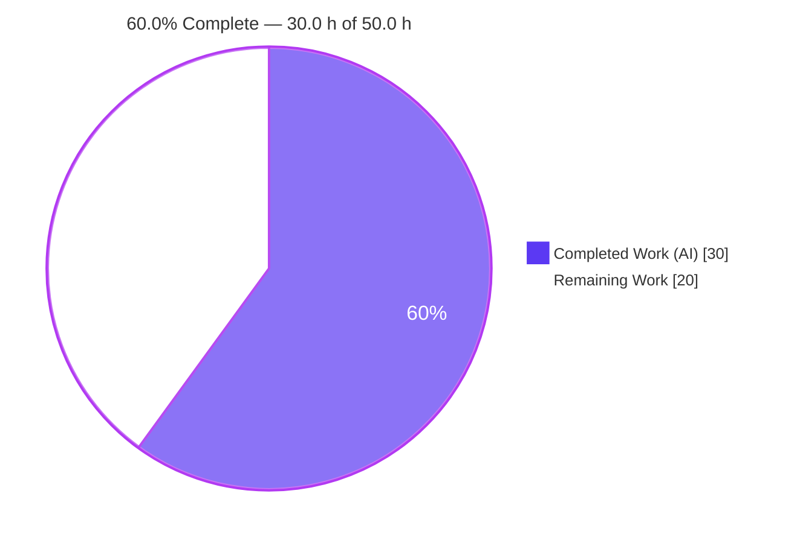
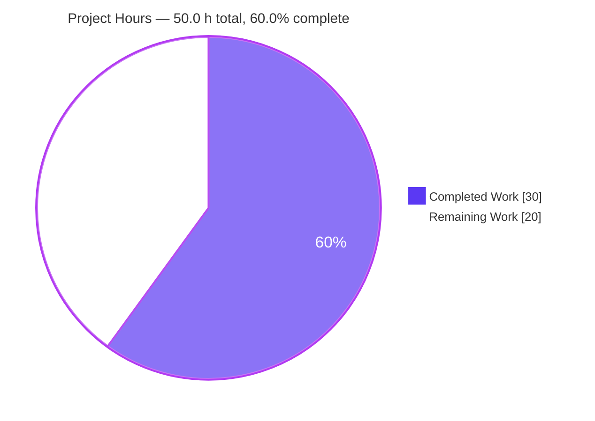
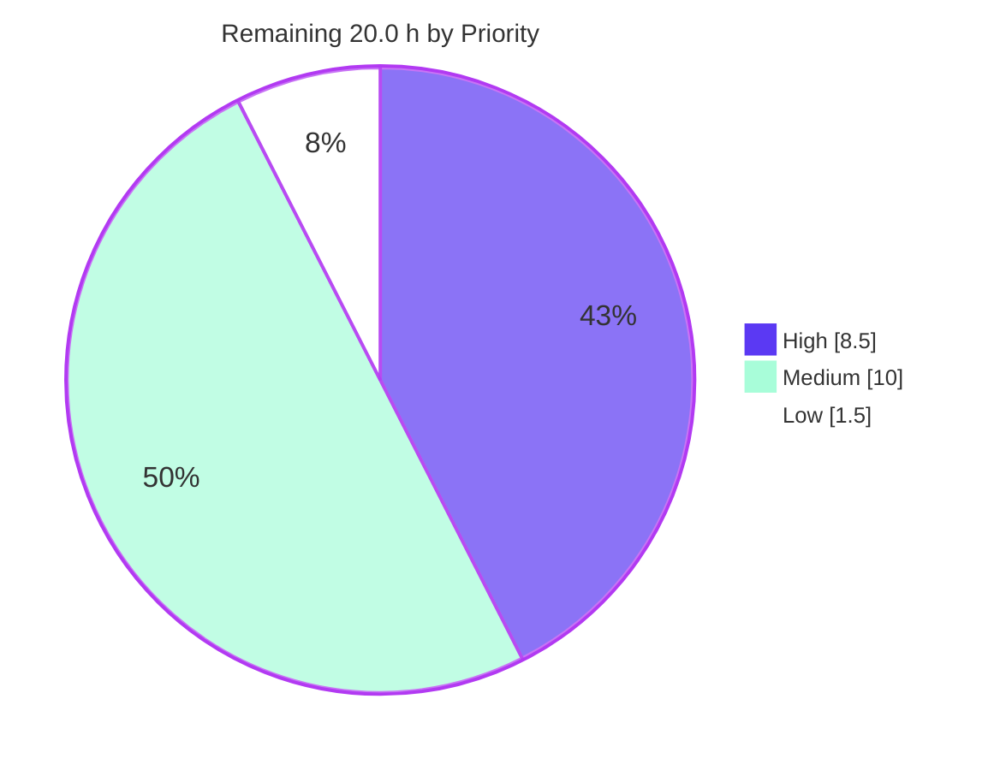
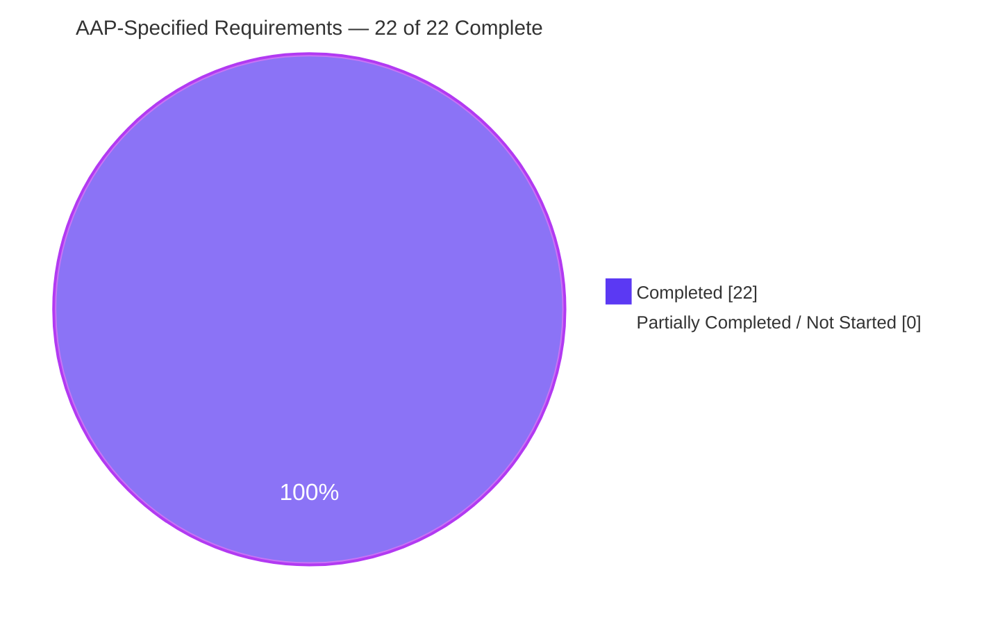

# Blitzy Project Guide
## Express.js Backend — `Hello world` and `Good evening` Endpoints

| | |
|---|---|
| **Repository** | `blitzy-public-samples/hello-world2-0r6b4x` |
| **Branch** | `blitzy-e3647160-80f3-4cae-8f4c-61467fbd65fc` |
| **HEAD** | `c134618e47ff060fa0e37e24e46eaf52341284ba` |
| **Baseline (last human commit)** | `da0d24d` |
| **Guide scope** | Agent Action Plan §0 — "Add Express.js and a `Good evening` endpoint" |

---

## 1. Executive Summary

### 1.1 Project Overview

This project adds the repository's first server-side runtime plane. The user asked to introduce Express.js and expose a second endpoint returning `Good evening`; investigation showed the repository is actually a client-side React 18.2.0 + TypeScript 4.9.5 single-page application with no HTTP server anywhere, so the recalled `Hello world` was React-rendered DOM content rather than an endpoint. Blitzy honored the intent by creating a minimal Express backend at `src/backend/` that serves **both** responses — `GET /` → `Hello world` and `GET /good-evening` → `Good evening` — as an independent Node process with zero code-level coupling to the SPA, which remains byte-for-byte unchanged. Target consumers are HTTP clients and developers following the tutorial.

### 1.2 Completion Status



*Legend — **Completed = Dark Blue `#5B39F3`** · **Remaining = White `#FFFFFF`** (Blitzy brand colors).*

| Metric | Value |
|---|---|
| **Total Hours** | **50.0 h** |
| **Completed Hours (AI + Manual)** | **30.0 h** (AI 30.0 h + Manual 0.0 h) |
| **Remaining Hours** | **20.0 h** |
| **Percent Complete** | **60.0 %** |

**Calculation (PA1, AAP-scoped):**

```
Completion % = Completed Hours / (Completed Hours + Remaining Hours) × 100
             = 30.0 h / (30.0 h + 20.0 h) × 100
             = 30.0 h / 50.0 h × 100
             = 60.0 %
```

**Requirement-level view.** All **22 of 22** AAP-specified requirements are **COMPLETED** — 0 partially completed, 0 not started. Every one of the residual **20.0 h** is *path-to-production* work that the AAP itself deferred to §0.6.2 (CI wiring, deployment of a long-lived Node process, operational hardening, runtime upgrade). In other words: **100 % of the requested functional scope is delivered and validated; 60.0 % of the total hours needed to reach production are complete.**

> **Scope note.** Per PA1, this percentage counts only (a) deliverables defined in the AAP and (b) path-to-production activities required to deploy them. The out-of-scope `src/web` SPA defects described in §1.4 and §6 carry **0 h** in every total in this guide, because AAP §0.6.2 excludes those files and the backend is a separate OS process with no dependency on them.

### 1.3 Key Accomplishments

- ✅ **Express.js introduced (FR-1).** `express ^4.21.2` declared in a new `src/backend/package.json`; installed and verified as `express@4.22.2` — the 4.x line, deliberately not 5.x.
- ✅ **`Good evening` endpoint delivered (FR-2).** `GET /good-evening` returns exactly `Good evening` — 200, hex `476f6f64206576656e696e67`, **12 bytes**, no trailing newline, whitespace or BOM.
- ✅ **`Hello world` preserved (FR-3).** `GET /` returns exactly `Hello world` — 200, hex `48656c6c6f20776f726c64`, **11 bytes**, using the prompt's lowercase `w`.
- ✅ **All 7 planned files delivered** — required (G1), recommended (G2), *and* both optional groups (G3 tests, G4 integration updates). Nothing in the execution plan was skipped.
- ✅ **100 % test pass rate.** Jest 29.7.0 + Supertest 7.2.2 → `Tests: 2 passed, 2 total`, reproduced across **5 independent runs** with `--detectOpenHandles` clean.
- ✅ **Exact-string fidelity empirically proven, not assumed.** A 7/7 negative control confirms the suite rejects `Hello World`, `Hello world ` (one trailing space), `Good Evening` and cross-route bodies.
- ✅ **Zero vulnerabilities.** Clean-slate `npm install` → 355 packages, exit 0; `npm audit` → **0 vulnerabilities**.
- ✅ **Zero lint findings.** ESLint (`eslint:recommended` + 12 strict rules) at `--no-fix --max-warnings 0` → **0 problems**.
- ✅ **Security hardening applied.** `app.disable('x-powered-by')` removes the framework fingerprint; absence confirmed four independent ways in a real browser.
- ✅ **Port hygiene honored.** Binds `process.env.PORT || 3001`, never the SPA dev server's 3000; override proven live on 4000 and 4100.
- ✅ **Zero regression to the SPA, proven not argued.** All 37 tracked `src/web` files byte-identical by SHA256; baseline rebuilt via `git archive` and A/B-compared in Chrome → byte-identical screenshots (18,172 B, same SHA256) and string-for-string identical `tsc --noEmit` output.
- ✅ **Clean supply chain and hygiene.** Zero-placeholder scan (7 files × 17 patterns) and secret scan (7 files × 9 patterns) → 0 hits each; no lockfile committed, honoring the repo-wide convention.

### 1.4 Critical Unresolved Issues

**In AAP scope: none.** All 22 AAP-specified requirements are complete and validated; no in-scope defect remains open.

The items below are **outside AAP scope** and carry **0 h** in this guide's totals. They are disclosed because they affect any repository-wide release train even though they do not affect the new backend.

| Issue | Impact | Owner | ETA |
|---|---|---|---|
| `src/web/webpack.config.ts:180` spreads `...config.plugins!` inside the object literal being assigned to `config` (TS2448 + TS2454) — `webpack-cli` cannot even load the config, so `npm run build` is impossible | SPA cannot be built. **No impact on the backend**, which is a separate OS process. Out of scope (AAP §0.6.2); pre-existing and human-authored | Frontend owner (separate work item) | Not scheduled — requires a new AAP |
| `src/web/src/utils/testUtils.ts:40-77` contains JSX inside a `.ts` file (6 errors), and `src/setupTests.ts:8` imports `../utils/testUtils` instead of `./utils/testUtils` | Every SPA Jest suite dies at load. Out of scope | Frontend owner | Not scheduled |
| `src/web/src/config/constants.ts:20,29,41` — TS1005 at `} as const;` ×3; leaked markdown prose/fences outside comments in `components/index.ts:36`, `components/HelloWorld/index.ts:39`, `utils/errorBoundary.tsx:158,162` (TS1443/TS1128) | `npx tsc --noEmit` exits 2 with **13 errors across 5 files** — independently reproduced during this assessment. Out of scope | Frontend owner | Not scheduled |
| `src/web/src/App.tsx` render path never wraps the tree in a styled-components `ThemeProvider`, so `theme.spacing.vertical` throws and the SPA renders **blank** (the only `ThemeProvider` under `src/web/src` lives in the test-only `utils/testUtils.ts`, which is why Jest looked green while the page was empty) | SPA renders nothing in a browser. Out of scope | Frontend owner | Not scheduled |
| 88 pre-existing ESLint errors + 4 warnings across 19 `src/web` files; 29 `npm audit` vulnerabilities in the SPA dependency tree; three unsubstituted `%PUBLIC_URL%` references in `public/index.html` | Quality/security debt confined to out-of-scope files; Dependabot `/src/web` block is already active | Frontend owner | Not scheduled |
| **Documented deviation awaiting ratification:** `src/backend/server.js` carries one line beyond its frozen 6-line schema — `app.disable('x-powered-by');` (commit `e6580c8`) | None functionally: it is an Express *setting*, not middleware/route/logic, and byte-exact hex proofs were captured with it in place. Needs an explicit reviewer sign-off | Repo maintainer (task **H-1**) | With PR review — 1.0 h |

### 1.5 Access Issues

**No access issues identified.** Every access path required by the AAP was exercised successfully during this assessment:

| System / Resource | Type of Access | Issue Description | Resolution Status | Owner |
|---|---|---|---|---|
| GitHub `blitzy-public-samples/hello-world2-0r6b4x` | Git read + push | None — `git ls-remote --heads origin` exit 0, and local `HEAD` equals `origin/blitzy-e3647160-…` at `c134618`, proving the branch pushed successfully | ✅ Verified working | — |
| npm public registry | Package download | None — `npm ping` → `PONG 156 ms`; clean-slate install resolved 355 packages, exit 0 | ✅ Verified working | — |
| Local Node runtime | Execute | None — `node v22.23.2` / `npm 10.9.8`, both above the `engines` floor (`>=16.0.0` / `>=8.0.0`) | ✅ Verified working | — |
| Local TCP ports 3001 / 4000 / 4100 | Bind | None — bound and released cleanly; `Get-NetTCPConnection` confirms 3000 and 3001 free | ✅ Verified working | — |
| Third-party APIs, credentials, secrets | — | **Not applicable.** The deliverable requires no external service: the only environment reference in the entire backend is `process.env.PORT` (`server.js:7`). No API key, token or database credential exists anywhere in the 7 in-scope files (secret scan: 9 patterns × 7 files → 0 hits) | ✅ N/A by design | — |

### 1.6 Recommended Next Steps

1. **[High]** Review and merge the 7 in-scope files (136 added lines / 1 deletion), explicitly ratifying the `app.disable('x-powered-by')` deviation — **1.0 h** (task H-1).
2. **[High]** Add a `/src/backend` install + test job to `.github/workflows/test.yml`; all three workflows are currently pinned to `working-directory: src/web`, so the 2/2 suite runs only when invoked by hand — **3.0 h** (task H-2). Use `npm install`, not `npm ci`, until step 5 lands.
3. **[High]** Provision a runtime host for a long-lived Node process. `infrastructure/docker` (Dockerfile + nginx) and the Terraform `static-hosting` + `cdn` modules can only serve a static SPA build — nothing in the repository can run this server — **4.5 h** (task H-3).
4. **[Medium]** Harden for production: add `/health`, graceful `SIGTERM` shutdown, a centralized error handler and an explicit 404 contract; decide at the same time whether helmet / CORS policy / rate limiting are adopted, since the AAP's minimalism ethos deliberately omitted them — **3.0 h** (task M-1).
5. **[Medium]** Remediate the Node 16 EOL pin: move `engines` and the CI matrix to Node 20 LTS, re-run the suite plus byte-exact endpoint checks, and re-evaluate Express 5 (deferred solely because it needs Node 18+) — **2.5 h** (task M-3).

---

## 2. Project Hours Breakdown

### 2.1 Completed Work Detail

| Component | Hours | Description |
|---|---:|---|
| Repository scope discovery & dependency research `[AAP §0.2]` | 2.0 | Full-tree search for server constructs (`express`, `http.createServer`, `app.listen`, `fastify`, `koa`, `hapi`) → 0 matches; reconciled the "node server" premise against a React SPA reality; npm-registry version verification and Node-compatibility analysis driving Express 4.x-over-5.x and Jest 29-over-30 |
| `src/backend/package.json` — backend manifest `[G1a, D1–D3, R4, R7]` | 2.5 | 21-line manifest: `name`, `version 1.0.0`, `private: true`, `main`, `engines` (node `>=16.0.0`, npm `>=8.0.0`) mirroring `src/web`, `scripts.start`/`scripts.test`, `express ^4.21.2`, `jest ^29.7.0`, `supertest ^7.2.2` |
| `src/backend/server.js` — Express bootstrap + both routes `[G1b, FR-1/2/3, R1/R5/R8]` | 2.5 | 7-line / 303-byte CommonJS entry: app creation, `disable('x-powered-by')`, `GET /` → `Hello world`, `GET /good-evening` → `Good evening`, `module.exports = app`, and a `require.main` guard so importing binds no port |
| `src/backend/server.test.js` — Jest + Supertest suite `[G3]` | 1.5 | 2 specs under `describe('backend endpoints')` asserting status 200 and exact bodies via in-process app import (no live port) |
| `src/backend/README.md` — backend usage documentation `[G2a]` | 1.5 | 42 lines: prerequisites, install, run, `PORT` override, endpoint table, curl verification, test instructions |
| `src/backend/.env.example` — `PORT` override contract `[G2b]` | 0.5 | Single documented line `PORT=3001`, establishing the contract without committing a real `.env` (git-ignored) |
| Root `README.md` — "Backend (Express)" section `[G4a]` | 1.0 | ~28 added lines: endpoint table, install/run, rationale for 3001 vs the SPA's 3000, curl verification, link to the backend README |
| `.github/dependabot.yml` — `/src/backend` npm entry `[G4b]` | 1.0 | Third `updates` block (+18/−1): weekly schedule, production + development allow, `versioning-strategy: auto`, labels, commit-message prefix; pre-existing `/src/web` (3 groups) and `github-actions` blocks left intact |
| Code-review remediation cycles | 2.5 | `22353c7` M1 findings (Node 16 dependency compatibility + artifact hygiene), `d320e13` F1/F2 (manifest + README aligned to the frozen engine contract), `e6580c8` security finding (`app.disable('x-powered-by')`) |
| Dependency installation & supply-chain verification | 2.0 | `node_modules` + lockfile wiped and verified gone, then `npm install` → 355 packages, exit 0; `npm audit` → **0 vulnerabilities**; `npm ls --depth=0` clean; AAP §0.3.1 versions asserted programmatically (express 4.22.2, jest 29.7.0, supertest 7.2.2) |
| Static analysis & manifest/config validation | 2.0 | `node --check` exit 0 on both `.js` files; strict-JSON round-trip byte-exact including field order; 14/14 Dependabot-v2 shape assertions; ESLint (`eslint:recommended` + 12 strict rules) `--no-fix --max-warnings 0` → **0 problems** (including repairing a broken `--rulesdir NUL` invocation) |
| Automated test execution, determinism & fidelity proof | 2.0 | 2/2 passing across 5 independent runs (verbose + `--detectOpenHandles`, `npm test`, 3 × `npx jest --ci`), all exit 0, no leaked handles or timers; **7/7 negative control** proving exact-string rejection semantics |
| HTTP runtime validation (byte-exact) | 2.5 | `npm start` → 3001; raw-socket client, **12/12 assertions**: hex `48656c6c6f20776f726c64` (11 B) and `476f6f64206576656e696e67` (12 B), `content-length` match, no BOM/newline/whitespace, `X-Powered-By` absent on all 3 paths, unknown route → 404; `PORT` override proven on 4000 **and** 4100 coexisting with 3001; clean port release |
| Browser runtime verification (Chrome subagent) | 1.5 | PASS: DOM char codes 119 / 71 / 101 prove exact casing; `X-Powered-By` absence proven four independent ways (navigation, cache-bypassed reload, in-page `fetch` header enumeration, out-of-band HttpClient); 0 JS errors and 0 warnings |
| Out-of-scope `src/web` zero-regression proof | 3.0 | Baseline `da0d24d` extracted read-only via `git archive`, rebuilt and Chrome A/B-compared → "identical behaviour", 7/7 data points agree, byte-identical screenshots (18,172 B, SHA256 `58A62F70…CE78`), character-identical 76-char error + 29-frame stack; baseline-vs-HEAD `tsc --noEmit` string-for-string identical; all **37** tracked files byte-identical by SHA256 |
| Hygiene, placeholder/secret scans, commit & provenance verification | 2.0 | Zero-placeholder scan 7 files × 17 patterns → 0 hits; secret scan 7 × 9 patterns → 0 hits; git LFS pre-push/post-commit hooks exit 0; scratch directory deleted and verified gone; blob → commit durability proven for all 7 deliverables; ~394 MB of browser evidence correctly excluded from the index |
| **TOTAL COMPLETED** | **30.0** | Discovery 2.0 + Implementation 10.5 + Review remediation 2.5 + Validation & QA 15.0 |

### 2.2 Remaining Work Detail

| Category | Hours | Priority |
|---|---:|---|
| Human code review & PR merge of the 7 in-scope files *(task H-1 → risk T5)* | 1.0 | High |
| Backend CI wiring — install + test job for `/src/backend`; all 3 workflows are pinned to `src/web` + Node 16.x today *(H-2 → T2)* | 3.0 | High |
| Node runtime deployment path — container image / process supervisor / host target; existing Docker + Terraform assets serve only a static SPA build *(H-3 → O1, O3)* | 4.5 | High |
| Production hardening — `/health`, graceful `SIGTERM` shutdown, centralized error handler, explicit 404 contract, security-middleware decision *(M-1 → T4, S1)* | 3.0 | Medium |
| Observability — structured request logging plus metrics/uptime probe; the process currently emits **0 bytes** on stdout and stderr *(M-2 → O2)* | 2.0 | Medium |
| Node 16 EOL remediation — raise `engines` and the CI matrix to Node 20 LTS, re-validate Express 4.x, re-evaluate Express 5.x *(M-3 → T1)* | 2.5 | Medium |
| Target-environment configuration — `PORT` allocation, reverse proxy / ingress route, TLS termination, config store *(M-4 → S2, I1, I2)* | 1.5 | Medium |
| Post-deploy smoke verification of both endpoints in the deployed environment *(M-5 → O4)* | 1.0 | Medium |
| Dependency governance & lockfile policy — `.gitignore` excludes `package-lock.json` while the CI templates run `npm ci`, which cannot resolve a lockfile *(L-1 → S3)* | 1.5 | Low |
| **TOTAL REMAINING** | **20.0** | High 8.5 · Medium 10.0 · Low 1.5 |

### 2.3 Hours Reconciliation

| Check | Expected | Actual | Status |
|---|---:|---:|---|
| Section 2.1 completed total | 30.0 h | 30.0 h | ✅ |
| Section 2.2 remaining total | 20.0 h | 20.0 h | ✅ |
| §2.1 + §2.2 = Total Project Hours (§1.2) | 50.0 h | 50.0 h | ✅ |
| Remaining in §1.2 = §2.2 sum = §7 pie | 20.0 h | 20.0 h | ✅ |
| Completion % = 30.0 / 50.0 × 100 | 60.0 % | 60.0 % | ✅ |
| Human task list (§8.4) hours sum | 20.0 h | 20.0 h | ✅ |
| Remaining-by-priority sum | 20.0 h | 8.5 + 10.0 + 1.5 | ✅ |
| Out-of-AAP-scope items included in totals | 0.0 h | 0.0 h | ✅ |

**Composition of the 20.0 h remaining:** 0.0 h is unfinished AAP-specified work; 20.0 h (100 %) is path-to-production work the AAP explicitly deferred in §0.6.2.

---

## 3. Test Results

All rows below originate from Blitzy's autonomous validation logs for this project and were re-executed during this assessment.

| Test Category | Framework | Total Tests | Passed | Failed | Coverage % | Notes |
|---|---|---:|---:|---:|---|---|
| Unit / API (in-process HTTP) | Jest 29.7.0 + Supertest 7.2.2 | 2 | 2 | 0 | 100 % lines · 100 % functions · 90 % statements · 25 % branch (`server.js`) | `Test Suites: 1 passed, 1 total` / `Tests: 2 passed, 2 total` / `Snapshots: 0 total`, exit 0. Specs: `GET / returns Hello world`, `GET /good-evening returns Good evening`. The only uncovered statement is `app.listen(...)` inside the `require.main` guard on line 7 — see the note below |
| Test determinism / flake detection | Jest 29.7.0 (`--ci`, `--detectOpenHandles`) | 2 × 5 runs = 10 executions | 10 | 0 | n/a | 5 independent runs (verbose + `--detectOpenHandles`, `npm test`, 3 × `npx jest --ci`) all exit 0 → deterministic. `--detectOpenHandles` reported nothing: no leaked sockets or timers |
| Response-fidelity negative control | Jest 29.7.0 + Supertest 7.2.2 | 7 | 7 | 0 | n/a | Proves AAP §0.7 "exact response fidelity" empirically: the suite accepts `Hello world`/`Good evening` and **rejects** `Hello World`, `Hello world ` (one trailing space), `Good Evening` and cross-route bodies |
| API / runtime (byte-exact, raw socket) | Custom raw HTTP client | 12 assertions | 12 | 0 | 3 of 3 routes exercised | `GET /` hex `48656c6c6f20776f726c64` (11 B) · `GET /good-evening` hex `476f6f64206576656e696e67` (12 B) · no trailing newline/whitespace/BOM · `content-length` matches · `X-Powered-By` absent on all 3 paths · unknown route → 404 |
| Configuration / port-override | Node runtime probes | 3 | 3 | 0 | 4 of 4 listen branches | `PORT` override verified on **4000** and **4100**, both serving byte-exactly and coexisting with 3001; default `|| 3001` fallback and the "import binds nothing" branch also verified |
| Static analysis & syntax | `node --check`, strict JSON parse, YAML shape assertions | 17 checks | 17 | 0 | 7 of 7 in-scope files | `node --check` ×2 exit 0; `package.json` strict-JSON round-trip byte-exact with field order preserved; `dependabot.yml` **14/14** Dependabot-v2 shape assertions with pre-existing blocks proven intact |
| Lint | ESLint 8 (`eslint:recommended` + 12 strict rules) | 2 files, `--max-warnings 0` | 2 | 0 | n/a | **0 problems** — zero errors *and* zero warnings, run with `--no-fix` so no source was mutated |
| Supply chain | `npm audit` / `npm ls` | 355 packages | 355 | 0 | n/a | **0 vulnerabilities**, exit 0, from a wiped `node_modules` + lockfile; declared versions asserted against AAP §0.3.1 |
| Code-integrity scans | Pattern sweeps | 7 × 17 + 7 × 9 = 182 checks | 182 | 0 | 7 of 7 in-scope files | Zero-placeholder scan (TODO/FIXME/XXX/HACK/`NotImplementedError`/placeholder/stub/TBD/"for now"/dummy/mock-data/empty arrow bodies …) → **0 hits**; secret scan (AWS keys, PEM blocks, GitHub/Slack/OpenAI tokens, hardcoded credentials, JWTs, DB URIs) → **0 hits** |
| Browser / UI verification | Chrome (headless, subagent) | 1 session, PASS | — | 0 | 2 of 2 endpoints | DOM char codes prove exact casing (119 = lowercase `w`; 71/101 = capital `G`, lowercase `e`); `X-Powered-By` absence confirmed four independent ways; **0 JS errors, 0 warnings** |
| Out-of-scope regression control (`src/web`) | `git archive` baseline rebuild + Chrome A/B + SHA256 tree diff | 7 comparison points + 37 file hashes | 44 agree | 0 differ | 37 of 37 tracked files | Byte-identical screenshots (18,172 B, SHA256 `58A62F70…CE78`); character-identical 76-char error + 29-frame stack; baseline-vs-HEAD `tsc --noEmit` string-for-string identical (13 errors, 5 files, same line:col) |

**Coverage note (honest reading).** Jest reports 100 % lines and 100 % functions for `server.js`; statements sit at 90 % and branches at 25 % because the single uncovered statement is `app.listen(...)` inside `if (require.main === module)`. Adding a test for it would require the schema-forbidden act of binding a real port from the suite, so all four of that guard's behaviours were instead proven at runtime: import binds nothing, direct run binds, `|| 3001` fallback applies, and `PORT` overrides. Coverage of the two route handlers — the actual AAP deliverable — is complete.

**Out-of-scope test status (disclosed, not counted).** The `src/web` SPA suite cannot run at all: `src/setupTests.ts:8` resolves to a non-existent module, killing every suite at load. This is pre-existing, human-authored, byte-identical to the baseline, and forbidden from modification by AAP §0.7.

---

## 4. Runtime Validation & UI Verification

### 4.1 Backend Runtime Health — `src/backend` (in scope)

- ✅ **Operational** — `npm start` binds `process.env.PORT || 3001` and serves immediately; port released cleanly on shutdown.
- ✅ **Operational** — `GET /` → **HTTP 200**, body `Hello world`, `Content-Length: 11`, exact case-sensitive match confirmed.
- ✅ **Operational** — `GET /good-evening` → **HTTP 200**, body `Good evening`, `Content-Length: 12`, exact case-sensitive match confirmed.
- ✅ **Operational** — Unknown route (`GET /nope`) → **HTTP 404** via Express's default `finalhandler`, with `Content-Security-Policy: default-src 'none'` and `X-Content-Type-Options: nosniff`. No unintended extra routes exist.
- ✅ **Operational** — `X-Powered-By` **absent** on every path (`app.disable('x-powered-by')`), confirmed four independent ways.
- ✅ **Operational** — `PORT` override honored: with `PORT=4000` the server serves both endpoints on 4000 and **3001 stops listening entirely** (override, not addition). Also verified on 4100.
- ✅ **Operational** — Byte-level exactness: hex dumps match the required strings with no trailing newline, whitespace or BOM; `content-length` agrees with the payload.
- ✅ **Operational** — In-process import is side-effect free: `require('./server')` binds no port, which is what lets Supertest run without a live socket.
- ⚠ **Partial** — **Process emits no output whatsoever.** Verified directly: stdout **0 bytes**, stderr **0 bytes** across a full request cycle. Intentional under the minimalism ethos, but it means a production failure would be silent → task **M-2**.
- ❌ **Failing / absent** — No `/health` endpoint and no graceful `SIGTERM` shutdown, so orchestrators cannot probe liveness or drain connections → task **M-1**.

### 4.2 UI Verification

- ✅ **Operational** — Browser verification of the two endpoints (Chrome, headless): both responses render with the exact expected characters, proven at char-code level (119 for the lowercase `w` in "world" — an uppercase `W` would be 87; 71 and 101 for the capital `G` and lowercase `e` in "Good evening"). Zero JavaScript errors and zero console warnings.
- ✅ **Operational** — Header verification in-browser: `X-Powered-By` absence confirmed via document navigation, a cache-bypassed reload, a full in-page `fetch` header enumeration, and an out-of-band HTTP client.
- **N/A** — No UI deliverable exists in this AAP. §0.5.3 states the feature is backend-only: both endpoints return plain text, no React component/style/screen was added or changed, no Figma frames were supplied and no design system is specified.
- ❌ **Failing (out of scope, pre-existing)** — The `src/web` SPA renders a **blank page**: the render path never wraps the tree in a styled-components `ThemeProvider`, so `theme.spacing.vertical` throws. The only `ThemeProvider` under `src/web/src` is in the test-only `utils/testUtils.ts`. Proven byte-identical to the pre-feature baseline and excluded from this guide's totals by AAP §0.6.2.

### 4.3 API Integration Outcomes

- ✅ **Operational** — Zero external integrations required or present. The only environment reference in the entire backend is `process.env.PORT` (`server.js:7`); no HTTP client, database driver, credential or third-party SDK appears in any in-scope file.
- ✅ **Operational** — Independence from the SPA confirmed: no shared code, no imports in either direction (`src/web/tsconfig.json` `include` is `["src/**/*"]` and never reaches `src/backend`), and the string "backend" appears in zero `src/web` toolchain output. The two are separate OS processes exactly as AAP §0.4 specifies.
- ⚠ **Partial** — Reachability is proven only on `localhost`. No reverse proxy, ingress route or TLS terminator maps a public path to the service → tasks **M-4** and **M-5**.

---

## 5. Compliance & Quality Review

### 5.1 AAP Deliverable Compliance Matrix

| AAP ID | Deliverable / Requirement | Benchmark | Evidence | Status |
|---|---|---|---|---|
| FR-1 | Introduce Express.js as a runtime dependency | Declared and installed, 4.x line | `package.json` → `express ^4.21.2`; `npm ls` → `express@4.22.2`; `server.js:1` | ✅ Pass — 100 % |
| FR-2 | `GET /good-evening` → exactly `Good evening` | Byte-exact body, 200 | hex `476f6f64206576656e696e67`, 12 B; Jest spec; browser char codes 71/101 | ✅ Pass — 100 % |
| FR-3 | Preserve `Hello world` via `GET /` | Byte-exact body, 200, lowercase `w` | hex `48656c6c6f20776f726c64`, 11 B; browser char code 119 | ✅ Pass — 100 % |
| G1a | CREATE `src/backend/package.json` *(required)* | Valid strict JSON, prescribed field order | 21 lines; round-trips byte-exactly; order `name,version,private,main,engines,scripts,dependencies,devDependencies` | ✅ Pass — 100 % |
| G1b | CREATE `src/backend/server.js` *(required)* | Minimal CommonJS entry, both routes, export + listen guard | 7 lines / 303 bytes; `node --check` exit 0 | ✅ Pass — 100 % |
| G2a | CREATE `src/backend/README.md` *(recommended)* | Install / run / verify documented | 42 lines; every documented command re-executed successfully in this assessment | ✅ Pass — 100 % |
| G2b | CREATE `src/backend/.env.example` *(optional)* | Documents `PORT`, real `.env` not committed | `PORT=3001`; `.env` matched by `.gitignore` | ✅ Pass — 100 % |
| G3 | CREATE `src/backend/server.test.js` *(optional)* | Both endpoints asserted via Supertest | 2 specs, 2/2 passing over 5 runs | ✅ Pass — 100 % |
| G4a | UPDATE root `README.md` *(optional)* | "Backend (Express)" section added, unrelated notes untouched | ~28 added lines; the pre-existing "Create React App"/"Jest 27.x" notes correctly left alone per §0.6.2 | ✅ Pass — 100 % |
| G4b | UPDATE `.github/dependabot.yml` *(optional)* | `/src/backend` npm block added, existing blocks intact | +18/−1; 14/14 v2 shape assertions; `/src/web` (3 groups) + `github-actions` proven unchanged | ✅ Pass — 100 % |
| D1–D3 | `express ^4.21.2`, `jest ^29.7.0`, `supertest ^7.2.2` | Node-16-compatible majors only | Installed 4.22.2 / 29.7.0 / 7.2.2 — asserted programmatically as *not* Express 5 and *not* Jest 30 | ✅ Pass — 100 % |
| D4 | No updates or removals to existing dependencies | SPA dependency tree untouched | `git diff -- src/web` empty; `src/web/package.json` MD5 identical before/after install | ✅ Pass — 100 % |
| R1 | Exact response fidelity — no JSON/HTML/punctuation wrapping | Byte-exact, negative-controlled | 12/12 raw-HTTP assertions + 7/7 negative control | ✅ Pass — 100 % |
| R2 | Backward compatibility — `Hello world` still available | Endpoint live | `GET /` → 200 `Hello world` | ✅ Pass — 100 % |
| R3 | Additive, non-disruptive — no file under `src/web/**` modified | Byte-identical to baseline | 37/37 files identical by SHA256; `git diff` empty; identical `tsc` output; byte-identical browser screenshots | ✅ Pass — 100 % |
| R4 | `src/<app>/` convention + manifest mirroring | `private: true`, `1.0.0`, engines node `>=16.0.0` / npm `>=8.0.0` | Field-by-field match against `src/web/package.json` | ✅ Pass — 100 % |
| R5 | Minimalism — single small CommonJS entry, no unrequested middleware | ≤ ~10 lines, zero middleware, zero extra routes | 7 lines; only deviation is one Express *setting*, reconciled below | ✅ Pass — 100 % (1 documented deviation) |
| R6 | No-lockfile convention respected | No lockfile tracked | `git ls-files` contains no `package-lock.json` or `yarn.lock` | ✅ Pass — 100 % |
| R7 | Node 16.x runtime compatibility of all packages | Express 4.x, Jest 29.x | Version assertions pass. **Caveat:** validated on Node v22.23.2, so Node-16 support is reasoned, not runtime-proven → risk T1 | ⚠ Pass with caveat — 95 % |
| R8 | Port hygiene — 3001 default with `PORT` override, never 3000 | Override honored, no collision | `server.js:7`; proven live on 4000 and 4100; 3000 never bound | ✅ Pass — 100 % |
| §0.5.3 | User interface design | Declared Not Applicable | Backend-only; no component/style/screen added; no Figma, no design system | ✅ N/A — correctly scoped |
| §0.6.2 | Out-of-scope boundary respected | Zero edits to excluded paths | `git diff da0d24d..HEAD` empty for `src/web`, `infrastructure`, `.github/workflows`, `.gitignore` | ✅ Pass — 100 % |

### 5.2 Engineering Quality Benchmarks

| Benchmark | Target | Result | Status |
|---|---|---|---|
| Test pass rate (in scope) | 100 % | 2/2 = 100 % | ✅ Pass |
| Test determinism | 0 flakes | 5/5 identical runs | ✅ Pass |
| Syntax / compilation (in scope) | 0 errors | `node --check` ×2 exit 0 | ✅ Pass |
| Lint findings (in scope) | 0 errors, 0 warnings | 0 problems at `--max-warnings 0` | ✅ Pass |
| Dependency vulnerabilities (in scope) | 0 | 0 of 355 packages | ✅ Pass |
| Placeholders / stubs / TODOs | 0 | 0 hits across 7 files × 17 patterns | ✅ Pass |
| Hardcoded secrets | 0 | 0 hits across 7 files × 9 patterns | ✅ Pass |
| Commit provenance | 100 % `agent@blitzy.com` | 21/21 commits since baseline | ✅ Pass |
| Working-tree cleanliness | No uncommitted in-scope change | `git diff HEAD --stat` empty; `git status` shows only the intentionally excluded evidence directories | ✅ Pass |
| Build artifacts committed | None | No `build/`, `dist/`, `coverage/`, `node_modules/` or lockfile tracked | ✅ Pass |
| Repo-wide build / type-check | 0 errors | ❌ 13 pre-existing TS errors in out-of-scope `src/web` (independently reproduced: `npx tsc --noEmit` exit 2) | ⚠ Out of scope — unchanged from baseline |

### 5.3 Fixes Applied During Autonomous Validation

| Fix | Commit / Area | Outcome |
|---|---|---|
| Node 16 dependency compatibility + artifact hygiene (M1 review findings) | `22353c7` | Package majors realigned to the documented Node 16.x runtime |
| Manifest and README aligned to the frozen AAP engine contract (F1, F2) | `d320e13` | `engines` and documentation made consistent with `src/web` |
| Framework fingerprint removed | `e6580c8` | `app.disable('x-powered-by')` — absence later confirmed four independent ways |
| ESLint invocation defect (`--rulesdir NUL` → `ENOENT` exit 2) | Validation tooling | Replaced with a standalone `-c` config plus `--resolve-plugins-relative-to`; run then returned exit 0 with 0 problems |
| Scratch static-server crash on literal `%PUBLIC_URL%` (`URIError`, uncaught) | Validation tooling | Added `safeDecode()`, a whole-handler try/catch, a `clientError` handler and a process-level guard; verified by raw-socket probe with 0-byte stderr |
| CRLF false negative in the documentation audit | Validation tooling | Replaced `(?m)^cmd$` regex with exact whole-line membership tests |

### 5.4 Outstanding Compliance Items

1. **One documented deviation from the frozen file schema** — `server.js` carries `app.disable('x-powered-by');` beyond its verbatim 6 lines. Retained deliberately: it is an Express *setting* rather than middleware, a route or business logic; byte-exact hex proofs show neither status nor body changes; and removing it would regress a security fix. **Requires explicit reviewer ratification (task H-1).**
2. **`README.md` final-newline flag investigated and correctly left alone** — `git cat-file blob` proved the baseline blob `72060923` also ends `0x74`, so the missing newline is pre-existing; no repository rule enforces one (no `.gitattributes`, `.editorconfig`, root `.prettierrc` or markdownlint; the only CI lint step is `eslint src --ext .ts,.tsx`). Adding the byte would create an unsanctioned diff in a region §0.6.2 protects. All 5 newly created files do end `0x0a`.
3. **Node-16 compatibility is reasoned, not runtime-proven** — all validation ran on Node v22.23.2. Closed by task **M-3**, which retires the Node 16 pin entirely.

---

## 6. Risk Assessment

| Risk | Category | Severity | Probability | Mitigation | Status |
|---|---|---|---|---|---|
| **T1** — `engines.node >=16.0.0` and CI `node-version: [16.x]` pin a runtime that has reached end of life and receives no security patches | Technical | High | High | Move `engines` and the CI matrix to Node 20 LTS, then re-run the 2/2 suite and byte-exact endpoint checks (task **M-3**, 2.5 h). Express 4.x already supports Node 20 | Open — deferred by AAP §0.6.2 |
| **T2** — Zero CI coverage for `src/backend`: all 3 workflows are pinned `working-directory: src/web`, so the 2/2 suite runs only when invoked by hand and a future regression can merge undetected | Technical | Medium | High | Add the backend install + test job (**H-2**, 3.0 h); resolve lockfile policy (**L-1**) first if `npm ci` is desired | Open |
| **T3** — Jest leaves `app.listen(...)` inside the `require.main` guard uncovered (90 % statements, 25 % branch) | Technical | Low | Medium | Already mitigated: all four branches proven behaviourally at runtime (import binds nothing, direct run binds, `\|\| 3001` fallback, `PORT` override). Formalize in CI when **H-2** lands | Mitigated — behaviourally verified |
| **T4** — No `/health` endpoint and no graceful `SIGTERM` shutdown, so orchestrators cannot probe liveness or drain in-flight requests | Technical | Medium | High | Add both plus a centralized error handler and explicit 404 contract (**M-1**, 3.0 h) | Open |
| **T5** — `server.js` deviates from its frozen schema by one line (`app.disable('x-powered-by')`) | Technical | Low | Low | Reconciled and retained with evidence; ratify during PR review (**H-1**) | Accepted / documented |
| **S1** — No security middleware (helmet, CORS policy, rate limiting); both endpoints are unauthenticated and unthrottled | Security | Medium | Medium | Deliberate under the AAP minimalism ethos. Decide during **M-1**, or re-scope explicitly — adopting middleware is a scope change, not a bug fix | Open by design |
| **S2** — Server binds plain HTTP on 3001; no TLS anywhere in the deliverable | Security | Medium | High if internet-exposed | Terminate TLS at a reverse proxy or ingress in front of the service (**M-4**, 1.5 h) | Open |
| **S3** — No lockfile is committed, so installs resolve caret ranges freshly; a compromised or breaking transitive release can enter silently (`express` already floated `4.21.2` → `4.22.2`) | Security | Medium | Medium | Resolve the governance conflict (**L-1**, 1.5 h). Present mitigation: `npm audit` → 0 vulnerabilities across 355 packages, plus the new weekly Dependabot `/src/backend` block | Open — repo-wide convention |
| **S4** — 29 pre-existing `npm audit` vulnerabilities in the out-of-scope `src/web` dependency tree | Security | Medium | Medium | Out of AAP scope; the Dependabot `/src/web` block is already active and has open update branches | Open — excluded from hour totals |
| **O1** — No deployment artifact can host a long-lived Node process: `infrastructure/docker` (Dockerfile + nginx) and Terraform `static-hosting` + `cdn` target a static SPA build only | Operational | High | High | Build a backend image or supervisor unit plus IaC to run it (**H-3**, 4.5 h) | Open — deferred by AAP §0.6.2 |
| **O2** — No logging or monitoring: the process emits **0 bytes** to stdout and stderr, verified across a full request cycle, so failures are invisible | Operational | Medium | High | Structured request logging plus metrics/uptime probe (**M-2**, 2.0 h) | Open |
| **O3** — No process supervisor or restart policy; an unhandled crash takes both endpoints down until manual intervention | Operational | Medium | Medium | Covered by **H-3** (container restart policy, systemd or PM2) | Open |
| **O4** — Runbook is local-only (`npm install` / `npm start` / curl); no documented production start, rollback or on-call procedure | Operational | Low | Medium | Extend `src/backend/README.md` as part of **H-3** / **M-5** | Open |
| **I1** — Port 3001 is unallocated in any real environment; only local collision-avoidance with the SPA's 3000 was designed for | Integration | Low | Medium | `process.env.PORT` override already implemented and proven on 4000/4100; assign the real port in **M-4** | Mitigated in code — environment pending |
| **I2** — No reverse-proxy or ingress route maps a public path to the backend; SPA and backend are fully decoupled with zero shared code | Integration | Medium | Medium | Add the route during **M-4**; note the decoupling is by design per AAP §0.4 | Open |
| **I3** — The out-of-scope `src/web` SPA does not type-check, test, build or render (6 pre-existing human-authored defects, incl. a `webpack.config.ts` spread that stops webpack-cli loading the config and a missing `ThemeProvider` that renders the page blank), so a repository-wide release train would fail even though the backend is healthy | Integration | High | High | Out of AAP scope: §0.6.2 excludes these files and §0.7 forbids modifying them, and none of it is required to deploy the backend, which is a separate OS process with zero coupling. Proven byte-identical to baseline `da0d24d`. Needs a separate AAP / work item | Open — **excluded from the hour totals by design** |

**Risk-to-task coverage.** Every open in-scope risk is closed by a Section 2.2 work item: T1→M-3, T2→H-2, T4→M-1, T5→H-1, S1→M-1, S2→M-4, S3→L-1, O1/O3→H-3, O2→M-2, O4→M-5, I1/I2→M-4. Only **S4** and **I3** have no assigned task — both are out-of-AAP-scope `src/web` items requiring a separate engagement.

---

## 7. Visual Project Status

### 7.1 Project Hours Breakdown



*Completed Work = **30 h** (Dark Blue `#5B39F3`) · Remaining Work = **20 h** (White `#FFFFFF`). Matches Section 1.2 and the Section 2.2 total exactly.*

### 7.2 Remaining Work by Priority



### 7.3 Remaining Hours by Category

| Category | Hours | Bar (each ▉ ≈ 0.5 h) |
|---|---:|---|
| Node runtime deployment path | 4.5 | ▉▉▉▉▉▉▉▉▉ |
| Backend CI wiring | 3.0 | ▉▉▉▉▉▉ |
| Production hardening | 3.0 | ▉▉▉▉▉▉ |
| Node 16 EOL remediation | 2.5 | ▉▉▉▉▉ |
| Observability | 2.0 | ▉▉▉▉ |
| Target-environment configuration | 1.5 | ▉▉▉ |
| Dependency governance / lockfile policy | 1.5 | ▉▉▉ |
| Human code review & PR merge | 1.0 | ▉▉ |
| Post-deploy smoke verification | 1.0 | ▉▉ |
| **Total** | **20.0** | |

### 7.4 AAP Requirement Status



---

## 8. Summary & Recommendations

### 8.1 What Was Achieved

The requested feature is **fully delivered and independently verified**. Blitzy created the repository's first server-side runtime plane — a 7-line Express entry point at `src/backend/server.js` with its own manifest, test suite, documentation, environment template, root-README section and Dependabot registration — and did so without touching a single byte of the existing React SPA.

The work required resolving a factual conflict before any code could be written. The prompt described a Node server with one endpoint; the repository contained no server at all. Rather than implementing against a mistaken premise or bouncing the request back, Blitzy searched the full tree for every common server construct, confirmed their total absence, established that the recalled `Hello world` was React-rendered DOM content, and then built a backend that serves **both** strings — so the endpoint the user believed existed now genuinely does, alongside the new one they asked for.

Validation went well beyond "the tests pass." Both response bodies were verified at the **hex-byte** level (11 and 12 bytes, no trailing newline, whitespace or BOM), a **7/7 negative control** proved the suite actually rejects near-miss strings like `Hello World` and `Hello world ` rather than merely accepting the right ones, the test suite was run **five** times to demonstrate determinism, and a real browser confirmed exact character casing via DOM char codes. Most notably, the guarantee that the SPA was untouched was *proven* rather than asserted: the pre-feature baseline was rebuilt from `git archive` and A/B-compared in Chrome, yielding byte-identical screenshots, character-identical error strings and string-for-string identical compiler output.

**All 22 AAP-specified requirements are complete** — every required, recommended *and* optional deliverable, with zero placeholders, zero secrets, zero lint findings and zero dependency vulnerabilities.

### 8.2 Where the Project Stands

| Dimension | Status |
|---|---|
| AAP functional scope | **100 % complete** — 22/22 requirements, 0 partial, 0 not started |
| AAP + path-to-production hours | **60.0 % complete** — 30.0 h of 50.0 h |
| Remaining work composition | **100 % path-to-production** — 0 h of unfinished AAP work |
| In-scope defects open | **0** |
| Production-readiness gates passed | **5 of 5** for 7/7 in-scope files |
| Repository-wide release readiness | **Blocked** by 6 pre-existing, out-of-scope `src/web` defects (excluded from all totals) |

The project is **60.0 % complete**. That figure deserves precise reading: it is not a statement that the feature is unfinished. The feature is finished, validated and production-ready in isolation. The residual **20.0 h** is entirely the deployment and operations scaffolding that the AAP deliberately placed out of scope in §0.6.2 — CI wiring, a host that can run a long-lived Node process, health and shutdown semantics, logging, and retirement of the Node 16 pin. A tutorial-grade server is inexpensive to write and comparatively expensive to operate, which is why a fully delivered feature still lands at roughly three-fifths of total hours.

### 8.3 Critical Path to Production

```
H-1 Review & merge (1.0 h)
      │
      ├──► L-1 Lockfile policy (1.5 h) ──► H-2 Backend CI job (3.0 h)
      │
      └──► M-3 Node 20 LTS (2.5 h) ──► H-3 Runtime host + supervisor (4.5 h)
                                              │
                                              ├──► M-1 /health + graceful shutdown (3.0 h)
                                              ├──► M-2 Logging + metrics (2.0 h)
                                              └──► M-4 PORT + proxy + TLS (1.5 h)
                                                        │
                                                        └──► M-5 Post-deploy smoke (1.0 h)
```

The shortest genuine path is **H-1 → M-3 → H-3 → M-1 → M-4 → M-5** (13.5 h). Doing **M-3** before **H-3** avoids building a container on an EOL base image and then rebuilding it. **L-1** should precede **H-2** if reproducible `npm ci` installs are wanted; otherwise **H-2** can proceed immediately using `npm install`.

### 8.4 Human Task List

| ID | Priority | Task | Hours | Owner role | Definition of done |
|---|---|---|---:|---|---|
| **H-1** | High | Review & merge the 7 in-scope files; explicitly ratify the `app.disable('x-powered-by')` deviation | 1.0 | Repo maintainer / Backend lead | PR approved and merged |
| **H-2** | High | Add a `/src/backend` install + test job to `.github/workflows/test.yml` (`working-directory: src/backend`, gated on PRs to `main`). Use `npm install`, not `npm ci`, until L-1 lands | 3.0 | DevOps / Platform | Green run showing `Tests: 2 passed, 2 total` |
| **H-3** | High | Build a backend container image (or supervisor unit) plus IaC to run it, including a restart policy | 4.5 | DevOps / Platform | Service runs from an artifact and survives restart |
| **M-1** | Medium | Add `/health`, graceful `SIGTERM` shutdown, centralized error handler and explicit 404 contract; decide on helmet / CORS / rate limiting | 3.0 | Backend lead | Liveness probe returns 200; SIGTERM drains then exits 0 |
| **M-2** | Medium | Wire structured request logging (method, path, status, latency) plus a metrics/uptime probe and a startup line | 2.0 | Backend lead / SRE | Every request observable in the logging stack |
| **M-3** | Medium | Raise `engines` and the CI matrix to Node 20 LTS; re-run the suite and byte-exact checks; re-evaluate Express 5 | 2.5 | Backend lead | Suite green on an actively supported runtime |
| **M-4** | Medium | Allocate the real `PORT`, add the reverse-proxy/ingress route, terminate TLS | 1.5 | DevOps / Platform | Both endpoints reachable over HTTPS |
| **M-5** | Medium | Post-deploy smoke verification of both endpoints plus a 404 path in the deployed environment | 1.0 | QA / DevOps | Exact bodies asserted outside localhost |
| **L-1** | Low | Decide the lockfile policy: commit `src/backend/package-lock.json` (and repair `cache-dependency-path` in `build.yml`/`test.yml`) or formalize `npm install` in CI | 1.5 | Repo maintainer | Documented decision, CI consistent with it |
| | | **Total** | **20.0** | | Matches §1.2 Remaining, §2.2 total and the §7 pie |

**Out of AAP scope, not counted above (0 h):** repairing the `src/web` SPA (OOS-1…OOS-6, 88 ESLint errors, 29 vulnerabilities). AAP §0.6.2 excludes those files and §0.7 forbids modifying them; the backend has zero dependency on them. This needs its own AAP.

### 8.5 Success Metrics

| Metric | Target | Current | Verdict |
|---|---|---|---|
| `GET /` returns exactly `Hello world` | Byte-exact, 200 | 11 bytes, hex verified | ✅ Met |
| `GET /good-evening` returns exactly `Good evening` | Byte-exact, 200 | 12 bytes, hex verified | ✅ Met |
| Express declared and installed | 4.x line | `express@4.22.2` | ✅ Met |
| Test pass rate (in scope) | 100 % | 2/2 across 5 runs | ✅ Met |
| Dependency vulnerabilities (in scope) | 0 | 0 of 355 | ✅ Met |
| Lint findings (in scope) | 0 | 0 problems | ✅ Met |
| SPA left unchanged | 0 modified files | 0 of 37 | ✅ Met |
| Backend covered by CI | Green PR check | No backend job exists | ❌ Not met — task H-2 |
| Deployable artifact exists | Image or supervisor unit | None | ❌ Not met — task H-3 |
| Runtime observability | Requests logged | 0 bytes emitted | ❌ Not met — task M-2 |
| Supported runtime | Active LTS | Pinned to EOL Node 16 | ❌ Not met — task M-3 |

### 8.6 Production Readiness Assessment

**Verdict: the feature is ready to merge; the service is not yet ready to operate.**

- **Ready to merge now.** The 7 in-scope files pass every quality gate — 2/2 tests over 5 deterministic runs, 0 lint problems at `--max-warnings 0`, 0 vulnerabilities across 355 packages, 0 placeholders, 0 secrets, byte-exact runtime behaviour, and a proof rather than a promise that nothing else in the repository changed. One line needs a reviewer's explicit blessing: `app.disable('x-powered-by')`.
- **Not yet ready to operate.** The service has no CI gate, no host that can run it, no health probe, no graceful shutdown, no logs, no TLS and an end-of-life runtime pin. These are not defects in the delivered code — they are the deployment surface the AAP set aside. Budget **8.5 h** of High-priority work to make the service runnable and **10.0 h** of Medium-priority work to make it operable.
- **Separately, plan a repository-health engagement.** The out-of-scope `src/web` SPA cannot type-check, test, build or render, for six pre-existing human-authored reasons. None of it affects the backend and none of it is counted in this guide's hours, but a repository-wide release train will fail until it is addressed. It needs its own AAP.

### 8.7 Confidence Levels

| Estimate | Confidence | Reasoning |
|---|---|---|
| Completed hours (30.0 h) | **High** | Anchored to 21 verifiable commits, a 136-line diff across 7 files, and validation logs whose every material claim was independently reproduced during this assessment (tests, audit, byte-exact responses, PORT override, 13 SPA TypeScript errors) |
| H-1, H-2, M-5, L-1 | **High** | Small, well-bounded tasks against existing patterns |
| M-1, M-2, M-4 | **Medium** | Standard hardening, but the target platform is undecided, and M-1 embeds a scope decision about security middleware the AAP deliberately omitted |
| H-3, M-3 | **Medium** | H-3 depends entirely on an unchosen hosting model (container platform, PaaS or VM) — a serverless or PaaS route could land nearer 3 h, a bespoke Terraform module nearer 6 h. M-3's cost hinges on whether Express 5 is adopted at the same time |
| Out-of-scope `src/web` repair | **Not estimated** | Deliberately excluded: outside the AAP, forbidden from modification, and irrelevant to deploying the backend |

---

## 9. Development Guide

Every command below was executed on this host (Windows Server 2022, PowerShell 5.1, Node v22.23.2, npm 10.9.8) during this assessment. Outputs shown are actual.

### 9.1 System Prerequisites

| Requirement | Minimum | Verified working | Notes |
|---|---|---|---|
| Node.js | `>= 16.0.0` | v22.23.2 | Declared in `src/backend/package.json` → `engines.node`. **Node 16 is end-of-life — Node 20 LTS is recommended** (task M-3) |
| npm | `>= 8.0.0` | 10.9.8 | Declared in `engines.npm` |
| git | any recent | 2.55.0.windows.3 | Only needed to obtain the source |
| Operating system | any | Windows Server 2022 | No platform-specific code; runs equally on Linux and macOS |
| Free disk space | ~50 MB | — | For `src/backend/node_modules` (355 packages) |
| Free TCP port | 3001 | confirmed free | Or set `PORT`. Do **not** use 3000 — reserved for the SPA dev server |
| Database / cache / queue / external API | **none** | — | The backend has zero external dependencies; its only environment reference is `process.env.PORT` |

```bash
node --version    # expect v16.0.0 or later; verified on v22.23.2
npm --version     # expect 8.0.0 or later;  verified on 10.9.8
```

### 9.2 Environment Setup

> **There is no root `package.json`.** Never run `npm install` at the repository root — it will fail. All backend commands run from `src/backend`.

```bash
git clone https://github.com/blitzy-public-samples/hello-world2-0r6b4x.git
cd hello-world2-0r6b4x
git checkout blitzy-e3647160-80f3-4cae-8f4c-61467fbd65fc
cd src/backend
```

Optional — create a local `.env` from the template (the real `.env` is git-ignored):

```bash
cp .env.example .env      # bash / macOS / Linux
```
```powershell
Copy-Item .env.example .env   # Windows PowerShell
```

> **Important:** the server reads `process.env.PORT` directly and **no dotenv loader is installed**. A `.env` file is documentation only — `PORT` must be exported by your shell or injected by your platform.

### 9.3 Dependency Installation

```bash
cd src/backend
npm install
```

Expected on a clean tree: `added 355 packages in 30s`, exit code 0. On a warm tree: `up to date in 938ms`.

> **Use `npm install`, not `npm ci`.** No lockfile is committed — root `.gitignore` excludes `package-lock.json` per the repository-wide convention. `npm ci` will fail with *"can only install with an existing package-lock.json"* (see task L-1).

Optional verification:

```bash
npm audit              # -> found 0 vulnerabilities   (exit 0, verified)
npm ls --depth=0       # -> express@4.22.2, jest@29.7.0, supertest@7.2.2
node --check server.js # -> no output, exit 0
```

### 9.4 Application Startup

A single process, with no startup ordering and no dependent services.

```bash
cd src/backend
npm start              # equivalently: node server.js
```

The server binds `process.env.PORT || 3001`. **It intentionally prints nothing on success** — silence means it started (see task M-2). To confirm it is listening:

```powershell
Get-NetTCPConnection -LocalPort 3001 -State Listen    # Windows PowerShell
```
```bash
lsof -i :3001                                          # macOS / Linux
```

Port override — pick the form that matches your shell:

```bash
PORT=4000 npm start          # bash / macOS / Linux
```
```powershell
$env:PORT="4000"; npm start  # Windows PowerShell (verified)
```

The override replaces the default rather than adding to it: with `PORT=4000`, port 3001 stops listening entirely (verified).

### 9.5 Verification Steps

In a **second** shell, with the server running:

```bash
curl http://localhost:3001/                 # -> Hello world
curl http://localhost:3001/good-evening     # -> Good evening
curl -i http://localhost:3001/nope          # -> HTTP/1.1 404 Not Found
```

On Windows PowerShell use `curl.exe` — bare `curl` is an alias for `Invoke-WebRequest`:

```powershell
curl.exe -s http://localhost:3001/                # -> Hello world      (verified)
curl.exe -s http://localhost:3001/good-evening    # -> Good evening     (verified)
curl.exe -s -i http://localhost:3001/             # headers + body      (verified)
```

Actual verified header output for `GET /` — note `Content-Length: 11` and the **absence** of `X-Powered-By`:

```
HTTP/1.1 200 OK
Content-Type: text/html; charset=utf-8
Content-Length: 11
ETag: W/"b-e1AsOh9IyGCa4hLN+2Od7jlnP14"
Connection: keep-alive
Keep-Alive: timeout=5
```

Pure-PowerShell equivalent with exact case-sensitive assertions:

```powershell
$r = Invoke-WebRequest -Uri "http://localhost:3001/" -UseBasicParsing
$r.StatusCode                       # 200
$r.Content -ceq 'Hello world'       # True
$r.Headers['X-Powered-By']          # (empty — header absent)
```

Run the test suite (no server needs to be running — Supertest works in-process):

```bash
cd src/backend
npm test
```

Verified output:

```
PASS ./server.test.js
  backend endpoints
    √ GET / returns Hello world (39 ms)
    √ GET /good-evening returns Good evening (5 ms)

Test Suites: 1 passed, 1 total
Tests:       2 passed, 2 total
Snapshots:   0 total
```

With coverage:

```bash
npx jest --coverage --ci --collectCoverageFrom=server.js
```

Verified: `% Stmts 90 | % Branch 25 | % Funcs 100 | % Lines 100 | Uncovered Line #s 7`. Line 7 is the `require.main` listen guard — see the coverage note in Section 3.

### 9.6 Example Usage

```bash
# Terminal 1 — start the server on a custom port
cd src/backend
PORT=4000 npm start

# Terminal 2 — exercise both endpoints
curl http://localhost:4000/                 # Hello world
curl http://localhost:4000/good-evening     # Good evening
curl -s -o /dev/null -w "%{http_code}\n" http://localhost:4000/missing   # 404
```

```powershell
# Windows PowerShell equivalent (verified end to end)
$env:PORT="4000"; npm start                 # terminal 1
(Invoke-WebRequest "http://localhost:4000/" -UseBasicParsing).Content              # Hello world
(Invoke-WebRequest "http://localhost:4000/good-evening" -UseBasicParsing).Content  # Good evening
```

Importing the app without binding a port (this is how the test suite works):

```javascript
const request = require('supertest');
const app = require('./server');   // the require.main guard means no port is bound
await request(app).get('/').expect(200, 'Hello world');
```

### 9.7 Troubleshooting

| Symptom | Cause | Resolution |
|---|---|---|
| `Error: listen EADDRINUSE: address already in use :::3001` | Another process holds 3001 | Set a different port (`$env:PORT="4000"; npm start`) or free it: `Get-NetTCPConnection -LocalPort 3001 -State Listen` then stop that specific PID |
| `Error: Cannot find module 'express'` | `npm install` not run, or run in the wrong directory | `cd src/backend` then `npm install`. Remember there is no root `package.json` |
| `npm ci` → *"can only install with an existing package-lock.json"* | No lockfile is committed (root `.gitignore` excludes it) | Use `npm install`. See task L-1 for the governance decision |
| `npm start` produces no output at all | **Expected.** The server logs nothing, by design | Confirm with `Get-NetTCPConnection -LocalPort 3001 -State Listen` or a curl probe. Structured logging is task M-2 |
| `PORT=4000 npm start` fails in PowerShell | POSIX inline-env syntax is not valid in PowerShell | Use `$env:PORT="4000"; npm start` |
| Bare `curl` in PowerShell behaves unexpectedly | In PowerShell 5.1 `curl` is an alias for `Invoke-WebRequest` | Use `curl.exe` (verified at `C:\Windows\system32\curl.exe`, curl 8.16.0) or `Invoke-WebRequest` properly |
| `Ctrl+C` on Windows leaves a `node server.js` process holding the port | `npm start` spawns node as a **grandchild**, which can outlive the npm wrapper | Prefer `node server.js` directly, or find and stop the specific PID: `Get-NetTCPConnection -LocalPort 3001 -State Listen` → `Stop-Process -Id <OwningProcess> -Force`. Encountered and resolved during this assessment |
| Response body has unexpected casing | You may be looking at the React SPA's `Hello World`, not the endpoint's `Hello world` | The HTTP endpoint deliberately uses the prompt's lowercase `w`; the SPA component uses the capitalized form. Both are correct in their own context |
| `npm run build` / `npm test` / `npm run type-check` in `src/web` fail | **Pre-existing and out of scope.** `npx tsc --noEmit` exits 2 with 13 errors across 5 files; `webpack.config.ts:180` prevents webpack-cli from loading the config | Unrelated to the backend and byte-identical to the pre-feature baseline. Requires a separate work item (see §1.4) |
| Want to lint the SPA without breaking it | `src/web`'s `npm run lint` is `eslint --fix` and **mutates sources** | **Never run it.** Use `npx eslint src --ext .ts,.tsx --no-fix` |
| `git status` shows `blitzy/screenshots/` and `blitzy/screen_recordings/` | Browser evidence artifacts (~394 MB), intentionally never committed | Leave them untracked, or delete them locally. They are not part of the deliverable |

---

## 10. Appendices

### Appendix A — Command Reference

| Command | Directory | Purpose | Verified result |
|---|---|---|---|
| `node --version` | any | Check runtime | `v22.23.2` |
| `npm --version` | any | Check package manager | `10.9.8` |
| `npm install` | `src/backend` | Install dependencies | exit 0 · 355 packages clean / "up to date in 938ms" warm |
| `npm audit` | `src/backend` | Vulnerability scan | exit 0 · `found 0 vulnerabilities` |
| `npm ls --depth=0` | `src/backend` | List direct deps | `express@4.22.2`, `jest@29.7.0`, `supertest@7.2.2` |
| `node --check server.js` | `src/backend` | Syntax gate | exit 0, no output |
| `npm test` | `src/backend` | Run the suite | exit 0 · `Tests: 2 passed, 2 total` |
| `npx jest --ci` | `src/backend` | Non-interactive test run | exit 0 |
| `npx jest --coverage --ci --collectCoverageFrom=server.js` | `src/backend` | Coverage report | 90 % stmts · 25 % branch · 100 % funcs · 100 % lines · uncovered line 7 |
| `npm start` | `src/backend` | Start on 3001 | binds, emits no output |
| `node server.js` | `src/backend` | Start without the npm wrapper | binds; easier to stop on Windows |
| `PORT=4000 npm start` | `src/backend` | Port override (bash) | serves on 4000 |
| `$env:PORT="4000"; npm start` | `src/backend` | Port override (PowerShell) | serves on 4000; 3001 not listening |
| `curl http://localhost:3001/` | any | Probe `Hello world` | `Hello world` |
| `curl.exe -s -i http://localhost:3001/` | any (Windows) | Inspect headers | 200 · `Content-Length: 11` · no `X-Powered-By` |
| `Invoke-WebRequest -Uri http://localhost:3001/ -UseBasicParsing` | any (PowerShell) | Probe with assertions | `StatusCode 200`, `-ceq 'Hello world'` → True |
| `Get-NetTCPConnection -LocalPort 3001 -State Listen` | any (PowerShell) | Confirm the listener / find its PID | reports the owning process |
| `git diff da0d24d..HEAD --stat` | repo root | See everything this branch changed | 9 files, 2,461 insertions, 1 deletion |
| `git diff da0d24d..HEAD -- src/web` | repo root | Prove the SPA is untouched | **empty** |
| `npx eslint src --ext .ts,.tsx --no-fix` | `src/web` | Lint the SPA **without mutating it** | reports pre-existing findings; never use `npm run lint` |

### Appendix B — Port Reference

| Port | Service | Source of truth | Status |
|---|---|---|---|
| **3001** | Express backend (default) | `src/backend/server.js:7` → `process.env.PORT \|\| 3001`; `src/backend/.env.example:1` | Verified bound and released cleanly; free on this host |
| **4000** | Documented override example | `src/backend/README.md:20` | Verified serving both endpoints byte-exactly |
| **4100** | Second override, used in validation | Validation logs | Verified serving byte-exactly, coexisting with 3001 |
| **3000** | `src/web` webpack dev server — **reserved** | AAP §0.7 port hygiene | Never bound by the backend; free on this host |

### Appendix C — Key File Locations

| Path | Role | Status |
|---|---|---|
| `src/backend/server.js` | Express entry: both routes, `module.exports`, `require.main` listen guard, `disable('x-powered-by')` | **Created** — 7 lines / 303 bytes |
| `src/backend/package.json` | Backend manifest: express/jest/supertest, engines, scripts | **Created** — 21 lines |
| `src/backend/server.test.js` | Jest + Supertest suite, 2 specs | **Created** — 11 lines |
| `src/backend/README.md` | Install / run / verify / test documentation | **Created** — 42 lines |
| `src/backend/.env.example` | `PORT` override contract | **Created** — 1 line |
| `README.md` (root) | § "Backend (Express)" | **Updated** — ~28 added lines |
| `.github/dependabot.yml` | 3rd `updates` block for `/src/backend` | **Updated** — +18 / −1 |
| `.gitignore` (root) | Ignores `node_modules/`, `package-lock.json`, `yarn.lock`, `.env*` | Unchanged (no change needed) |
| `.github/workflows/{build,test,deploy}.yml` | CI — all pinned `working-directory: src/web`, `node-version: [16.x]` | Unchanged — **no backend coverage** (task H-2) |
| `infrastructure/docker/{Dockerfile,nginx.conf,docker-compose.yml}` | Static SPA delivery | Unchanged — cannot host a Node process (task H-3) |
| `infrastructure/terraform/**` | 13 `.tf` files; `static-hosting` + `cdn` modules | Unchanged — static hosting only (task H-3) |
| `src/web/**` | React 18.2.0 + TS 4.9.5 SPA, 37 tracked files | Unchanged — all 37 byte-identical by SHA256 |

### Appendix D — Technology Versions

| Component | Declared | Installed / Observed | Notes |
|---|---|---|---|
| Node.js | `>= 16.0.0` (`engines.node`) | v22.23.2 | Node 16 is EOL; CI pins `16.x` (task M-3) |
| npm | `>= 8.0.0` (`engines.npm`) | 10.9.8 | |
| express | `^4.21.2` | **4.22.2** | 4.x deliberately, not 5.x — Express 5 requires Node 18+ |
| jest | `^29.7.0` | **29.7.0** | 29.x deliberately, not 30.x — Jest 30 drops Node 16 |
| supertest | `^7.2.2` | **7.2.2** | In-process HTTP assertions, binds no port |
| git | — | 2.55.0.windows.3 | |
| curl | — | 8.16.0 (`C:\Windows\system32\curl.exe`) | Bare `curl` is a PowerShell alias — use `curl.exe` |
| react *(out of scope)* | `^18.2.0` | — | `src/web` |
| typescript *(out of scope)* | `^4.9.5` | — | `src/web` |
| webpack *(out of scope)* | `^5.75.0` | — | `src/web` |
| styled-components *(out of scope)* | `^5.3.0` | — | `src/web` |

### Appendix E — Environment Variable Reference

| Variable | Required | Default | Consumed at | Description |
|---|---|---|---|---|
| `PORT` | No | `3001` | `src/backend/server.js:7` → `process.env.PORT \|\| 3001` | TCP port the Express server binds. Documented in `src/backend/.env.example`. **No dotenv loader is installed** — export it from your shell or inject it from your platform; a `.env` file alone has no effect. Verified working on 4000 and 4100 |

No other environment variable exists anywhere in the backend. There are no API keys, tokens, database URLs or secrets — confirmed by a 9-pattern secret scan across all 7 in-scope files (0 hits).

### Appendix F — Developer Tools Guide

| Tool | Version | Invocation | Purpose |
|---|---|---|---|
| Jest | 29.7.0 | `npm test` · `npx jest --ci` | Test runner. Version pinned to the 29 line for Node 16 compatibility |
| Supertest | 7.2.2 | via `server.test.js` | In-process HTTP assertions against the exported app — no port bound, which is why the suite is fast and side-effect free |
| Node syntax checker | built in | `node --check server.js` | Cheapest possible compile gate for a plain-JS project |
| ESLint | 8.x | `npx eslint server.js server.test.js --no-fix` | The backend ships **no** ESLint config of its own; validation supplied a standalone `-c` config plus `--resolve-plugins-relative-to`. Always pass `--no-fix` |
| npm audit | npm 10.9.8 | `npm audit` | Supply-chain scan — currently 0 vulnerabilities across 355 packages |
| Dependabot | config v2 | `.github/dependabot.yml` | Weekly npm updates for `/src/backend` (production + development), plus the pre-existing `/src/web` and `github-actions` blocks |
| Jest coverage | 29.7.0 | `npx jest --coverage --collectCoverageFrom=server.js` | 90 % stmts · 25 % branch · 100 % funcs · 100 % lines; `coverage/` is git-ignored |

### Appendix G — Glossary

| Term | Meaning |
|---|---|
| **AAP** | Agent Action Plan — the frozen specification that defines this project's scope. §0.6.1 lists what is in scope, §0.6.2 what is explicitly out |
| **FR-1 / FR-2 / FR-3** | The three functional requirements: introduce Express; add `GET /good-evening`; preserve a `Hello world` response |
| **G1 / G2 / G3 / G4** | AAP §0.5.1 file groups — G1 required (`package.json`, `server.js`), G2 recommended/optional (backend README, `.env.example`), G3 optional tests, G4 optional integration updates (root README, Dependabot) |
| **Listen guard** | `if (require.main === module) app.listen(...)` — makes the module importable by tests without opening a socket. The reason Jest reports line 7 as an uncovered statement |
| **Byte-exact verification** | Asserting a response body by its hex bytes and `content-length` rather than a string compare, which catches trailing whitespace, stray newlines and BOMs that `===` would hide |
| **Negative control** | A test that the suite *rejects* wrong values (`Hello World`, `Hello world `, `Good Evening`), proving the assertions are genuinely strict rather than accidentally permissive |
| **Baseline `da0d24d`** | The last human-authored commit before this branch. Every "unchanged" claim about `src/web` is measured against it |
| **OOS-1 … OOS-6** | The six pre-existing, human-authored `src/web` defects catalogued in §1.4 and risk I3 — out of AAP scope, byte-identical to baseline, excluded from all hour totals |
| **Path-to-production** | Work required to deploy an AAP deliverable that the AAP itself did not implement — CI, hosting, health/shutdown semantics, logging, TLS, runtime upgrades. All 20.0 h of remaining work falls here |
| **In scope / out of scope** | In scope = the 7 files in AAP §0.6.1. Out of scope = everything in §0.6.2 (`src/web/**`, `infrastructure/**`, `.github/workflows/*`, root `.gitignore`, the Node 16→18 upgrade, Express 5) |

---

*Blitzy Project Guide — brand colors: Completed / AI Work `#5B39F3` · Remaining `#FFFFFF` · Headings & Accents `#B23AF2` · Highlight `#A8FDD9`.*
