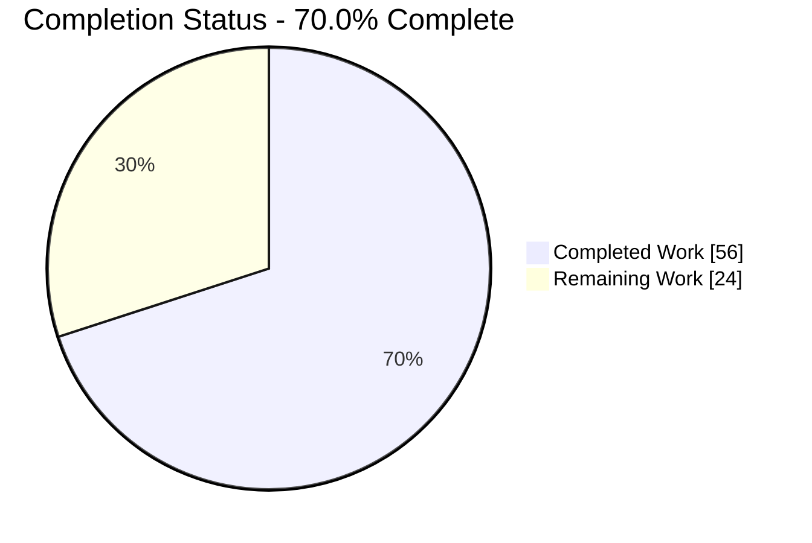
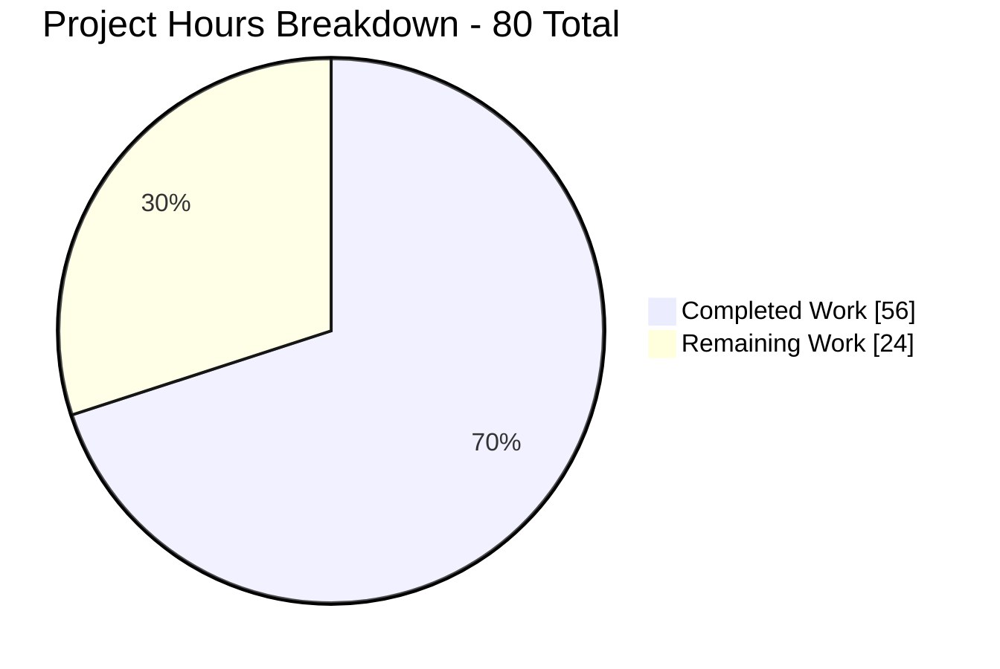
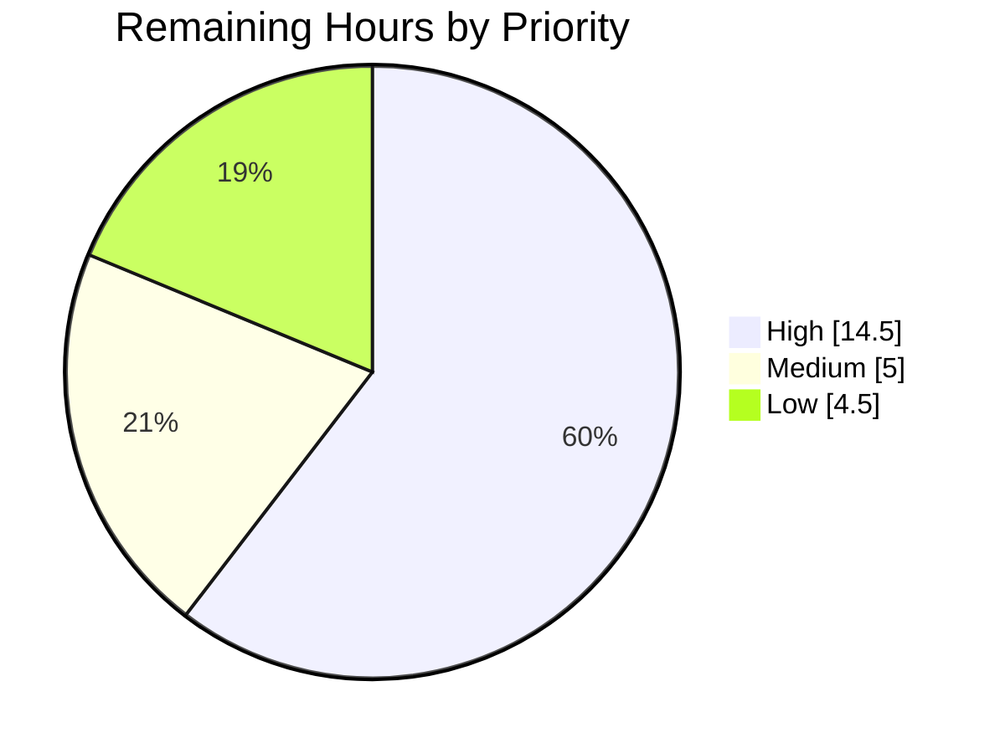
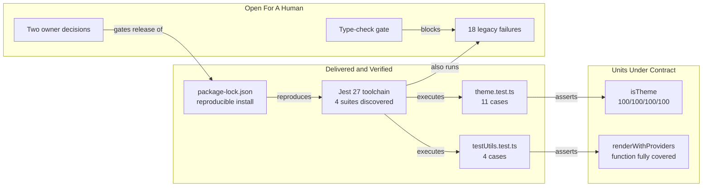

# 1. Executive Summary

## 1.1 Project Overview

This project pins down the behavioural contract of two previously untested functions in the `src/web` React 18 + TypeScript single-page application: the `isTheme` type guard (`src/web/src/styles/theme.ts`) and the `renderWithProviders` render helper (`src/web/src/utils/testUtils.tsx`). Two co-located Jest suites now assert those contracts, and the test layer beneath them was made executable and reproducible — runner, transformer, DOM environment and types aligned on Jest 27.5.1, the render helper parsing and instrumenting, and a committed lockfile making installs deterministic. The audience is the web platform team that maintains this package.

## 1.2 Completion Status

**70.0% complete** — 56 of 80 hours delivered.



| Metric | Value |
|---|---|
| Total Hours | **80** |
| Completed Hours (AI + Manual) | **56** (56 AI + 0 manual) |
| Remaining Hours | **24** |
| Percent Complete | **70.0%** |

56 / (56 + 24) × 100 = **70.0%**. Colours: Completed **Dark Blue `#5B39F3`**, Remaining **White `#FFFFFF`**.

## 1.3 Key Accomplishments

- `isTheme` fully specified by 11 cases; `src/web/src/styles/theme.ts` at 100% statements, branches, functions and lines.
- `renderWithProviders` fully specified by 4 cases; every statement and function in the helper is exercised.
- Both error-path assertions proven load-bearing: introducing error handling flips each case from pass to fail.
- The test layer executes — four suites discovered and run, with no change to the runner's configuration.
- `src/web/src/utils/testUtils.tsx` parses and instruments, with all four extensionless importers still resolving.
- Installs are reproducible — a tracked lockfile keeps `npm ci` byte-idempotent on npm 8/Node 16 and npm 11/Node 22.
- Zero advisories across the 64-package production dependency graph.
- Both suites deterministic across serial, parallel, reversed-order and uncached runs, and on two Node majors.

## 1.4 Critical Unresolved Issues

| Issue | Impact | Owner | ETA |
|---|---|---|---|
| The repository test command exits 1 on 18 failures in `src/web/src/App.test.tsx` and `src/web/src/components/HelloWorld/HelloWorld.test.tsx` | No workflow can gate on test results; a genuine regression in the verified suites could pass unnoticed | Web platform team | 1 sprint |
| The repository-global 100% coverage gate fails on all four metrics (43.8 / 48 / 28.57 / 41.37) | The same command stays non-zero even once the failures clear; acceptance currently rests on a scoped run | Repository owner / QA lead | 1 week |
| Type checking halts on 7 syntax errors, masking roughly 30 semantic errors | Type regressions cannot be caught, and the build workflow never reaches its test step | Web platform team | 1 sprint |
| 26 development-tree dependency advisories (11 high, 0 critical, 0 production) with no in-range remedy | Awaiting a recorded risk acceptance or an authorised coordinated upgrade — see Section 5.2 | Security owner | 1 week |
| The application renders nothing in a browser: `#root` stays empty because `ts-loader` is named by `src/web/webpack.config.ts` but declared nowhere, so no application chunk is emitted | The app cannot be served or built; unrelated to the delivered test layer | Web platform team | 2 sprints |
| `createTestId` in `src/web/src/utils/testUtils.tsx:93-97` is exercised by no test | File-level coverage of that module cannot reach 100%; its ID generator is unverified | Web platform team | 1 sprint |
| The three workflows have never executed on their pinned, end-of-life Node 16 runtime, and `deploy.yml` keys its trigger on a workflow name that does not exist | Install, cache-key and matrix behaviour unproven in CI; the deploy chain cannot fire | Release engineering | 1 sprint |
| Four build-time lockfile selections are verified statically only | A regression there would surface only once the bundler path works | Web platform team | With the build repair |

## 1.5 Access Issues

**No access issues identified.** Verified directly: `process.env.NODE_ENV` is the only environment variable any source file reads, no credentials or secrets are needed anywhere, and there is no database, broker, VPN or private registry. All 1,425 locked packages resolve from the public npm registry over HTTPS, and `npm ci` completes without authentication.

## 1.6 Recommended Next Steps

1. **[High]** Give the shared render helper a complete theme; one root cause accounts for all 18 outstanding failures.
2. **[High]** Restore the type-check gate: clear the 7 syntax errors, then triage what they unmask.
3. **[High]** Settle the two open decisions — the coverage-acceptance basis, and the advisory posture.
4. **[Medium]** Execute the three workflows once on a branch and settle the end-of-life Node 16 pin.
5. **[Medium]** Split a read-only lint script before any workflow runs the mutating one.

# 2. Project Hours Breakdown

## 2.1 Completed Work Detail

| Component | Hours | Description |
|---|---|---|
| `isTheme` type-guard contract suite | 6 | `src/web/src/styles/theme.test.ts` — 11 cases in four concern groups; full branch inventory of the guard's three-operand conjunction, including each short-circuit position; hostile-getter fixtures built with `Object.defineProperty`; 100% on all four metrics for `theme.ts` |
| `renderWithProviders` contract suite | 5 | `src/web/src/utils/testUtils.test.ts` — 4 cases authored without JSX via `React.createElement`; theme-agnostic fixtures; per-test console spy required by `resetMocks`; a live `rerender` and a referential-identity check on a caller-supplied container |
| Reproducible tracked lockfile and install contract | 12 | `src/web/package-lock.json` authored where none existed, plus the narrow ignore negation that un-ignores only this path; successive relocks reconciling exact toolchain pins, patched advisory floors and Node 16 engine compatibility; idempotence proven on two npm majors with three negative controls |
| Acceptance, regression and determinism validation | 7 | Scoped acceptance gate established over the two target modules; full-suite baseline comparison by test name and status; seven repeat runs across serial, parallel, reversed-order and uncached modes; lint, type-check and formatting deltas |
| Dependency security and supply-chain assessment | 7 | All 26 advisory entries characterised and attributed; semver intersection proving no in-range remedy exists; module-load instrumentation establishing reachability; registry provenance, integrity and signature verification; active-compromise exposure sweep |
| Test-toolchain dependency alignment | 5 | Six `devDependencies` edits placing runner, transformer, environment and types on the 27.x line, with peer-range verification; clears the two conditions that previously stopped every suite before collection |
| Runner discovery and execution under the unchanged configuration | 2 | Both new paths verified against the existing `testMatch` and `collectCoverageFrom` globs; four suites discovered; `src/web/jest.config.ts` untouched |
| Scope discipline and read-only contract preservation | 3 | 31 governing contracts — Jest, TypeScript, ESLint, Prettier, Babel and webpack configuration, production sources, both existing suites, three workflows, the Dockerfile and both READMEs — held byte-identical; the declared dependency surface held to the authorised six changes |
| Error-path mutation validation | 3 | Both inverse mutations executed against the real sources and reverted byte-exactly, proving the hostile-getter and render-error cases are pinned to real error semantics rather than passing vacuously |
| Pre-existing defect inventory and carry-forward register | 3 | Every unrelated defect located, evidenced against the tree and left untouched as instructed — the legacy failures, the syntax errors, the lint backlog, the absent runner stubs, the stale references and the build defects |
| Render-helper extension rename and module-resolution continuity | 2 | `testUtils.ts` → `testUtils.tsx` with content byte-identical; all four extensionless importers re-proven under both the runner's resolution order and the compiler's |
| Global setup-harness import repair | 1 | One specifier in `src/web/src/setupTests.ts`, restoring the lifecycle harness every suite inherits |
| **Total** | **56** | |

## 2.2 Remaining Work Detail

| Category | Hours | Priority |
|---|---|---|
| Legacy suite repair — give the shared render helper a complete theme and re-verify both existing suites | 5 | High |
| Type-check gate restoration — clear the 7 syntax errors, then triage the semantic errors they mask | 6 | High |
| Coverage-acceptance decision — confirm the scoped gate or re-scope the repository-global threshold | 1.5 | High |
| Dependency-advisory risk decision — record a time-bounded acceptance or authorise the coordinated upgrade | 2 | High |
| CI runtime and workflow alignment — settle the Node 16 pin, execute the three workflows once, correct the deploy trigger name | 4 | Medium |
| Non-mutating lint path — the lint script applies `--fix` and would rewrite source in CI | 1 | Medium |
| Residual coverage gap — cover `createTestId` so the render-helper module reaches file-level 100% | 1.5 | Low |
| Runner configuration completeness — supply the two named asset/style stubs and the `@/*` mapper entry | 1 | Low |
| Housekeeping and stale references — untracked media directory, README test-layout claim, `CODEOWNERS` line 21, harness version annotations | 2 | Low |
| **Total** | **24** | |

Priority split: High **14.5h**, Medium **5h**, Low **4.5h**.

## 2.3 Hours Reconciliation

| Check | Result |
|---|---|
| Section 2.1 total | 56 |
| Section 2.2 total | 24 |
| 2.1 + 2.2 = Total Project Hours (Section 1.2) | 56 + 24 = **80** ✅ |
| Remaining hours identical in Sections 1.2, 2.2 and 7 | **24** in all three ✅ |
| Completion percentage | 56 / 80 = **70.0%**, used verbatim in Sections 1.2, 7 and 8 ✅ |

# 3. Test Results

Every figure below was observed on the current tree. The repository's own command, `CI=true npm test -- --ci` from `src/web`, reports **4 suites (2 passed, 2 failed) and 33 tests (15 passed, 18 failed)** and exits 1 — the non-zero exit comes from the 18 failures in the two pre-existing suites plus the repository-global 100% coverage gate. The scoped acceptance command over the two target modules reports **2 suites and 15 tests passed** and exits 0.

| Area / Category | Framework | Tests | Passed | Failed | Coverage | What This Proves |
|---|---|---|---|---|---|---|
| Theme type guard — `src/web/src/styles/theme.test.ts` | Jest 27.5.1 + ts-jest 27.1.5 | 11 | 11 | 0 | `theme.ts` **100 / 100 / 100 / 100** | A malformed value can never satisfy the guard: `null`, four non-object primitives and each of the three required keys missing are all rejected, and a hostile object cannot slip through unnoticed |
| Render helper contract — `src/web/src/utils/testUtils.test.ts` | Jest 27.5.1 + React Testing Library 13.4.0 (jsdom) | 4 | 4 | 0 | Whole function covered; module 95.45% stmts / 94.73% lines | Components mount inside the theme provider tree, a caller's own render container wins over the helper's defaults, the returned `rerender` genuinely re-renders, and a render-time error reaches the caller with its message intact |
| Existing application suites — shell and `HelloWorld` component | Jest 27.5.1 + React Testing Library 13.4.0 | 18 | 0 | 18 | `App.tsx` 100%, `HelloWorld.tsx` 100%, `styles.ts` 40% | These suites are fully instrumented but cannot pass while the shared render helper injects a theme carrying only `colors`; all 18 fail on the same undefined `spacing` read (42 occurrences) |
| Error-path mutation sensitivity | Jest 27.5.1, sources mutated then restored byte-exactly | 2 | 2 | 0 | n/a | Both error-path cases are load-bearing: introducing error handling into either function flips its case from pass to fail, so neither can pass vacuously |
| Determinism and isolation | Jest 27.5.1 across 7 run configurations | 15 | 15 | 0 | n/a | Results do not depend on worker mode, test ordering or cache state — serial, parallel, reversed-order and uncached runs agree, and so do two Node majors |
| Static analysis of the delivered files | TypeScript 4.9.5, ESLint 8.57.1, Prettier 2.8.8 | 3 | 3 | 0 | n/a | Both new suites compile, lint at zero warnings and match the repository's formatting contract |
| Repository static gates | TypeScript 4.9.5, ESLint 8.57.1 | 2 | 0 | 2 | n/a | Type checking halts on 7 pre-existing syntax errors and repository-wide lint reports 108 problems — neither touches a delivered file, and both remain open |
| Install and dependency integrity | npm 11.18.0 and npm 8.19.4 | 5 | 5 | 0 | n/a | `npm ci` reproduces the exact tree, leaves the lockfile byte-identical, resolves 35 direct dependencies with no invalid or missing entries, and reports zero advisories in the production graph |

Rows 1–3 account for all 33 tests in the suite. Rows 4–8 are additional verification passes over the same code and configuration, not additional tests.

### Not Covered

- **`createTestId` (`src/web/src/utils/testUtils.tsx:93-97`)** — the module's ID generator, including its empty-argument guard and `throw`, is exercised by no test. This is the only reason file-level coverage of that module cannot reach 100%. Test it before relying on it.
- **The application at runtime** — no test drives the app end to end. The shell and component suites cover their own composition, but nothing asserts that the page mounts, and it currently does not (Section 4).
- **The bundler and build path** — no test loads `src/web/webpack.config.ts`, `src/web/babel.config.ts` or any loader. Four build-time dependency selections that keep the tree installable on the declared Node runtime are consequently verified by static range analysis and a successful install only; nothing executes them.
- **Nine coverage-eligible modules have no dedicated suite**: `config/environment.ts`, `config/constants.ts`, `hooks/useErrorBoundary.ts`, `reportWebVitals.ts`, `styles/GlobalStyles.ts`, `utils/errorBoundary.tsx`, `components/HelloWorld/styles.ts`, `components/HelloWorld/types.ts` and `setupTests.ts`. Two of them — `config/constants.ts` and `utils/errorBoundary.tsx` — cannot even be instrumented, because syntax errors defeat the coverage collector. These are the reason the repository-global gate cannot pass.
- **The CI environment itself** — the three workflows have never run, so their install, cache-key and Node-matrix behaviour is unproven outside a local container.

# 4. Runtime Validation & UI Verification

Legend: ✅ Operational · ⚠ Partial · ❌ Failing

- ✅ **Test runner start-up** — the runner loads `src/web/jest.config.ts` through `ts-node` with a silent stderr, transforms every suite with `ts-jest`, constructs its jsdom environment and reports version 27.5.1. `jest --listTests` returns exactly the four expected suites.
- ✅ **Global test lifecycle** — `src/web/src/setupTests.ts` executes for every suite: the DOM matchers it registers succeed inside the passing render-helper cases, and the per-test mock reset it relies on behaves as the delivered spy lifecycle expects.
- ✅ **Provider-tree rendering under jsdom** — a supplied element mounts inside the styled-components provider, is found by test-id query, appears in the rendered markup, and is replaced by a live `rerender`. The provider wrapper is executed 7 times and the re-bound `rerender` closure once.
- ✅ **Render-time error propagation** — a component that throws during render surfaces its own message to the caller, and React's console reporting fires rather than the failure being swallowed.
- ✅ **Dependency installation** — `npm ci` completes from an empty `node_modules` on both npm 11.18.0/Node 22 and npm 8.19.4/Node 16.20.2, leaves the lockfile byte-identical, and installs no package that declares itself incompatible with the runtime the repository targets.
- ⚠ **Dev server** — it binds on port 3000 and answers `GET /` with HTTP 200 and the 1,657-byte document, but the compilation behind it emits 43 errors and no application chunk is produced.
- ❌ **Application render in a browser** — the page paints no application UI at all. `#root` exists and its `innerHTML` is empty, no mutation of it is ever observed, and `window.React` is undefined. Only the dev server's compile-error overlay is visible. Root cause: `src/web/webpack.config.ts` names `ts-loader` for every `.ts`/`.tsx` file and that package is declared nowhere, so no TypeScript module compiles and the emitted chunk contains only the hot-reload client.
- ❌ **Static asset paths** — `src/web/public/index.html` still contains unsubstituted `%PUBLIC_URL%` placeholders. Because they are extension-relative, the browser requests `/%PUBLIC_URL%/static/js/bundle.js`, `/%PUBLIC_URL%/manifest.json` and `/%PUBLIC_URL%/favicon.ico`, and the dev server rejects all four with HTTP 400 (`URIError: Failed to decode param`).
- ❌ **Production build** — cannot run: `src/web/webpack.config.ts:180` spreads `config.plugins` inside the object literal that defines `config`, and the `clean`/`prebuild` scripts invoke `rimraf`, which is also undeclared.
- ⚠ **Content-Security-Policy behaviour** — never exercised. `src/web/public/index.html:12` sets `default-src 'self'; script-src 'self'` with no `style-src`, which would block styled-components' injected stylesheet, but zero violations occur today because no stylesheet is ever injected — the compile failure is reached first. Re-check this immediately after the build is repaired.

No external integrations exist to validate: this package makes no network call, has no API, database, broker or authentication surface, and reads only `process.env.NODE_ENV`.

# 5. Compliance & Quality Review

## 5.1 Compliance Matrix

| # | Deliverable / Benchmark | Status | Verified Evidence | Progress |
|---|---|---|---|---|
| 1 | `isTheme` behavioural contract and its coverage target | ✅ PASS | 11/11 cases pass; `src/web/src/styles/theme.ts` at 100% statements, branches, functions and lines; every short-circuit position of the guard's conjunction exercised | ██████████ 100% |
| 2 | `renderWithProviders` behavioural contract and its coverage target | ✅ PASS | 4/4 cases pass; every statement and function in `src/web/src/utils/testUtils.tsx:59-80` executed, including the re-bound `rerender` closure; the range contains no branch to miss | ██████████ 100% |
| 3 | Discovery and execution under the existing runner, with no configuration change | ✅ PASS | `src/web/jest.config.ts` has a zero-line diff; `jest --listTests` returns four suites; both `.test.ts` paths match the existing globs | ██████████ 100% |
| 4 | Scope containment — nothing else changed | ✅ PASS | Net change is 7 diff entries covering 8 file operations; no new directory, fixture, helper or test utility; all fixtures declared inline | ██████████ 100% |
| 5 | Toolchain coherence on the Jest 27 line | ✅ PASS | Exact pins resolve for runner, transformer, environment and types; one copy of every Jest-family package at major 27; all five transformer peer ranges satisfied | ██████████ 100% |
| 6 | Render-helper parse and instrumentation integrity | ✅ PASS | Recorded as a 100% rename with content byte-identical; all four extensionless importers resolve to the `.tsx` file; the module now reports real coverage | ██████████ 100% |
| 7 | Reproducible install and tracked lockfile | ✅ PASS | `src/web/package-lock.json` tracked and un-ignored; `npm ci` succeeds and stays byte-idempotent on two npm majors; all 1,425 records HTTPS registry-resolved with integrity hashes | ██████████ 100% |
| 8 | Error-path assertion sensitivity | ✅ PASS | Both inverse mutations flip their case from pass to fail and both sources restore byte-exactly | ██████████ 100% |
| 9 | Style, formatting and type conformance of delivered files | ✅ PASS | ESLint exits 0 at zero warnings, Prettier check exits 0, and a scoped type check reports no diagnostics for either suite | ██████████ 100% |
| 10 | Production dependency security posture | ✅ PASS | Zero advisories across the 64-package production graph; patched floors held; no credential-bearing, git, file or alternate-registry source anywhere in the lockfile | ██████████ 100% |
| 11 | Existing baseline preserved — nothing regressed | ✅ PASS | The 33-row test-name-and-status set is unchanged apart from the 15 additions; repository-wide lint and type-check output unchanged; 31 read-only contracts byte-identical | ██████████ 100% |
| 12 | Repository-global 100% coverage gate | ❌ FAIL — by design | Measured 43.8 / 48 / 28.57 / 41.37. Nine coverage-eligible modules have no dedicated suite and are outside this scope; the configured threshold was deliberately not weakened | ████░░░░░░ 44% |

## 5.2 AAP & Rule Divergences and Gaps

No user-specified rules exist for this project: the canonical rules source holds none, and the Agent Action Plan records the same. Every divergence below is therefore a departure from that plan rather than from a user rule.

| # | What the AAP/Rule Required | What Was Delivered Instead | Why It Diverged | Impact | Remediation |
|---|---|---|---|---|---|
| 1 | Both target functions were described as containing `try`/`catch` error handling, and verifying that handling was named the primary objective | Assertions that pin the functions' real observable behaviour, plus a substitute validation procedure | Neither function contains any error handling; the described behaviour does not exist in the code | None on correctness — but the delivered semantics are not what was expected | None required. Decide whether the functions *should* catch; if so, that is new work |
| 2 | "No new dependencies" and "zero config changes", alongside "must run under the existing `npm test`" — **Sanctioned** | Six `devDependencies` edits and nothing else; no Jest, TypeScript, ESLint, Babel or webpack setting touched | The three constraints were mutually unsatisfiable: the command aborted before collecting a single suite | Positive — the suite executes at all. The declared dependency surface grew by five packages plus one re-pin | None required. Keep the pins; see divergence 7 |
| 3 | "Do not modify `testUtils.ts`" — **Sanctioned** | Renamed to `testUtils.tsx`, extension only, content byte-identical | The file carried JSX under a `.ts` extension, so it could be neither imported nor instrumented, and no compiler option can change that | Positive and contained; every importer still resolves | None required |
| 4 | Generate the lockfile on Node 16.20.2 / npm 8.19.4 with `--legacy-peer-deps` | Generated on Node 22.23.2 / npm 11.18.0 with an explicit lockfile-version 2, without that flag | The mandated toolchain floor forbids Node 16, and the flag measurably broke the tree | Low — the artefact is the required format and installs cleanly on both runtimes | Never run `npm dedupe` against this lockfile; re-run the engine scan after any regeneration |
| 5 | The repository-global 100% coverage threshold | Left honestly failing rather than relaxed, with acceptance resting on a scoped run | Nine coverage-eligible modules are outside this scope, so the gate cannot pass | The repository test command exits non-zero; also in Section 1.4 | Confirm the scoped gate as the acceptance basis, or re-scope the threshold (Section 2.2) |
| 6 | Avoid known exploitable dependency exposure | 26 development-tree advisories accepted and fully characterised, none upgraded | No in-range remedy exists for any of the seven affected packages; every offered fix is a major bump of a declared dependency | Development and CI tooling only; the production graph reports zero. Also in Section 1.4 | Record a time-bounded risk acceptance, or authorise the coordinated upgrade (Section 2.2) |
| 7 | An optional seventh dependency change was offered — re-pinning the Jest type-config package to the 27.x line | Declined; the declared range stays one major ahead of the runner | The change sat outside the authorised set and is type-only, so declining satisfied both constraints | None on execution; a documentation-level version incoherence remains | Fold into the stale-reference cleanup (Section 2.2) |
| 8 | Leave the working tree clean | `git status --porcelain` reports one untracked directory of verification media | The directory holds evidence captures rather than code, and adding an ignore rule would have been a second unauthorised edit | None on build, test or lint | Delete it or add an ignore rule (Section 2.2) |

**1 — The described error handling does not exist.** `isTheme` (`src/web/src/styles/theme.ts:71-82`) is a null-and-type guard followed by a three-operand conjunction, and `renderWithProviders` (`src/web/src/utils/testUtils.tsx:59-80`) delegates straight to the library renderer. Neither catches anything. The suites therefore assert what the code really does: a throwing getter on the first property read propagates with its exact message, a throwing getter behind a non-object first operand is never invoked so the caller receives `false`, and a component that throws during render surfaces its own message. Because the stated check — remove the `try`/`catch` and confirm the tests fail — had nothing to remove, the inverse was run: adding error handling flips both cases to failing. Decide whether these functions should catch; today they do not.

**2 — Six dependency declarations were unavoidable.** Before this work, `npm test` terminated with `Cannot find module 'ts-node'` before collecting a suite, and a hoisted DOM environment two majors ahead of the runner broke environment construction. No test could run, so the acceptance criteria could not be evaluated at all. Six `devDependencies` edits close that: the runner, transformer, DOM environment and type definitions now sit on the 27.x line at exact pins. Nothing else moved — `jest.config.ts`, `tsconfig.json`, `.eslintrc.json`, `babel.config.ts` and `webpack.config.ts` are byte-identical, and all eight npm scripts are unchanged. Treat the 27.x pins as deliberate: the transformer's major must track the runner's, so a bump breaks the suite.

**3 — The rename was the smallest possible remedy.** `src/web/src/utils/testUtils.tsx` contains JSX, and TypeScript decides whether to parse JSX purely from the file extension — no compiler or transformer setting can override that. Under its former `.ts` name the module produced six parse errors, could not be imported by any test, and could not be instrumented for coverage, so the helper's contract was not merely hard to verify but unmeasurable. The rename changes the extension and nothing else: the content is byte-identical and git records it as a 100% rename. All four extensionless importers continue to resolve, because both the runner's module extensions and the compiler's resolution try `.tsx`. No signature, export or behaviour changed.

**4 — Lockfile generation runtime.** The plan specified generating on Node 16.20.2 with `--legacy-peer-deps`; the environment's toolchain floor forbids installing Node 16, so generation happened on Node 22.23.2 / npm 11.18.0 with lockfile version 2 forced so the on-disk shape still matches. The flag was dropped deliberately after measurement: with it, peer resolution pruned `react-is` and `@testing-library/dom`, and the suite went from 15 passing tests to zero collected. The committed artefact installs cleanly and idempotently on both npm 8.19.4/Node 16.20.2 and npm 11.18.0/Node 22. One maintenance rule follows: `npm dedupe` re-floats five in-range selections and would make the tree declare itself incompatible with the Node version this repository targets.

**5 — The global coverage gate is red on purpose.** `src/web/jest.config.ts` demands 100% on all four metrics across `src/**/*.{ts,tsx}`, while the measured figures are 43.8 / 48 / 28.57 / 41.37. Nine coverage-eligible modules have no dedicated suite, and two of them cannot even be instrumented because syntax errors defeat the collector. Relaxing a project-wide quality bar to make a narrow change appear to pass would have been worse than leaving it honestly failing, so the threshold was not touched. The consequence is concrete: `npm test` exits 1 regardless of the delivered work. Either accept the scoped acceptance command as the gate, or re-scope the threshold to the modules that are actually covered.

**6 — The advisory surface has no in-scope remedy.** `npm audit` reports 26 entries — 11 high, 6 moderate, 9 low, none critical — resolving to seven packages that actually own an advisory. For each, the set of versions simultaneously outside every vulnerable range and inside every declaring parent's range is empty, so no lockfile-only fix exists; every fix npm offers is a major bump of a declared dependency, and the Jest-family route also breaks the transformer's peer contract. Exposure is confined to development and CI tooling: `npm audit --omit=dev` reports zero across the 64-package production graph, and seven of the eight vulnerable copies load no file on the test path. This needs an owner signature, not an engineering change.

**7 — The optional type-package re-pin was declined.** The plan offered, as explicitly optional and cosmetic, re-pinning the Jest type-configuration package from its `^29.0.0` range down to the 27.x line, and asked that declining be stated. It was declined: the change sat outside the authorised set, the package is type-only at runtime, and `^29.0.0` is also the value `src/web/jest.config.ts` annotates itself with on line 1. Execution is unaffected — every Jest 27 package carries its own nested copy — so the only residue is a declared range one major ahead of the runner. If the tidier alignment is wanted, it is a one-line change with no behavioural effect; fold it into the stale-reference cleanup.

**8 — One untracked directory remains.** `git status --porcelain` reports a single untracked directory holding nine binary verification captures — seven screenshots and two screen recordings — against a stated expectation of a clean tree. It contains no code, nothing is staged, and it affects no build, test or lint result. It was left in place because deleting it would have destroyed verification evidence and adding an ignore rule would have been a second edit to a file authorised for exactly one line. Either delete the directory or add an ignore entry for it as a housekeeping change; both options are inconsequential to the codebase.

# 6. Risk Assessment

| Risk | Category | Severity | Probability | Mitigation | Status |
|---|---|---|---|---|---|
| The repository test command exits 1, so no workflow can gate on test results and a real regression in the verified suites could pass unnoticed among the 18 known failures | Technical | High | High | Complete the shared render helper's theme, settle the coverage threshold, and use the scoped acceptance command as the interim gate | Open |
| Type checking halts on 7 syntax errors, suppressing roughly 30 semantic errors project-wide — including two that would flag the missing styled-components type declarations — so type regressions cannot be caught and the build workflow never reaches its test step | Technical | High | Medium | Clear the syntax errors first, then triage the semantic set; run a scoped compiler check over changed files in the meantime | Open |
| The declared Node runtime is past end of life yet pinned across all three workflows, `infrastructure/docker/Dockerfile` and `package.json` engines, so CI and image builds receive no runtime security patches | Security | High | Medium | Move to a supported LTS line, or record an accepted exception with a review date and commercial extended support | Open — owner decision |
| The application is not shippable: nothing renders in a browser, and the production build cannot run because `webpack.config.ts:180` self-references the object being defined while `ts-loader` and `rimraf` are invoked but undeclared | Operational | High | High | Scope an application repair separately: declare the missing build tooling, fix the configuration self-reference, mount a theme provider and substitute the `%PUBLIC_URL%` placeholders | Open — pre-existing, outside this deliverable |
| 26 development-tree dependency advisories (11 high) have no in-range remedy, and every offered fix is a major bump of a declared dependency | Security | Medium | Low | Signed time-bounded acceptance, or an authorised coordinated upgrade; the production graph is already clean and seven of eight vulnerable copies load no file on the test path | Open — owner decision |
| None of the three workflows has ever executed, so install, cache-key and Node-matrix behaviour is unproven in CI, and `deploy.yml` keys its trigger on a workflow name that does not exist | Integration | Medium | Medium | Run all three on a branch once, and correct the trigger name to match the build workflow | Open |
| Dependency automation groups the Jest family for this package and the lockfile is now tracked, so it will propose bumping the deliberate 27.x pins; accepting one breaks the transformer's peer contract and the suite stops running | Operational | Medium | Medium | Mark the pins as held, or add an ignore entry for the Jest group until a coordinated upgrade is authorised | Open |
| Toolchain automation can silently undo verified state: regenerating the lockfile with `npm dedupe` re-floats the selections that keep the tree installable on the declared runtime, and the lint script's `--fix` would rewrite source — including the byte-frozen render helper — because `validate` and `prebuild` both chain it | Technical | Medium | Medium | Document the regeneration contract, re-run the engine scan after any relock, and split a read-only lint script | Partially mitigated |

# 7. Visual Project Status

### Overall Progress — 70.0% Complete

Completed = Dark Blue `#5B39F3` · Remaining = White `#FFFFFF`



### Remaining Work by Priority — 24 Hours



### Remaining Hours by Category

| Category | Hours | Share |
|---|---|---|
| Type-check gate restoration | 6 | ████████████ 25.0% |
| Legacy suite repair | 5 | ██████████ 20.8% |
| CI runtime and workflow alignment | 4 | ████████ 16.7% |
| Dependency-advisory risk decision | 2 | ████ 8.3% |
| Housekeeping and stale references | 2 | ████ 8.3% |
| Coverage-acceptance decision | 1.5 | ███ 6.3% |
| Residual coverage gap (`createTestId`) | 1.5 | ███ 6.3% |
| Non-mutating lint path | 1 | ██ 4.2% |
| Runner configuration completeness | 1 | ██ 4.2% |
| **Total** | **24** | **100%** |

### Delivered Surface



Integrity note: the **24** remaining hours shown here match the Remaining Hours in Section 1.2 and the sum of the Hours column in Section 2.2 exactly, and **56 + 24 = 80** Total Project Hours.

# 8. Summary & Recommendations

The assignment was narrow and it is delivered. Two functions that had no dedicated tests now have precise, executable contracts: `isTheme` is specified by 11 cases that drive `src/web/src/styles/theme.ts` to 100% on statements, branches, functions and lines, and `renderWithProviders` is specified by 4 cases that execute every statement and function in the helper, including the re-bound `rerender` closure. Both error-path assertions were proven load-bearing by mutating the sources and watching the cases flip, so neither passes vacuously. Both suites are deterministic across serial, parallel, reversed-order and uncached runs, and on two Node majors. Against the Agent Action Plan's scope, the project is **70.0% complete — 56 of 80 hours**.

What made that possible is worth stating separately, because it is the larger half of the delivered value. This test layer did not previously execute: the runner could not read its own TypeScript configuration, a hoisted DOM environment two majors ahead of the runner broke environment construction, the global setup harness imported a path that had never existed, and the shared render helper carried JSX under an extension that cannot parse it. All four conditions are cleared, and `jest --listTests` now returns four suites under a configuration file with a zero-line diff. Installs are reproducible for the first time: a tracked lockfile makes `npm ci` succeed and stay byte-idempotent on both npm 8/Node 16 and npm 11/Node 22, every record resolves from the public registry with an integrity hash, and the production dependency graph reports zero advisories.

The remaining 24 hours divide into two kinds of work, and neither is test authoring. Eleven hours are repairs to code this assignment was told to leave alone: 18 tests in the two pre-existing suites fail on a single root cause — the shared render helper injects a theme carrying only `colors` while a styled-component reads `theme.spacing` — and type checking halts on 7 syntax errors that suppress roughly 30 semantic errors behind them. Until both are addressed, `npm test` exits 1 and the build workflow never reaches its test step, which means the delivered suites cannot gate anything. The other thirteen hours are path-to-production: two owner decisions (the coverage-acceptance basis and the development-tree advisory posture), one CI exercise on a runtime that is past end of life, a read-only lint script, and small hygiene items.

One matter sits outside this scope but should not be discovered later. The application itself does not run. Driven in a browser, the dev server answers with HTTP 200 but the page paints no application UI at all — `#root` stays empty and React never mounts — because `src/web/webpack.config.ts` names `ts-loader` for every TypeScript file and that package is declared nowhere, so no application chunk is emitted. The production build is separately impossible: the configuration spreads `config.plugins` inside the literal that defines `config`. Two further defects are queued behind that one and will surface the moment it is fixed: no theme provider is mounted in `App.tsx`, and the page's content-security policy omits `style-src`, which will block styled-components' injected stylesheet.

**Production readiness.** The delivered test layer is ready to merge and to rely on: use the scoped acceptance command as its gate today, since it exits 0 with 15 of 15 passing and the guard module at full coverage. The repository as a whole is **not** release-ready, for reasons that predate this work and are enumerated in Sections 1.4 and 6. The critical path is short and ordered: complete the render helper's theme so the suite goes green, restore the type-check gate, take the two open decisions, then run the workflows once for real. Success is measurable and unambiguous — `CI=true npm test -- --ci` exiting 0 from `src/web`, with the two delivered suites still at 15 of 15 and the guard module still at 100%.

# 9. Development Guide

Every command below was executed against this repository and the stated output is what it produced. All commands run from **`src/web`** — the repository root has no `package.json` and this is not a monorepo.

## 9.1 System Prerequisites

| Requirement | Declared by the repository | Verified working |
|---|---|---|
| Node.js | `>=16.0.0` (`package.json` engines; workflows and the Dockerfile pin 16.x) | **v22.23.2** — used for every command in this guide |
| npm | `>=8.0.0` | **11.18.0**; the lockfile is also proven installable under 8.19.4 |
| OS | any Linux/macOS with a POSIX shell | Ubuntu container |
| Disk | ~600 MB for `node_modules` (1,423 packages) | — |
| Browser | any modern browser for the dev server | Chrome (headless) |

The 16.x pin is past end of life. Node 22 installs and runs the full suite correctly, so treat the pin as a decision to make (Section 2.2), not a constraint to honour blindly.

## 9.2 Environment Setup

No environment variables and no secrets are required. `process.env.NODE_ENV` is the only variable any source file reads, and Jest sets it to `test` itself. There is no database, cache, broker or external service to start.

```bash
cd src/web
```

## 9.3 Dependency Installation

```bash
# Preferred - exact, reproducible tree from the committed lockfile
cd src/web
npm ci
```

Expected: exit 0, roughly `added 1423 packages, and audited 1424 packages in 8s`, with no `EBADENGINE`, `ERESOLVE` or `EINTEGRITY` line, and the lockfile byte-unchanged afterwards.

```bash
# Alternative when you intend to update the lockfile
npm install --no-audit --no-fund
```

Three rules for this package:

- **Never pass `--legacy-peer-deps`.** It prunes `react-is` and `@testing-library/dom`, which are needed at runtime, and the suite drops from 15 passing tests to zero collected.
- **Never run `npm ci --dry-run`** — it deletes `node_modules` before deciding it had nothing to do.
- **Never run `npm dedupe`** — it re-floats the dependency selections that keep the tree installable on the Node version this repository targets.

## 9.4 Running The Tests

```bash
# Full suite, exactly as CI invokes it
cd src/web
CI=true npm test -- --ci
```

Expected today: **exit 1** — `Test Suites: 2 failed, 2 passed, 4 total` and `Tests: 18 failed, 15 passed, 33 total`. The two delivered suites pass; the 18 failures are pre-existing and all report `Cannot read properties of undefined (reading 'vertical')`. Coverage prints `theme.ts` at 100/100/100/100 and four global-threshold failures.

```bash
# Scoped acceptance gate for the delivered work - this is the gate that should be green
CI=true npx jest --coverage --watchAll=false \
  --testPathPattern="src/(styles/theme|utils/testUtils)\.test\.ts$" \
  --collectCoverageFrom="src/{styles/theme,utils/testUtils}.{ts,tsx}" \
  --coverageThreshold='{}'
```

Expected: **exit 0**, `Test Suites: 2 passed`, `Tests: 15 passed`, `theme.ts 100 | 100 | 100 | 100`, and `testUtils.tsx 86.36 | 0 | 50 | 84.21` with lines 93-97 uncovered — that residue is the untested `createTestId`, and the isolated 0% branch figure is an artefact of running the file alone, not a regression.

```bash
# One suite
CI=true npx jest --runTestsByPath src/styles/theme.test.ts --coverage=false

# One case by name
CI=true npx jest -t "returns true for the shipped defaultTheme" --coverage=false

# Fully serial, for debugging flake
CI=true npx jest --runInBand --watchAll=false

# Confirm what the runner will collect, and how it resolved its configuration
npx jest --listTests
npx jest --showConfig
```

Expected, in order: 1 suite with 11 passed; 1 passed and 32 skipped; the same 18/15 split as the full run; exactly 4 paths; exit 0 with **empty** stderr.

Never run `npx jest --watch` or `--watchAll` in CI or any automated context — they never exit. The `test` script already passes `--watchAll=false`.

## 9.5 Static Checks

```bash
cd src/web
npm run type-check
npx eslint src/styles/theme.test.ts src/utils/testUtils.test.ts --no-fix --max-warnings=0
npx eslint src --ext .ts,.tsx --no-fix
npx prettier --check src/styles/theme.test.ts src/utils/testUtils.test.ts
```

Expected, in order: exit 2 with 7 pre-existing syntax errors; exit 0 with no output; exit 1 with 108 pre-existing problems; exit 0 with `All matched files use Prettier code style!`.

**Do not run `npm run lint`.** It carries `--fix` and rewrites source in place, including the byte-frozen render helper. `npm run validate` and `npm run prebuild` both chain it, so avoid those too until a read-only lint script exists.

## 9.6 Running The Application

The application does not currently render — see Section 4. The dev server nevertheless starts, and this is the only invocation that works:

```bash
cd src/web
TS_NODE_TRANSPILE_ONLY=true TS_NODE_COMPILER_OPTIONS='{"module":"commonjs"}' \
  npx webpack serve --env mode=development --devtool source-map \
  --no-open --server-type http --host 0.0.0.0 --port 3000 --allowed-hosts all
```

Expected: the server binds on port 3000 and `curl -s -o /dev/null -w "%{http_code}" http://localhost:3000/` returns **200**, but the compilation prints **43 errors** beginning with `Module not found: Error: Can't resolve 'ts-loader'`, and the browser shows only the dev server's error overlay.

The two environment overrides are mandatory: `webpack.config.ts` type-fails under `ts-node` and the project's module setting is `esnext`. The configuration also branches on `--env mode=…`, not `--mode`, which is why `npm start` and `npm run build` do not work as declared.

## 9.7 Verification Checklist

Work down this list after any change; each line states the exact expected result.

1. `npm ci` → exit 0, lockfile unchanged afterwards.
2. `npx jest --showConfig` → exit 0, **empty** stderr. Any output here means the TypeScript configuration is not loading.
3. `npx jest --listTests` → exactly four paths, including both `.test.ts` files.
4. Scoped acceptance gate → exit 0, 15 passed, `theme.ts` 100 on all four metrics.
5. `CI=true npm test -- --ci` → 15 passed / 18 failed. Any change to the 18, or any new failure in the 15, is a regression.
6. `npx eslint … --no-fix --max-warnings=0` on the two suites → exit 0.
7. `npm audit --omit=dev` → exit 0, `found 0 vulnerabilities`.
8. `git status --porcelain` → nothing beyond the known untracked media directory.

## 9.8 Troubleshooting

| Symptom | Cause | Resolution |
|---|---|---|
| `Error: Jest: 'ts-node' is required for the TypeScript configuration files` | Dependencies not installed from the committed lockfile | `cd src/web && npm ci` |
| `TypeError: Cannot read properties of undefined (reading 'testEnvironmentOptions')` | A DOM environment package resolved at a major ahead of the runner | Reinstall from the lockfile; do not upgrade the Jest family piecemeal — the transformer's major must track the runner's |
| `Cannot find module '../utils/testUtils' from 'src/setupTests.ts'` | A stale setup-harness path; this file is `setupFilesAfterEnv`, so it kills every suite | The specifier must be `'./utils/testUtils'` |
| `Test suite failed to run … Jest encountered an unexpected token` on the render helper | JSX under a `.ts` extension | The helper must keep its `.tsx` extension; no compiler or transformer option can enable JSX for `.ts` |
| `Cannot read properties of undefined (reading 'vertical')` in the existing suites | The shared render helper injects a theme carrying only `colors`, while the styled-component reads `theme.spacing.vertical` | Give the helper a complete theme (Section 2.2) |
| Four global coverage-threshold failures | Nine modules have no dedicated suite; the threshold is repository-wide | Use the scoped acceptance gate, or re-scope the threshold |
| `Module not found: Error: Can't resolve 'ts-loader'` from webpack | The loader is named by `webpack.config.ts` but declared nowhere | Declare the build tooling as part of the application repair |
| `sh: 1: rimraf: not found` from `npm run clean` | Same class of gap; `prebuild` chains `clean` | Declare it, or replace the script with a Node one-liner |
| HTTP 400 with `URIError: Failed to decode param '/%PUBLIC_URL%/…'` | Unsubstituted placeholders in `public/index.html` | Substitute them at build time or replace them with absolute paths |
| A test run never returns | Watch mode | Always pass `--watchAll=false` or `--ci` |
| Source files changed unexpectedly after a lint or build | `npm run lint` applies `--fix`, and `validate`/`prebuild` chain it | Use `npx eslint … --no-fix`; add a read-only lint script |

# 10. Appendices

## A. Command Reference

All commands run from `src/web`.

| Purpose | Command | Expected |
|---|---|---|
| Install exactly | `npm ci` | exit 0, ~1,423 packages, lockfile unchanged |
| Install and update the lock | `npm install --no-audit --no-fund` | exit 0 |
| Full suite (CI form) | `CI=true npm test -- --ci` | exit 1 — 15 passed / 18 failed / 33 total |
| Scoped acceptance gate | `CI=true npx jest --coverage --watchAll=false --testPathPattern="src/(styles/theme\|utils/testUtils)\.test\.ts$" --collectCoverageFrom="src/{styles/theme,utils/testUtils}.{ts,tsx}" --coverageThreshold='{}'` | exit 0 — 15 passed |
| Single suite | `CI=true npx jest --runTestsByPath src/styles/theme.test.ts --coverage=false` | exit 0 — 11 passed |
| Single case | `CI=true npx jest -t "<case name>" --coverage=false` | exit 0 — 1 passed, 32 skipped |
| Serial run | `CI=true npx jest --runInBand --watchAll=false` | exit 1 (same 18 failures) |
| List collected suites | `npx jest --listTests` | 4 paths |
| Dump resolved config | `npx jest --showConfig` | exit 0, empty stderr |
| Type check | `npm run type-check` | exit 2 — 7 pre-existing errors |
| Lint (read-only, scoped) | `npx eslint src/styles/theme.test.ts src/utils/testUtils.test.ts --no-fix --max-warnings=0` | exit 0 |
| Lint (read-only, all) | `npx eslint src --ext .ts,.tsx --no-fix` | exit 1 — 108 problems |
| Format check | `npx prettier --check src/styles/theme.test.ts src/utils/testUtils.test.ts` | exit 0 |
| Audit (all) | `npm audit` | 26 findings — 0 critical / 11 high / 6 moderate / 9 low |
| Audit (production only) | `npm audit --omit=dev` | exit 0 — `found 0 vulnerabilities` |
| Dependency tree | `npm ls --depth=0` | exit 0 — 35 direct dependencies |
| Dev server | `TS_NODE_TRANSPILE_ONLY=true TS_NODE_COMPILER_OPTIONS='{"module":"commonjs"}' npx webpack serve --env mode=development --devtool source-map --no-open --server-type http --host 0.0.0.0 --port 3000 --allowed-hosts all` | binds; serves HTTP 200; 43 compile errors |
| Debugger attach | `node --inspect-brk node_modules/jest/bin/jest.js --runInBand --watchAll=false` | waits for a debugger |

Do not use: `npm run lint` (applies `--fix`), `npm run validate` / `npm run prebuild` (chain the mutating lint), `npm start` / `npm run build` (do not work as declared), `npm ci --dry-run` (deletes `node_modules`), `npm dedupe` (undoes the lockfile's runtime compatibility), `npx jest --watch` / `--watchAll` (never exit).

## B. Port Reference

| Port | Service | Notes |
|---|---|---|
| 3000 | webpack dev server | Default; override with `--port`. Serves `GET /` as HTTP 200 today but paints no application UI |
| — | tests | No port binding. The suites are jsdom-only, with no network, filesystem, timer or database use |

## C. Key File Locations

| Path | Role |
|---|---|
| `src/web/src/styles/theme.test.ts` | Delivered — 11 cases for the theme type guard |
| `src/web/src/utils/testUtils.test.ts` | Delivered — 4 cases for the render helper |
| `src/web/src/styles/theme.ts` | Unit under contract: `isTheme` at lines 71-82; also exports `defaultTheme` |
| `src/web/src/utils/testUtils.tsx` | Unit under contract: `renderWithProviders` at lines 59-80; `createTestId` at 93-97 is untested; the local theme at lines 25-31 supplies only `colors` |
| `src/web/src/setupTests.ts` | Global lifecycle every suite inherits — DOM matchers, mock reset, DOM reset, timer clearing |
| `src/web/jest.config.ts` | Runner contract — unchanged by this work |
| `src/web/package.json` | 4 runtime and 31 development dependencies; 8 scripts |
| `src/web/package-lock.json` | Tracked, lockfile version 2, 1,425 records |
| `.gitignore` line 90 | `!src/web/package-lock.json` — the negation that keeps the lockfile tracked |
| `src/web/src/App.test.tsx`, `src/web/src/components/HelloWorld/HelloWorld.test.tsx` | Pre-existing suites; the 18 outstanding failures live here |
| `src/web/src/components/HelloWorld/styles.ts` | Lines 16 and 19 read `theme.spacing` — the failure site |
| `src/web/webpack.config.ts` | Names `ts-loader`; line 180 self-references `config` |
| `src/web/public/index.html` | Line 12 sets the content-security policy; still contains `%PUBLIC_URL%` placeholders |
| `.github/workflows/{test,build,deploy}.yml` | CI; all pin Node 16.x |
| `src/web/coverage/` | Coverage output (`text`, `lcov`, `html`); not tracked |

## D. Technology Versions

| Package | Version | Role |
|---|---|---|
| jest | 27.5.1 | Test runner |
| ts-jest | 27.1.5 | TypeScript transform — its major must track the runner's |
| ts-node | 10.9.2 | Loads the TypeScript runner configuration |
| jest-environment-jsdom | 27.5.1 | DOM environment |
| jsdom | 16.7.0 | Resolved by the environment above |
| @types/jest | 27.5.2 | Runner type definitions |
| identity-obj-proxy | 3.0.0 | Style-module stub used by the module mapper |
| typescript | 4.9.5 | Compiler |
| @testing-library/react | 13.4.0 | Component rendering and querying (requires React 18) |
| @testing-library/jest-dom | 5.17.0 | DOM assertion matchers |
| @testing-library/user-event | 14.6.3 | Interaction simulation (used by the pre-existing suites) |
| react / react-dom | 18.3.1 | Runtime |
| styled-components | 5.3.11 | Supplies the theme provider the helper wraps with |
| eslint | 8.57.1 | Linting |
| prettier | 2.8.8 | Formatting |
| node / npm | 22.23.2 / 11.18.0 | Verified runtime (repository declares `>=16` / `>=8`) |

## E. Environment Variable Reference

| Variable | Required | Purpose |
|---|---|---|
| `NODE_ENV` | No | The only variable any source file reads; the runner sets it to `test` |
| `CI` | Recommended | Set to `true` for any non-interactive run, which is what CI does |
| `TS_NODE_TRANSPILE_ONLY` | Only for webpack | Must be `true`, or the webpack configuration type-fails under `ts-node` |
| `TS_NODE_COMPILER_OPTIONS` | Only for webpack | Must be `{"module":"commonjs"}`, because the project's module setting is `esnext` |
| `PORT` | No | Not read by the configuration; pass `--port` to the dev server instead |

No secrets, API keys or credentials exist or are needed.

## F. Developer Tools Guide

- **Coverage** — Istanbul via the runner. `text`, `lcov` and `html` reporters write to `src/web/coverage`; open `src/web/coverage/lcov-report/index.html` for the browsable view. The repository-global threshold is 100% on all four metrics; override it per invocation with `--coverageThreshold='{}'` when measuring a subset, and never weaken it in the configuration file.
- **Debugging a case** — `node --inspect-brk node_modules/jest/bin/jest.js --runInBand --watchAll=false`, then attach from your editor. Use `-t "<case name>"` to isolate one case.
- **Adding a suite** — colocate it beside its subject as `<Name>.test.ts` or `.test.tsx`; the existing globs pick it up with no configuration change. Keep JSX out of `.ts` files. Create spies inside `beforeEach`, because mocks are reset before every test. Suites in this package declare no interfaces, which avoids the naming rule that existing code already breaks.
- **Mutation-checking an error path** — temporarily change the behaviour the assertion depends on and confirm the case flips to failing, then restore the file and verify its hash. An error-path test that survives that change is not testing anything.
- **Regenerating the lockfile** — from `src/web`, run `npm install --lockfile-version=2 --no-audit --no-fund`, then re-check that no installed package declares itself incompatible with the Node version the repository targets. Do not run `npm dedupe`.

## G. Glossary

| Term | Meaning here |
|---|---|
| Scoped acceptance gate | The single runner invocation that measures only the two target modules and overrides the repository-wide coverage threshold for that run only. Exits 0 today |
| Inverse mutation | Temporarily adding the error handling an assertion assumes absent, to prove the error-path case fails when the behaviour changes |
| Short-circuit position | Each operand of the type guard's three-operand conjunction. Each is a separate branch, which is why all three missing-key cases are required for full branch coverage |
| Theme-agnostic fixture | A test component that reads nothing from the theme, so it is unaffected by the incomplete theme the shared helper injects |
| Byte-identical rename | A file whose path changed while its content did not — recorded by git as a 100% rename |
| Legacy failures | The 18 pre-existing failures in the two original suites, all from one undefined theme read |
| Production graph | The 64 packages an install would materialise with development dependencies omitted; it carries zero advisories |
