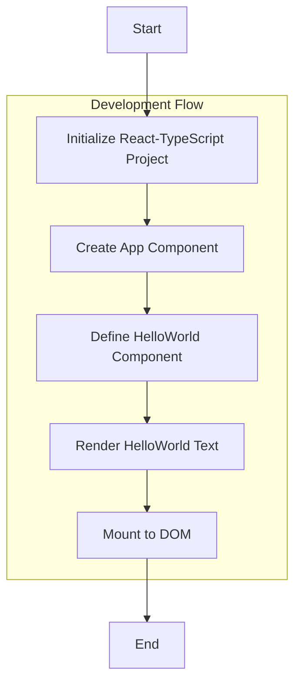
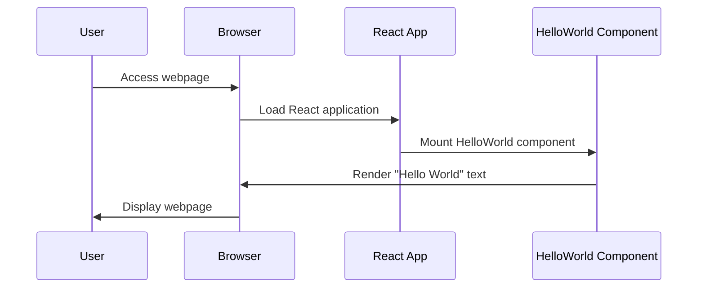
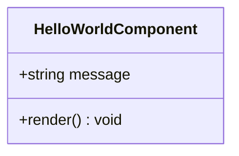
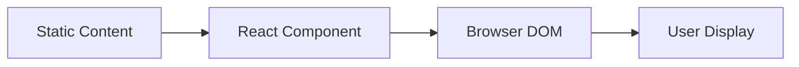

# Product Requirements Document (PRD)

# 1. INTRODUCTION

## 1.1 Purpose
This Product Requirements Document (PRD) outlines the requirements and specifications for developing a minimal "Hello World" web application. The document serves as a reference for developers, project stakeholders, and team members involved in the implementation and maintenance of the application.

## 1.2 Scope
The project encompasses the development of a simple web page that displays the text "Hello World" using modern web technologies. The application will:
- Utilize ReactJS with TypeScript as the primary development framework
- Render a single page with static content
- Demonstrate basic React component architecture
- Serve as a foundational template for future React-TypeScript projects

The project intentionally maintains minimal complexity to serve as a basic implementation example.

# 2. PRODUCT DESCRIPTION

## 2.1 Product Perspective
The "Hello World" web application is a standalone, single-page application that operates independently without integration requirements to external systems. It serves as a minimal implementation of a React-TypeScript application within a modern web browser environment.

## 2.2 Product Functions
The application provides the following core functions:
- Renders a single React component displaying "Hello World" text
- Demonstrates TypeScript type safety in a React environment
- Serves static content through a web browser interface
- Maintains a component-based architecture following React principles

## 2.3 User Characteristics
The application targets two primary user groups:
1. Developers
   - Technical professionals learning React and TypeScript
   - Familiarity with web development concepts
   - Looking for reference implementation
2. Project Stakeholders
   - Technical and non-technical team members
   - Need to verify basic React-TypeScript setup
   - Require minimal working example

## 2.4 Constraints
- Technical Constraints
  - Must use React 18.x or higher
  - Must use TypeScript 4.x or higher
  - Must maintain browser compatibility with modern web browsers (Chrome, Firefox, Safari, Edge)
  - Single-page application architecture only
- Development Constraints
  - Code must be strictly typed using TypeScript
  - No external UI libraries or frameworks beyond React
  - Must follow React best practices and conventions

## 2.5 Assumptions and Dependencies
Assumptions:
- Users have access to modern web browsers
- Development environment supports React and TypeScript
- Basic knowledge of web technologies by development team

Dependencies:
- Node.js runtime environment
- React framework
- TypeScript compiler
- Web development tools (bundler, development server)
- NPM or Yarn package manager

# 3. PROCESS FLOWCHART





# 4. FUNCTIONAL REQUIREMENTS

## 4.1 Feature Breakdown

### F1: Application Initialization
**ID**: F1  
**Description**: Basic React-TypeScript application setup and configuration  
**Priority**: High  

| Requirement ID | Requirement Description | Acceptance Criteria |
|---------------|------------------------|-------------------|
| F1.1 | Project must be initialized using Create React App with TypeScript template | - Successfully created project structure<br>- TypeScript configuration present<br>- No build errors |
| F1.2 | Configure minimal development environment | - Development server runs<br>- TypeScript compilation works<br>- No unnecessary dependencies |

### F2: Hello World Component
**ID**: F2  
**Description**: Core component displaying "Hello World" text  
**Priority**: High  

| Requirement ID | Requirement Description | Acceptance Criteria |
|---------------|------------------------|-------------------|
| F2.1 | Create typed React functional component | - Component defined using TypeScript<br>- Follows React component conventions<br>- No type errors |
| F2.2 | Render "Hello World" text | - Text displays correctly<br>- Component renders without errors<br>- Maintains simple implementation |

### F3: Application Entry Point
**ID**: F3  
**Description**: Main application mounting and rendering  
**Priority**: High  

| Requirement ID | Requirement Description | Acceptance Criteria |
|---------------|------------------------|-------------------|
| F3.1 | Mount React application to DOM | - Application mounts successfully<br>- No console errors<br>- Proper root element targeting |
| F3.2 | Handle basic component rendering | - Component tree renders correctly<br>- Proper TypeScript types used<br>- Clean mounting process |

# 5. NON-FUNCTIONAL REQUIREMENTS

## 5.1 Performance Requirements

| Requirement | Description | Target Metric |
|------------|-------------|---------------|
| Load Time | Initial page load time | < 1.5 seconds |
| Time to First Byte (TTFB) | Server response time | < 200ms |
| First Contentful Paint | Time until first content display | < 1 second |
| Bundle Size | Total JavaScript bundle size | < 100KB |
| Memory Usage | Browser memory consumption | < 50MB |

## 5.2 Safety Requirements

| Requirement | Description |
|------------|-------------|
| Error Handling | Implement basic error boundaries in React components |
| Graceful Degradation | Provide fallback content if JavaScript fails to load |
| Browser Compatibility | Ensure graceful handling of unsupported browser features |

## 5.3 Security Requirements

| Requirement | Description |
|------------|-------------|
| Content Security Policy | Implement basic CSP headers for static content |
| Secure Dependencies | Use only verified npm packages with no known vulnerabilities |
| XSS Prevention | React's built-in XSS protection must remain enabled |

## 5.4 Quality Requirements

### 5.4.1 Availability
- Application uptime: 99.9%
- Single page must be accessible during all business hours
- Maximum planned downtime: 1 hour per month

### 5.4.2 Maintainability
- Code maintainability index > 85
- Documentation must be up-to-date
- TypeScript strict mode enabled
- ESLint configuration enforced

### 5.4.3 Usability
- Page must be readable on all modern browsers
- Text must meet WCAG 2.1 contrast requirements
- Support for screen readers required
- Responsive design for common screen sizes

### 5.4.4 Scalability
- Support concurrent users: up to 100
- Static content must be cacheable
- Component structure must support future expansion

### 5.4.5 Reliability
- Zero critical failures allowed
- All TypeScript compile errors must be resolved
- No runtime JavaScript exceptions

## 5.5 Compliance Requirements

| Requirement | Description |
|------------|-------------|
| Web Standards | Comply with HTML5 and CSS3 standards |
| Accessibility | Meet WCAG 2.1 Level A requirements |
| Browser Support | Support latest versions of Chrome, Firefox, Safari, and Edge |
| Code Standards | Follow React and TypeScript recommended coding standards |

# 6. DATA REQUIREMENTS

## 6.1 Data Models

Given the minimal nature of the Hello World application, the data model is extremely simple with no database requirements.



## 6.2 Data Storage

### 6.2.1 Runtime Storage
- Application state maintained in memory during runtime only
- No persistent storage requirements
- Component props and state handled by React's virtual DOM

### 6.2.2 Static Assets
- Source code stored in version control
- Built artifacts served through static file hosting
- No database or persistent storage needed

## 6.3 Data Processing

### 6.3.1 Data Flow



### 6.3.2 Data Security
- No sensitive data handling required
- Standard browser security model applies
- React's built-in XSS protection sufficient

### 6.3.3 Data Validation
- TypeScript type checking during development
- Props validation through TypeScript interfaces
- No runtime data validation required

# 7. EXTERNAL INTERFACES

## 7.1 User Interfaces
- Single web page with centered "Hello World" text
- No navigation elements or complex UI components required
- Minimal styling for text display

### 7.1.1 UI Mockup

```
+------------------------+
|                        |
|                        |
|      Hello World       |
|                        |
|                        |
+------------------------+
```

### 7.1.2 UI Requirements
| Element | Description | Requirements |
|---------|-------------|--------------|
| Text Display | Main "Hello World" text | - Center-aligned<br>- Readable font<br>- Sufficient contrast |
| Viewport | Browser window | - Responsive layout<br>- Minimum width: 320px<br>- Maximum width: 100% viewport |

## 7.2 Software Interfaces

### 7.2.1 Development Dependencies
| Software | Version | Purpose |
|----------|---------|---------|
| React | 18.x | UI framework |
| TypeScript | 4.x | Static typing |
| Node.js | 16.x+ | Runtime environment |
| Web Browser | Modern versions | Application platform |

### 7.2.2 Runtime Interfaces
| Interface | Description |
|-----------|-------------|
| DOM | Browser Document Object Model for rendering |
| React Virtual DOM | Internal React rendering engine |
| TypeScript Compiler | Development-time type checking |

## 7.3 Communication Interfaces

### 7.3.1 Client-Side Communication
| Protocol | Usage |
|----------|--------|
| HTTP/HTTPS | Static file serving |
| Browser APIs | DOM manipulation |

Note: Hardware interfaces section is omitted as this is a simple web application with no direct hardware interaction requirements.

# 8. APPENDICES

## 8.1 GLOSSARY
| Term | Definition |
|------|------------|
| Component | A reusable, self-contained piece of UI in React that can contain its own logic and styling |
| DOM | Document Object Model - a programming interface for HTML documents |
| Static Typing | A programming language feature that enforces type checking at compile time |
| Virtual DOM | React's lightweight copy of the actual DOM that helps optimize rendering performance |

## 8.2 ACRONYMS
| Acronym | Definition |
|---------|------------|
| API | Application Programming Interface |
| CSP | Content Security Policy |
| DOM | Document Object Model |
| HTML | HyperText Markup Language |
| NPM | Node Package Manager |
| PRD | Product Requirements Document |
| TTFB | Time to First Byte |
| UI | User Interface |
| WCAG | Web Content Accessibility Guidelines |
| XSS | Cross-Site Scripting |

## 8.3 ADDITIONAL REFERENCES
| Resource | Description | URL |
|----------|-------------|-----|
| React Documentation | Official React framework documentation | https://reactjs.org/docs |
| TypeScript Handbook | Official TypeScript language documentation | https://www.typescriptlang.org/docs |
| Create React App | Official tool for creating React applications | https://create-react-app.dev |
| React TypeScript Cheatsheet | Community-maintained TypeScript guide for React | https://github.com/typescript-cheatsheets/react |