# Technical Specifications

# 1. INTRODUCTION

## 1.1 EXECUTIVE SUMMARY

This technical specification outlines the implementation of a minimal "Hello World" web application using React and TypeScript. The project serves as a foundational template demonstrating the basic setup and configuration of a modern web application using type-safe JavaScript. Primary stakeholders include developers seeking reference implementation and technical teams requiring a baseline React-TypeScript project structure.

The application addresses the need for a clean, well-documented starting point for React-TypeScript development while demonstrating essential project setup, component architecture, and type safety implementation.

## 1.2 SYSTEM OVERVIEW

### Project Context

| Aspect | Description |
|--------|-------------|
| Business Context | Educational/reference implementation for React-TypeScript development |
| Current System | New implementation, no existing system to replace |
| Enterprise Integration | Standalone application with no external system dependencies |

### High-Level Description

| Component | Details |
|-----------|----------|
| Frontend Framework | React 18.x with TypeScript |
| Architecture | Single-page application (SPA) |
| Core Components | HelloWorld component, Application root |
| Technical Approach | Functional components with strict typing |

### Success Criteria

| Criterion | Target Metric |
|-----------|---------------|
| Build Success | Zero TypeScript compilation errors |
| Performance | Initial page load < 1.5 seconds |
| Code Quality | 100% type coverage |
| Browser Support | Full functionality in modern browsers |

## 1.3 SCOPE

### In-Scope

#### Core Features and Functionalities

| Feature | Description |
|---------|-------------|
| Component Rendering | Display of "Hello World" text |
| Type Safety | TypeScript implementation for all components |
| Build Pipeline | Development and production build configurations |
| Development Tools | Local development server and debugging setup |

#### Implementation Boundaries

| Boundary | Coverage |
|----------|----------|
| User Groups | Developers and technical stakeholders |
| System Access | Web browser-based access |
| Platform Support | Modern web browsers |
| Environment | Client-side only |

### Out-of-Scope

- Backend services or API implementations
- User authentication and authorization
- Data persistence or state management
- Complex UI components or styling frameworks
- Performance optimization beyond basic requirements
- Cross-browser compatibility for legacy browsers
- Deployment and hosting configurations
- Continuous integration/deployment pipelines

# 2. SYSTEM ARCHITECTURE

## 2.1 High-Level Architecture

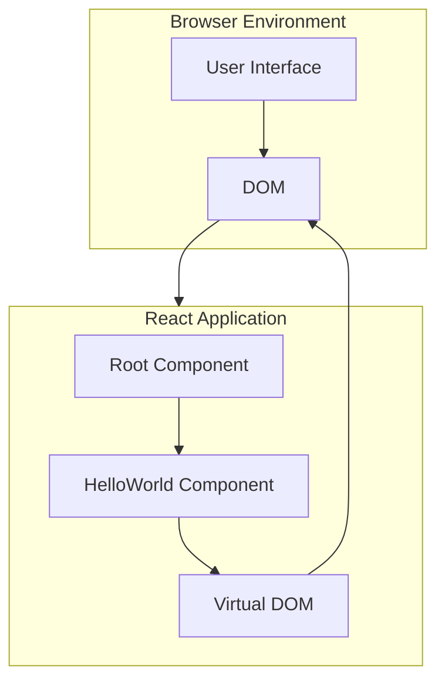

## 2.2 Component Details

### 2.2.1 Core Components

| Component | Purpose | Technologies | Interfaces |
|-----------|---------|--------------|------------|
| Root Component | Application entry point | React 18, TypeScript | `ReactDOM.render()` |
| HelloWorld Component | Display message | React 18, TypeScript | `FC<HelloWorldProps>` |
| Virtual DOM | DOM abstraction | React 18 | React Reconciler |

### 2.2.2 Component Specifications

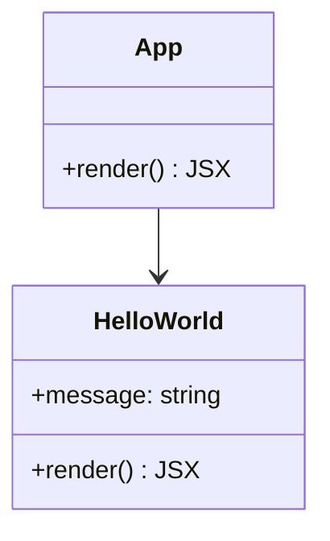

## 2.3 Technical Decisions

### 2.3.1 Architecture Choices

| Decision | Choice | Rationale |
|----------|--------|-----------|
| Architecture Style | Monolithic SPA | Minimal complexity requirements |
| Component Pattern | Functional Components | Modern React best practices |
| State Management | Local Component State | No complex state requirements |
| Build System | Create React App | Standard tooling, minimal setup |

### 2.3.2 Technology Stack

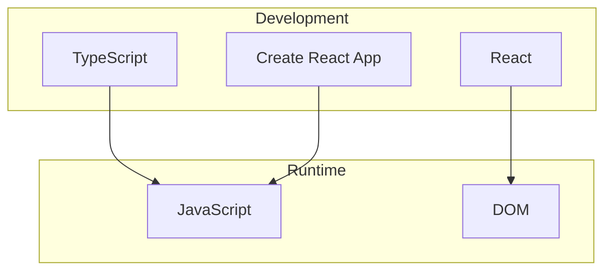

## 2.4 Cross-Cutting Concerns

### 2.4.1 Error Handling

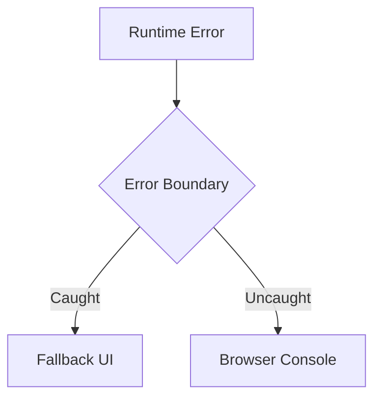

### 2.4.2 Performance Flow

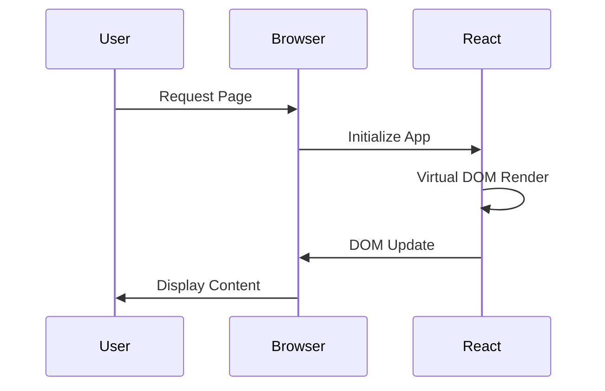

## 2.5 System Context

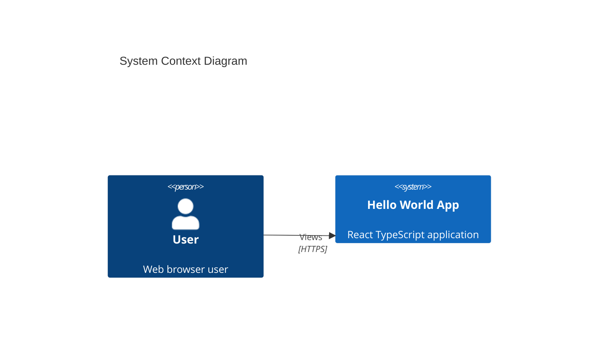

## 2.6 Container Architecture

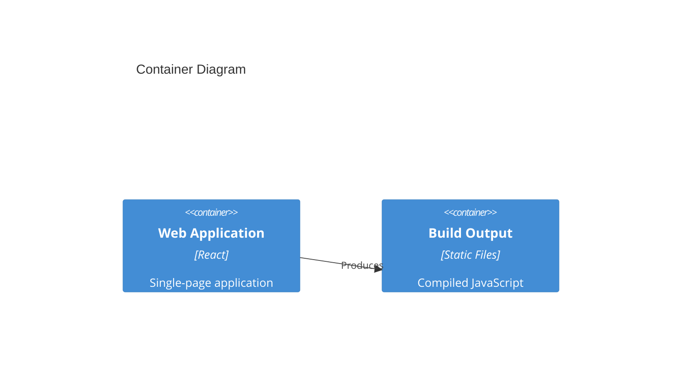

## 2.7 Component Architecture

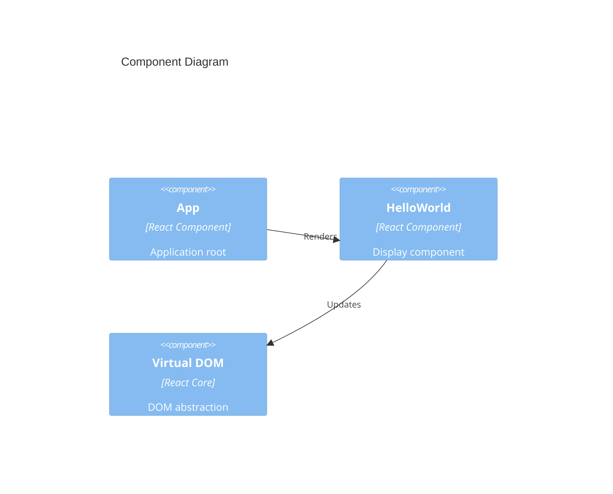

## 2.8 Deployment Architecture

```mermaid
deployment
    node Browser {
        artifact "React Application" {
            component[App Component]
            component[HelloWorld Component]
        }
    }
    
    node "Development Environment" {
        component[TypeScript Compiler]
        component[React Dev Server]
    }
```

# 3. SYSTEM COMPONENTS ARCHITECTURE

## 3.1 USER INTERFACE DESIGN

### 3.1.1 Design Specifications

| Aspect | Specification |
|--------|---------------|
| Layout | Single centered content area |
| Typography | System default font stack |
| Color Scheme | Default browser text color |
| Responsiveness | Fluid layout with centered text |
| Accessibility | WCAG 2.1 Level A compliance |
| Browser Support | Modern browsers (Chrome, Firefox, Safari, Edge) |
| Themes | System default only |
| i18n | English only |

### 3.1.2 Interface Elements

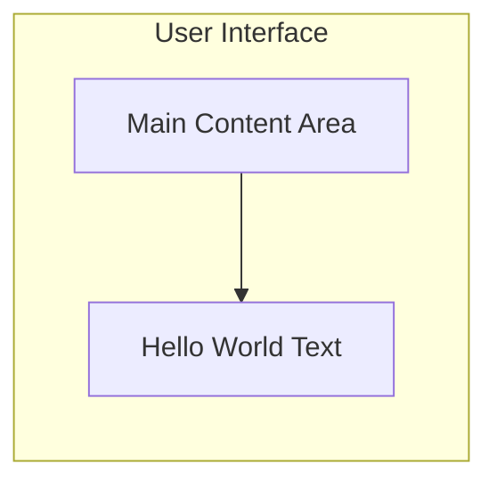

### 3.1.3 Component Layout

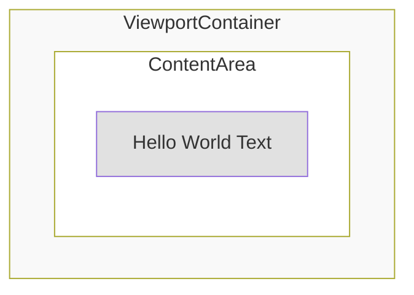

### 3.1.4 Component States

| State | Behavior |
|-------|----------|
| Initial Load | Immediate text display |
| Error | React error boundary fallback |
| Loading | None required |

### 3.1.5 Responsive Breakpoints

| Breakpoint | Behavior |
|------------|----------|
| All sizes | Centered text, fluid margins |

### 3.1.6 Error Handling

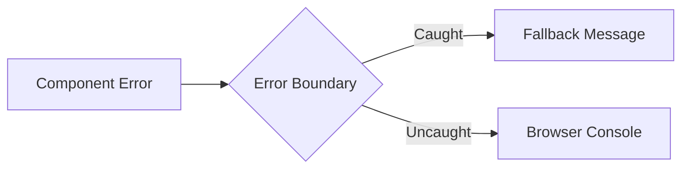

## 3.2 DATABASE DESIGN

*Not applicable for this implementation as it's a static single-page application with no data persistence requirements.*

## 3.3 API DESIGN

*Not applicable for this implementation as it's a standalone client-side application with no API requirements.*

## 3.4 Component Structure


## 3.5 State Management

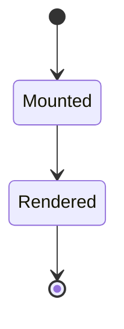

## 3.6 Component Lifecycle

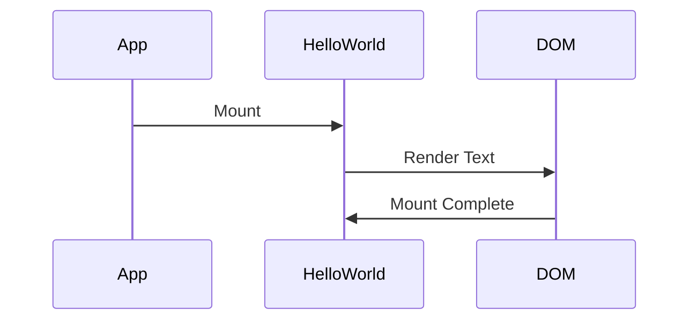

# 4. TECHNOLOGY STACK

## 4.1 PROGRAMMING LANGUAGES

| Language | Version | Purpose | Justification |
|----------|---------|---------|---------------|
| TypeScript | 4.x | Frontend development | Type safety, enhanced developer experience |
| JavaScript | ES2022 | Compiled output | Browser runtime compatibility |
| HTML5 | Latest | Markup | Standard web content structure |
| CSS3 | Latest | Styling | Basic visual presentation |

## 4.2 FRAMEWORKS & LIBRARIES

| Framework/Library | Version | Purpose | Justification |
|------------------|---------|---------|---------------|
| React | 18.x | UI Framework | Modern component architecture, virtual DOM efficiency |
| React DOM | 18.x | DOM Manipulation | Required for React browser rendering |
| TypeScript Compiler | 4.x | Static Type Checking | Compile-time type safety |
| Create React App | 5.x | Project Scaffolding | Standard tooling, minimal configuration |

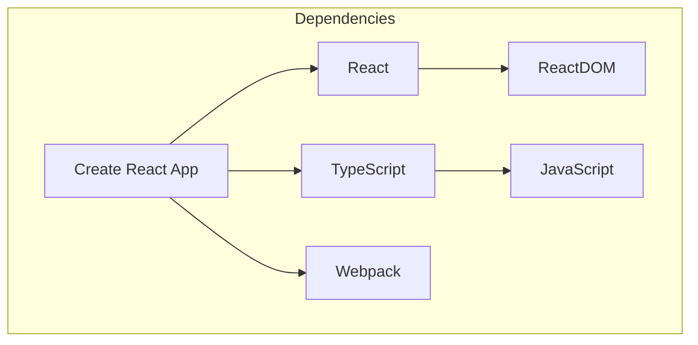

## 4.3 DATABASES & STORAGE

*Not applicable - Application has no data persistence requirements.*

## 4.4 THIRD-PARTY SERVICES

*Not applicable - Application runs entirely client-side with no external service dependencies.*

## 4.5 DEVELOPMENT & DEPLOYMENT

### Development Tools

| Tool | Version | Purpose |
|------|---------|---------|
| Node.js | 16.x+ | Development runtime |
| npm/yarn | Latest | Package management |
| TypeScript Compiler | 4.x | Static type checking |
| ESLint | 8.x | Code quality |
| Web Browser | Latest | Testing environment |

### Build System

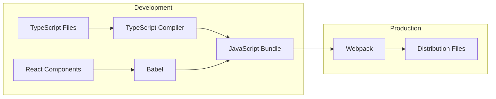

### Development Pipeline

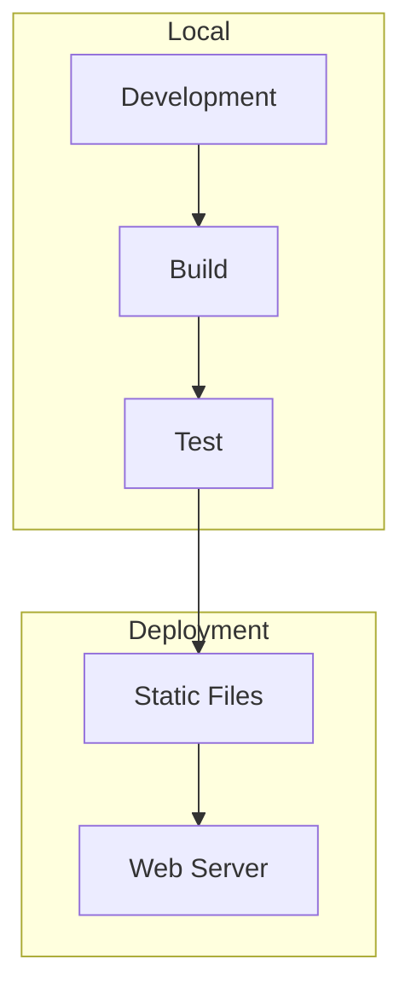

### Environment Requirements

| Requirement | Specification |
|-------------|---------------|
| Node.js | v16.x or higher |
| npm/yarn | Latest stable version |
| Browser | Modern evergreen browsers |
| IDE | TypeScript support required |
| Build Tools | Webpack 5.x (via CRA) |

# 5. SYSTEM DESIGN

## 5.1 USER INTERFACE DESIGN

The user interface consists of a single page with centered "Hello World" text, implementing a minimal design approach.

### 5.1.1 Layout Structure

```mermaid
graph TD
    subgraph Viewport
        subgraph MainContainer[Main Container]
            T[Hello World Text]
        end
    end
    style Viewport fill:#f9f9f9
    style MainContainer fill:#ffffff
    style T fill:#000000
```

### 5.1.2 Component Layout Specifications

| Component | Specifications |
|-----------|----------------|
| Main Container | - Full viewport height and width<br>- Flexbox display<br>- Center alignment both vertically and horizontally |
| Text Content | - System font stack<br>- Default text color<br>- Readable font size (16px) |

### 5.1.3 Wireframe

```
+--------------------------------+
|                                |
|                                |
|                                |
|           Hello World          |
|                                |
|                                |
|                                |
+--------------------------------+
```

### 5.1.4 Component Hierarchy

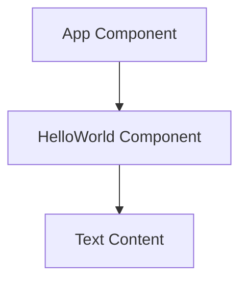

### 5.1.5 Responsive Behavior

| Breakpoint | Behavior |
|------------|----------|
| All sizes | - Centered content<br>- Fluid margins<br>- Single column layout |

## 5.2 DATABASE DESIGN

*Not applicable - This application does not require data persistence.*

## 5.3 API DESIGN

*Not applicable - This is a standalone client-side application with no API requirements.*

## 5.4 Component Flow

```mermaid
sequenceDiagram
    participant User
    participant App
    participant HelloWorld
    
    User->>App: Access Page
    App->>HelloWorld: Mount Component
    HelloWorld->>User: Display Text
```

## 5.5 State Management

```mermaid
stateDiagram-v2
    [*] --> Initialize
    Initialize --> Render
    Render --> Display
    Display --> [*]
```

## 5.6 Technical Architecture

```mermaid
graph TD
    subgraph Browser
        R[React Runtime]
        D[DOM]
        V[Virtual DOM]
    end
    
    subgraph Components
        A[App Component]
        H[HelloWorld Component]
    end
    
    A --> H
    H --> V
    V --> D
    R --> V
```

## 5.7 Build Process

```mermaid
flowchart LR
    TS[TypeScript Files] --> TC[TypeScript Compiler]
    TC --> JS[JavaScript]
    JS --> WP[Webpack]
    WP --> Bundle[Static Bundle]
```

# 6. USER INTERFACE DESIGN

## 6.1 Layout Overview

The application consists of a single viewport-height page with centered content displaying "Hello World" text.

```
+--------------------------------------------------+
|                                                  |
|                                                  |
|                                                  |
|                   Hello World                    |
|                                                  |
|                                                  |
|                                                  |
+--------------------------------------------------+
```

## 6.2 Component Layout

### 6.2.1 Main Container

```
+--------------------------------------------------+
|                   App Container                   |
|  +----------------------------------------------+|
|  |              HelloWorld Component            ||
|  |                                              ||
|  |                 Hello World                  ||
|  |                                              ||
|  +----------------------------------------------+|
|                                                  |
+--------------------------------------------------+
```

## 6.3 Responsive Layouts

### 6.3.1 Desktop View (>= 1024px)
```
+--------------------------------------------------+
|                                                  |
|                                                  |
|                   Hello World                    |
|                                                  |
|                                                  |
+--------------------------------------------------+
```

### 6.3.2 Tablet View (768px - 1023px)
```
+--------------------------------+
|                                |
|                                |
|            Hello World         |
|                                |
|                                |
+--------------------------------+
```

### 6.3.3 Mobile View (< 768px)
```
+--------------------+
|                    |
|                    |
|    Hello World     |
|                    |
|                    |
+--------------------+
```

## 6.4 Component States

### 6.4.1 Initial Load
```
+------------------+
|                  |
|   Loading...     |
|   [========]     |
|                  |
+------------------+
```

### 6.4.2 Error State
```
+------------------+
|      [!]         |
| Error Loading    |
| Component        |
|                  |
| [Retry Button]   |
+------------------+
```

## 6.5 Typography and Spacing

```
+--------------------------------------------------+
|                                                  |
|  Font: System Default                            |
|  Size: 16px (1rem)                              |
|  Weight: Regular (400)                           |
|                                                  |
|  Vertical Spacing: 100vh (full viewport height)  |
|  Horizontal Spacing: Auto (centered)             |
|                                                  |
+--------------------------------------------------+
```

## 6.6 Component Hierarchy

```
+-- App
    +-- HelloWorld
        +-- Text Content
```

## 6.7 UI Component Legend

| Symbol | Meaning |
|--------|---------|
| +--+ | Container border |
| \| | Vertical border |
| [...] | Text input field |
| [Button] | Clickable button |
| [========] | Loading progress bar |
| [!] | Error/warning indicator |

## 6.8 Accessibility Features

```
+--------------------------------------------------+
| ARIA Attributes:                                  |
| +-- role="main"                                  |
|     +-- aria-label="Hello World Content"         |
|         +-- aria-live="polite"                   |
+--------------------------------------------------+
```

## 6.9 Color Scheme

```
+--------------------------------------------------+
| Background: #FFFFFF (White)                       |
| Text: #000000 (Black)                            |
| Error: #FF0000 (Red)                             |
| Loading: #0000FF (Blue)                          |
+--------------------------------------------------+
```

# 7. SECURITY CONSIDERATIONS

## 7.1 AUTHENTICATION AND AUTHORIZATION

*For this minimal Hello World application, no authentication or authorization is required as it serves only static public content.*

| Security Aspect | Implementation |
|----------------|----------------|
| Public Access | Unrestricted access to static content |
| User Sessions | None required |
| Role Management | Not applicable |

## 7.2 DATA SECURITY

### 7.2.1 Data Protection Measures

```mermaid
flowchart TD
    A[Static Content] --> B{Security Measures}
    B --> C[CSP Headers]
    B --> D[HTTPS Transport]
    B --> E[XSS Prevention]
    C --> F[Runtime Protection]
    D --> F
    E --> F
```

| Security Measure | Implementation |
|-----------------|----------------|
| Content Security Policy | `default-src 'self'; script-src 'self'` |
| XSS Protection | React's built-in escaping mechanisms |
| Data Exposure | No sensitive data present |
| Asset Protection | Static file integrity checks via subresource integrity |

### 7.2.2 Build-time Security

```mermaid
flowchart LR
    subgraph Security Checks
        A[Source Code] --> B[TypeScript Compilation]
        B --> C[Dependency Audit]
        C --> D[Bundle Generation]
        D --> E[Security Headers]
    end
```

## 7.3 SECURITY PROTOCOLS

### 7.3.1 Transport Security

| Protocol | Implementation |
|----------|----------------|
| HTTPS | Required for production deployment |
| TLS Version | Minimum TLS 1.2 |
| HTTP Headers | `Strict-Transport-Security` enabled |

### 7.3.2 Runtime Security Controls

```mermaid
stateDiagram-v2
    [*] --> StaticContent
    StaticContent --> SecurityHeaders
    SecurityHeaders --> BrowserRendering
    BrowserRendering --> [*]
```

### 7.3.3 Security Headers Configuration

| Header | Value | Purpose |
|--------|-------|---------|
| Content-Security-Policy | `default-src 'self'` | Prevent XSS attacks |
| X-Frame-Options | DENY | Prevent clickjacking |
| X-Content-Type-Options | nosniff | Prevent MIME-type sniffing |
| Referrer-Policy | strict-origin-when-cross-origin | Control referrer information |

### 7.3.4 Development Security Measures

```mermaid
flowchart TD
    A[Development] --> B{Security Checks}
    B --> C[npm audit]
    B --> D[TypeScript Checks]
    B --> E[ESLint Security Rules]
    C --> F[Secure Build]
    D --> F
    E --> F
```

| Phase | Security Measure |
|-------|-----------------|
| Development | - npm audit checks<br>- TypeScript strict mode<br>- ESLint security rules |
| Build | - Dependency vulnerability scanning<br>- Bundle integrity verification |
| Deployment | - Security headers configuration<br>- HTTPS enforcement |

# 8. INFRASTRUCTURE

## 8.1 DEPLOYMENT ENVIRONMENT

For this minimal Hello World application, a simple static web hosting environment is sufficient.

| Environment Type | Description | Justification |
|-----------------|-------------|---------------|
| Static Hosting | Single-page application hosting | Minimal infrastructure needs for static content |
| CDN Support | Optional content delivery network | Improved global access and caching |
| Development | Local development environment | Required for development and testing |

```mermaid
flowchart TD
    subgraph Production
        SH[Static Hosting]
        CDN[Content Delivery Network]
        DNS[DNS]
    end
    
    subgraph Development
        LD[Local Development]
        TS[TypeScript Compiler]
        WP[Webpack Dev Server]
    end
    
    DNS --> CDN
    CDN --> SH
    LD --> TS
    TS --> WP
```

## 8.2 CLOUD SERVICES

Given the minimal requirements, lightweight cloud services are recommended.

| Service Type | Provider Options | Purpose |
|-------------|------------------|----------|
| Static Hosting | GitHub Pages, Netlify, Vercel | Host compiled static files |
| DNS | Cloudflare, Route53 | Domain name resolution |
| CDN | Cloudflare, Fastly | Content delivery and caching |

```mermaid
graph TD
    subgraph Cloud Infrastructure
        DNS[DNS Service]
        CDN[CDN]
        HOSTING[Static Hosting]
    end
    
    DNS --> CDN
    CDN --> HOSTING
    HOSTING --> STATIC[Static Files]
```

## 8.3 CONTAINERIZATION

*While containerization is not strictly necessary for this simple application, a minimal Docker setup can be provided for consistency and portability.*

```mermaid
graph LR
    subgraph Docker Container
        NGINX[NGINX Server]
        STATIC[Static Files]
    end
    
    BUILD[Build Output] --> STATIC
    STATIC --> NGINX
```

### Docker Configuration

| Component | Purpose | Configuration |
|-----------|---------|---------------|
| Base Image | NGINX Alpine | Lightweight web server |
| Build Stage | Node.js | Compile TypeScript and build React |
| Production Stage | NGINX | Serve static files |

## 8.4 ORCHESTRATION

*Not required for this minimal implementation due to static nature and simple deployment requirements.*

## 8.5 CI/CD PIPELINE

```mermaid
flowchart LR
    subgraph CI/CD Pipeline
        GIT[Git Repository] --> BUILD[Build]
        BUILD --> TEST[Test]
        TEST --> DEPLOY[Deploy]
    end
    
    subgraph Checks
        TS[TypeScript Check]
        LINT[Lint]
        UNIT[Unit Tests]
    end
    
    BUILD --> TS
    BUILD --> LINT
    TEST --> UNIT
```

### Pipeline Stages

| Stage | Actions | Tools |
|-------|---------|-------|
| Source | Code checkout | Git |
| Build | TypeScript compilation, webpack bundle | npm/yarn |
| Test | Type checking, linting | TSC, ESLint |
| Deploy | Static file deployment | GitHub Actions/Netlify/Vercel |

### Deployment Configuration

```mermaid
sequenceDiagram
    participant Git as Git Repository
    participant CI as CI/CD Pipeline
    participant Host as Static Host
    
    Git->>CI: Push Changes
    CI->>CI: Build & Test
    CI->>Host: Deploy Static Files
    Host->>Host: Cache Invalidation
```

### Environment Variables

| Variable | Purpose | Environment |
|----------|---------|-------------|
| NODE_ENV | Runtime environment | Development/Production |
| CI | CI environment flag | CI/CD Pipeline |
| DEPLOY_TOKEN | Deployment authentication | Production |

# 8. APPENDICES

## 8.1 ADDITIONAL TECHNICAL INFORMATION

### Development Environment Setup

```mermaid
flowchart LR
    subgraph Prerequisites
        N[Node.js 16.x+]
        NPM[npm/yarn]
        IDE[TypeScript-enabled IDE]
    end
    
    subgraph Project Setup
        CRA[Create React App]
        TS[TypeScript Template]
        DEP[Dependencies]
    end
    
    N --> CRA
    NPM --> CRA
    CRA --> TS
    TS --> DEP
```

### Build Process Details

| Phase | Tools | Output |
|-------|-------|--------|
| Development | ts-loader, webpack-dev-server | Source maps, development bundle |
| Production | TypeScript compiler, webpack | Minified production bundle |
| Testing | Jest, React Testing Library | Test reports |

### File Structure

```mermaid
graph TD
    subgraph Project Structure
        SRC[src/]
        PUBLIC[public/]
        CONFIG[config/]
        BUILD[build/]
    end
    
    SRC --> |TypeScript files| BUILD
    PUBLIC --> |Static assets| BUILD
    CONFIG --> |Build configuration| BUILD
```

## 8.2 GLOSSARY

| Term | Definition |
|------|------------|
| Bundle | Compiled and minified JavaScript output file |
| Component | Reusable UI element in React |
| Development Server | Local server for development and testing |
| DOM | Document Object Model - browser's HTML representation |
| Props | Properties passed to React components |
| Static Typing | Compile-time type checking in TypeScript |
| Transpilation | Converting TypeScript to JavaScript |
| Virtual DOM | React's memory representation of the UI |
| Webpack | Module bundler for JavaScript applications |

## 8.3 ACRONYMS

| Acronym | Full Form |
|---------|-----------|
| API | Application Programming Interface |
| CRA | Create React App |
| CSP | Content Security Policy |
| DOM | Document Object Model |
| HTML | HyperText Markup Language |
| IDE | Integrated Development Environment |
| JSX | JavaScript XML |
| NPM | Node Package Manager |
| SPA | Single Page Application |
| TSC | TypeScript Compiler |
| UI | User Interface |
| WCAG | Web Content Accessibility Guidelines |
| XSS | Cross-Site Scripting |

## 8.4 REFERENCE ARCHITECTURE

```mermaid
C4Context
    title Reference Architecture
    
    Person(dev, "Developer", "Application developer")
    System(ide, "Development Environment", "TypeScript-enabled IDE")
    System(build, "Build System", "Create React App")
    System(browser, "Web Browser", "Application runtime")
    
    Rel(dev, ide, "Develops in")
    Rel(ide, build, "Compiles via")
    Rel(build, browser, "Deploys to")
```

## 8.5 DEVELOPMENT WORKFLOW

```mermaid
stateDiagram-v2
    [*] --> Development
    Development --> TypeCheck: TSC
    TypeCheck --> Build: Success
    TypeCheck --> Development: Errors
    Build --> Test
    Test --> Deploy
    Deploy --> [*]
```

## 8.6 TOOLCHAIN DEPENDENCIES

| Tool | Version | Purpose |
|------|---------|---------|
| Create React App | 5.x | Project scaffolding and build setup |
| ESLint | 8.x | Code quality and style enforcement |
| Jest | 27.x | Unit testing framework |
| React Scripts | 5.x | Development and build scripts |
| TypeScript | 4.x | Static type checking |
| Webpack | 5.x | Module bundling |